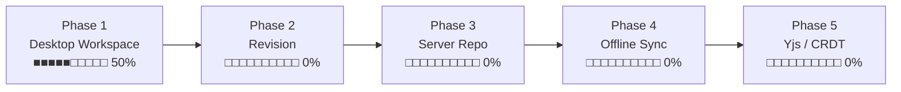

# 구현 현황

기준: 2026-09-07 · v0.10.0

범례 — ✅ 구현됨 · 🟡 일부 · ⬜ 미구현

***

## 한눈에 보기

| 영역                  |  상태 | 비고                    |
| ------------------- | :-: | --------------------- |
| 마크다운 위지윅 편집         |  ✅  | MDXEditor 4 / Lexical |
| 본문 조판 (표·제목·인용문)    |  ✅  | 공유 CSS, 두 앱 동일        |
| PDF 저장                |  🟡 | MD Editor 만. WebView2 PrintToPdf |
| Mermaid 다이어그램       |  ✅  | 플러그인 형태로 분리           |
| 파일 열기 / 저장          |  ✅  | Rust 커맨드 + 네이티브 대화상자  |
| 탭 · 드래그앤드롭          |  ✅  | MD Editor             |
| 이미지 붙여넣기            |  ✅  | 저장 폴더 동적 설정           |
| 표 셀 안 줄바꿈 (Alt+Enter) |  ✅  | 두 앱 공통, 파일에는 `<br />`   |
| 취소선 (`~~`)             |  ✅  | 두 앱 공통. 위첨자·아래첨자는 일부러 뺐다 |
| 창 나누기 (위·아래 두 화면) |  ✅  | 두 앱 공통. Word · Visual Studio 방식 |
| 남의 마크다운 열기 (`<` 교정)  |  ✅  | XML 로그·`<-`·자동링크가 있어도 열린다  |
| 저장소 트리 (다중)         |  ✅  | MDSyncNote, 로컬 폴더만    |
| 자동 저장               |  ✅  | MDSyncNote, 기본 60초       |
| Windows 파일 연결        |  ✅  | MD Editor, 우클릭 메뉴·연결 프로그램 |
| 저장소 git init · 자동 commit |  ✅  | MDSyncNote. 저장 + 이름변경·이동·삭제도 커밋으로 |
| 파일/폴더 CRUD          |  ✅  | MDSyncNote 생성·이름변경(F2)·삭제·이동(3초 누르고 끌기) |
| File Watcher        |  🟡 | MD Editor 만. MDSyncNote 미적용   |
| SQLite 메타데이터        |  ⬜  |                       |
| 전문 검색               |  ✅  | MDSyncNote, 색인 없이 훑기 (80ms/저장소) |
| 변경 이력 / Revision    |  🟡 | 자동 commit 됨. 이력 보기·되돌리기 UI 없음 |
| 서버 저장소 (WebDAV·FTP) |  ⬜  | 인터페이스 자리만 있음          |
| 동기화 / Yjs           |  ⬜  |                       |

**전체 계획 대비 대략 40%.** Phase 1(Desktop Markdown Workspace)의 절반을 넘겼다.

***

## 앱별 상세

### MD Editor — 단일 창 에디터

계획서 **MD Editor V1** 두 줄은 **모두 구현 완료**.

| 기능                                               |  상태 | 위치                             |
| ------------------------------------------------ | :-: | ------------------------------ |
| 위지윅 편집 (`#` → 제목 등 즉시 렌더링)                       |  ✅  | `editor-core/Editor.jsx`       |
| 툴바 — 굵게·목록·표·링크·코드블록·구분선                         |  ✅  | 〃                              |
| 위지윅 ↔ 원본 ↔ 변경점 3모드 전환                            |  ✅  | 〃                              |
| 코드블록 문법 강조 (7개 언어)                               |  ✅  | 〃                              |
| Mermaid 다이어그램 + 소스 편집 + 오류 표시                    |  ✅  | `editor-core/MermaidBlock.jsx` |
| 파일 열기 / 저장 / 다른 이름으로                             |  ✅  | `md-editor/App.jsx`            |
| **드래그앤드롭으로 파일 열기** (상단 드롭존)                    |  ✅  | 〃 + `useFileDrop.js`            |
| **탐색기 우클릭 → MD Editor로 열기**                       |  ✅  | `win_assoc.rs` · `WinAssoc.jsx` |
| **명령줄 인자로 받은 파일 열기**                              |  ✅  | `cli.rs` (`startup_file`)       |
| **외부 변경 감지 → 불러오기/덮어쓰기 선택**                    |  ✅  | `md-core/watcher.rs` + `useExternalChanges.js` |
| **탭으로 여러 문서 열고 전환**                              |  ✅  | 〃                              |
| 탭별 수정 표시(●) · 닫기 확인                              |  ✅  | 〃                              |
| 단축키 N/O/S/Shift+S/T/W/Tab                        |  ✅  | 〃                              |
| **이미지 붙여넣기 → 자동 저장 + 링크**                        |  ✅  | `editor-core/images.js`        |
| **이미지 폴더 동적 설정** (`images` / `.` / `assets/img`) |  ✅  | 〃 + 설정 UI                      |
| **표 셀 안 Alt+Enter 줄바꿈**                          |  ✅  | `editor-core/tableCellBreak.jsx` |
| **`<br>` · `<-` · 자동링크가 든 파일 열기**                 |  ✅  | `editor-core/normalizeMarkdown.js` |
| **표 셀 경계를 지켜 정규화** (셀 넘는 백틱·태그, 여러 줄 주석)   |  ✅  | `editor-core/mdSegments.js`    |
| 툴바 상단 고정                                         |  ✅  | `editor-core/editor.css`       |
| **취소선 툴바** (파일에는 `~~`)                          |  ✅  | `editor-core/Editor.jsx`       |
| **창 나누기** — 위 손잡이를 끌어내려 위·아래 두 화면        |  ✅  | `editor-core/SplitEditor.jsx`  |
| **표에서 여러 셀 끌어 복사** (TSV + 표)                  |  ✅  | `editor-core/tableSelect.js`   |
| **문서 제목을 창 제목·탭에** (첫 H1, 없으면 파일 이름)        |  ✅  | `md-editor/paths.js`           |
| **제목줄 없앰 · 탭 줄 오른쪽 그림 단추** (Open·Save·Save As) |  ✅  | `md-editor/TabBar.jsx` · `icons.jsx` |

### MDSyncNote — 저장소 워크스페이스 (V2)

계획서 **MDSyncNote** 항목 대조.

| 계획 문장                                |  상태 | 비고                                         |
| ------------------------------------ | :-: | ------------------------------------------ |
| 왼편 저장소 아코디언 트리 뷰                     |  ✅  | 펼침/접힘, 저장소별                                |
| 오른편 선택 Note 내용 뷰 (MD Editor 내용뷰를 따름) |  ✅  | 공유 패키지로 **완전히 동일**                         |
| 사용자 폴더를 저장소로 선택                      |  ✅  | 여러 개 등록, localStorage 유지                   |
| 차후 ftp / webdav 지원 가능해야 함            |  🟡 | `listDir(repo, path)` 한 곳만 분기하면 됨. 구현은 안 됨 |
| 수정 후 일정 시간 뒤 자동 저장 (기본 1분, 조정 가능)    |  ✅  | 기본 60초, 설정에서 초 단위                          |
| 변경사항이 있을 때만 저장                       |  ✅  | dirty 플래그                                  |
| 폴더 구조 표시                             |  ✅  | 지연 로딩, 마크다운만, 폴더 우선 정렬                     |
| 새 폴더 생성 / 이름변경 / 삭제                  |  ✅  | 오른쪽 버튼 메뉴 · **F2**. 삭제는 휴지통으로        |
| 끌어서 다른 폴더로 옮기기                    |  ✅  | **3초 누르고 있으면** 끌 수 있다. 같은 폴더 안 순서 바꾸기는 없다 |
| 트리 / 본문 사이 나누기 막대                  |  ✅  | 폭은 설정에 남는다 (160~720px)                 |
| Note 추가 / 이름변경 / 삭제                  |  ✅  | 〃 `.md` 자동, 만들면 바로 열림               |
| 저장소별 git local 자동 추가                 |  ✅  | 트리 머리의 [Git 초기화] 버튼 (init + 첫 커밋)          |
| 변경 저장 시 자동 commit                    |  ✅  | 저장이 실제로 일어났을 때만. 설정에서 끌 수 있음                |
| 이름변경 · 이동 · 삭제도 commit             |  ✅  | 자동 저장 박자로 모아서. 무엇을 어떻게 했는지 메시지에 적는다 |
| 트리 우클릭 → MD Editor 로 열기            |  ✅  | 실행 파일을 이 앱 옆에서 찾는다 (`open_with.rs`)       |
| 트리 우클릭 → 경로 복사                    |  ✅  | 파일·폴더 모두 (`shell.js`)                       |
| 검색 결과에 수정일자                       |  ✅  | 오늘은 시각 · 올해는 월/일 · 그 전은 연.월.일          |
| **환경 정보를 실행 파일 옆 `MDSyncNote.ini` 로** |  ✅  | 저장소 목록 + 설정. 쓰던 localStorage 는 옮겨 담는다 |
| SQLite 변경 관리                         |  ⬜  |                                            |
| sync (공유폴더·ftp·webdav, 단방향/양방향)      |  ⬜  |                                            |

***

## 계획서 절별 대조

| 절   | 항목                                                                        |                                 상태                                |
| --- | ------------------------------------------------------------------------- | :---------------------------------------------------------------: |
| 3.1 | Local Folder Repository                                                   |                                 ✅                                 |
| 3.2 | Multiple Repositories                                                     |                                 ✅                                 |
| 3.3 | Repository Provider 추상화                                                   |                  🟡 JS 쪽 `listDir` 만. Rust 계층은 없음                 |
| 4   | File Tree — expand/collapse, 클릭 열기, 다중 저장소                                |                                 ✅                                 |
| 4   | File Tree — 새 파일/폴더, rename, delete, move                                 |                                 ✅                                 |
| 4   | File Tree — 최근 파일, 즐겨찾기                                                   |                                 ⬜                                 |
| 4   | File Watcher 로 외부 변경 감지                                                   |                    🟡 MD Editor 만                    |
| 5   | Clipboard 이미지 붙여넣기 → 자동 저장 + 링크                                           |                                 ✅                                 |
| 5   | 이미지 파일명 자동 생성                                                             |                             ✅ 타임스탬프+난수                            |
| 5   | attachment 폴더 방식                                                          | 🟡 **문서 기준 상대 폴더**로 구현 (계획서의 저장소 공용 `.attachments/` 와 다름 — 아래 참고) |
| 5   | 중복 이미지 hash 검사                                                            |                                 ⬜                                 |
| 5   | 미사용 attachment 검색                                                         |                                 ⬜                                 |
| 5   | 이미지 Drag & Drop                                                           |                 ⬜ Tauri 가 OS 레벨 드롭을 가로채므로 별도 처리 필요                |
| 5   | 이미지 크기 조정 / 압축                                                            |                                 ⬜                                 |
| 6   | SQLite (repositories / documents / revisions / sync\_state / sync\_queue) |                                 ⬜                                 |
| 7   | FTS5 전문 검색                                                                |        ✅ 색인 없는 라이브 검색으로 대체 (근거는 Update_History v0.8.0)        |
| 8   | File Watcher                                                              |                    🟡 MD Editor 만                    |
| 9   | Revision History (hash, revision, device id, compare, restore)            |                     🟡 git 자동 커밋으로 이력은 쌓인다. 비교·복원 UI 없음                     |
| 10  | Offline-first 동기화                                                         |                                 ⬜                                 |
| 11  | Yjs / CRDT                                                                |                                 ⬜                                 |

### 계획과 달라진 점 — 이미지 저장 위치

계획서 5절은 **저장소 공용 `.attachments/`** 를 우선 검토한다고 했는데, 실제로는
**문서 옆의 설정 가능한 폴더**(기본 `images/`)로 구현했다. MD Editor V1 문장이
"현재 md 폴더 아래 images 라는 폴더" 였기 때문이다.

MDSyncNote 로 오면 계획서 쪽 논리(문서를 옮겨도 경로가 안 깨진다)가 더 맞다.
설정값 하나만 저장소 루트 기준으로 해석하도록 바꾸면 되므로, 나중에 전환 가능하다.

***

## Phase 진척 (계획서 12절)



**Phase 1 세부**

| 항목                      |     상태    |
| ----------------------- | :-------: |
| Tauri                   |     ✅     |
| Local Folder Repository |     ✅     |
| Multiple Repositories   |     ✅     |
| File Tree               | ✅ (읽기 전용) |
| Markdown Editor         |     ✅     |
| Image Paste             |     ✅     |
| File Watcher            |     🟡    |
| SQLite Metadata         |     ⬜     |
| SQLite FTS5             |     ⬜     |

***

## 코드 위치

```
md-workspace/
├─ packages/editor-core/src/
│  ├─ Editor.jsx          72줄  MDXEditor 플러그인·툴바 구성
│  ├─ SplitEditor.jsx    130줄  창 나누기 — 손잡이·두 화면·한 방향 내용 옮기기
│  ├─ MermaidBlock.jsx    94줄  Mermaid 렌더러 + 툴바 버튼
│  ├─ tableCellBreak.jsx  89줄  표 셀 Alt+Enter 줄바꿈 (<br /> 전용 노드)
│  ├─ images.js           79줄  이미지 저장 경로 계산·저장·미리보기 변환
│  ├─ settings.js         19줄  설정 로드/저장
│  ├─ tauriBridge.js       2줄  Tauri 환경 판별
│  └─ editor.css         107줄  에디터 공용 스타일
├─ crates/md-core/src/
│  └─ commands.rs         77줄  read_file, write_file, save_binary_b64,
│                               read_binary_base64, read_dir
└─ apps/
   ├─ md-editor/
   │  ├─ src/App.jsx     215줄  탭 상태·열기/저장·조립
   │  ├─ src/useFileDrop.js 52줄 상단 드롭존 좌표 판정
   │  ├─ src/useShortcuts.js 24줄 Ctrl 단축키
   │  ├─ src/TabBar.jsx   23줄
   │  ├─ src/SettingsBar.jsx 27줄
   │  ├─ src/WinAssoc.jsx 55줄  파일 연결 등록 UI
   │  ├─ src/paths.js      7줄  열 수 있는 확장자·파일명
   │  ├─ src/app.css     127줄  탭바·설정·드롭존
   │  └─ src-tauri/src/
   │     ├─ win_assoc.rs 183줄  HKCU 파일 연결 등록/해제
   │     └─ cli.rs        33줄  startup_file · --register 인자
   └─ md-sync-note/
      ├─ src/App.jsx     230줄  저장소 관리·문서 열기·자동 저장/커밋
      ├─ src/RepoTree.jsx  78줄  저장소 하나의 트리 + 유령 이름표·메뉴·이름 창
      ├─ src/TreeNode.jsx  91줄  트리 한 줄 (펼침·F2·끌기 손잡이·놓을 자리)
      ├─ src/useTreeOps.js 138줄 만들기·이름 바꾸기·옮기기·지우기
      ├─ src/useTreeDrag.js 89줄 3초 누르기 → 끌기 (포인터 이벤트로 직접)
      ├─ src/usePendingCommits.js 46줄  파일 조작을 모아 한 커밋으로
      ├─ src/SideSplit.jsx 31줄  트리/본문 나누기 막대
      ├─ src/GitLine.jsx   49줄  저장소 머리의 git 상태 줄
      ├─ src/SettingsBar.jsx 38줄
      ├─ src/repos.js     56줄  저장소 목록·listDir·repoOf
      ├─ src/git.js       53줄  git 커맨드 래퍼·커밋/파일조작 메시지
      ├─ src/app.css     185줄  사이드바·트리·나누기 막대·끌기 표시
      └─ src-tauri/src/
         └─ git.rs       230줄  git status/init/commit (+ 테스트 3건)
```

***

## 검증 상태

| 대상                       | 방법                         |      결과      |
| ------------------------ | -------------------------- | :----------: |
| 두 앱 프론트엔드 빌드             | `vite build`               |      통과      |
| Rust 워크스페이스              | `cargo check --workspace`  |      통과      |
| **실제 데스크톱 앱 실행**         | Xvfb 가상 디스플레이에서 바이너리 직접 실행 | 창 정상, 크래시 없음 |
| 위지윅 · Mermaid · 이미지 붙여넣기 | 헤들리스 브라우저                  |      통과      |
| 탭 전환 시 내용 보존             | 헤들리스 브라우저                  |      통과      |
| 저장소 트리 2단계 펼침 → 파일 열기    | 헤들리스 브라우저                  |      통과      |
| 이미지 경로 조합 6종             | 단위 테스트                     |      통과      |
| git 초기화·커밋·중첩 저장소 범위      | `cargo test -p md-sync-note` 3건 |      통과      |
| 파일 감시 — 해시 판단·폴더 감시 배선   | `cargo test -p md-core` 7건      |      통과      |
| 파일/폴더 CRUD — 덮어쓰기 거부·휴지통 | `cargo test -p md-core` 4건      |      통과      |
| 트리 메뉴·이름 규칙·즉시 반영        | 헤들리스 브라우저 12건            |      통과      |
| 외부 변경 → 불러오기/덮어쓰기 흐름     | 헤들리스 브라우저 13건            |      통과      |
| 파일 연결 등록/해제             | `--register` 후 `reg query`, 해제 후 원복 |   통과   |
| 인자 파일 열기·드롭존 배치·연결 UI    | 헤들리스 브라우저 8건               |      통과      |
| git 버튼·저장→커밋·자동커밋 끄기     | 헤들리스 브라우저 12건              |      통과      |
| 표 셀 Alt+Enter — 삽입·왕복·기존 Enter 유지 | 헤들리스 브라우저 3개 시나리오      |      통과      |
| `<` 정규화 28종 + 결과를 실제 MDX 파서로 재파싱 | 단위 테스트          |      통과      |
| 표 셀 경계 함정 27종 + 실사용 문서 57개, 정규화 후 실제 MDX 파서로 재파싱 | v0.9.1 검증 | 통과 |
| 문서 제목(H1→창·탭) · 표 셀 끌어 고르기 · Ctrl+C 클립보드 실제 확인 | 헤들리스 브라우저 11건 | 통과 |
| 제목줄 없음 · 그림 단추 이름 · 한글 단추 없음 · 탭이 늘어도 단추가 안 밀림 | 헤들리스 브라우저 11건 | 통과 |
| **실제 문제 파일**(115KB) 열기 — 표 24개 렌더 | 헤들리스 브라우저     |      통과      |
| 열었을 때 수정표시 없음 · 편집 시 수정표시 | 헤들리스 브라우저        |      통과      |
| 빈 문서에 종이 카드가 하나만 (중복 상자) | 헤들리스 브라우저          |      통과      |
| 취소선 — 버튼 · 적용 · `~~` 로 직렬화   | 헤들리스 브라우저          |      통과      |
| 창 나누기 — 끌어 나누기·두 화면·반대쪽 반영·두 번 눌러 합치기 | 헤들리스 브라우저 (두 앱) | 통과 |
| F2 이름 바꾸기 · 사이드바 폭 조정과 유지 | 헤들리스 브라우저          |      통과      |
| 3초 누르기 → 끌기 → 놓을 자리 강조 → 놓기 | 헤들리스 브라우저          |      통과      |
| 같은 폴더 거절 · 폴더를 자기 아래로 거절 · 끌기 뒤 문서가 안 열림 | 헤들리스 브라우저 | 통과 |

**아직 검증하지 못한 것**: 실제 드래그앤드롭(OS 이벤트라 스텁으로 흉내 낼 수 없다),
탐색기 우클릭 메뉴 모양, 이미지 붙여넣기. 그리고 **실제 파일이 있는 저장소에서
트리 옮기기와 그 커밋 메시지** — 브라우저 데모 모드는 파일을 바꾸지 못한다.
사람이 앱을 띄워 한 번 확인해야 한다.

***

## 다음 작업 후보

계획서 13절 우선순위와 지금 상태를 맞춰본 순서.

|  순위 | 작업                      | 이유                                                 |
| :-: | ----------------------- | -------------------------------------------------- |
|  1  | ~~파일/폴더 CRUD~~        | ✅ v0.9.0 에서 이동까지 완료                                     |
|  2  | File Watcher — MDSyncNote 적용 | MD Editor 는 v0.5.0 에서 끝났다. **지금 가장 위에 있는 남은 일**   |
|  3  | ~~git local 자동 commit~~  | ✅ v0.4.0 에서 완료. 다음은 이력 보기·되돌리기 UI                    |
|  4  | ~~SQLite + FTS5~~        | v0.8.0 에서 색인 없는 검색으로 해결. 300ms 넘어가면 그때 캐시→FTS5        |
|  5  | 서버 저장소 (WebDAV 등)       | Provider 계층 실제 분리                                  |
|  6  | 동기화                     | 위가 다 있어야 함                                         |
|     |                         |                                                    |
|     |                         |                                                    |

**추가 기능필요**

- ~~표 안에서 줄바꿈~~ → ✅ v0.4.1 에서 Alt+Enter 로 해결
- ~~취소선~~ · ~~창 나누기~~ · ~~F2 이름 바꾸기~~ · ~~트리 나누기 막대~~ ·
  ~~끌어서 옮기기~~ · ~~이름변경·이동 커밋~~ → ✅ v0.9.0
- **표를 여러 셀에 걸쳐 긁어 복사하기** — 지금은 셀 하나 안에서만 선택된다.
  구조적인 제약이라 값이 싸지 않다. 아래 "표 복사 제약" 참고
- **편집 후 저장하면 MDXEditor 표기법으로 다시 쓰인다** — `p.62~65` → `p.62~~65`,
  `A_B` → `A\\_B`. 마크다운 렌더러에서는 같게 보이지만, 이스케이프를 풀지 않는
  PDF·인쇄 도구에서는 역슬래시가 그대로 보인다. 확장을 빼는 API 도, 이스케이프를
  줄이는 옵션도 없어 값싼 해법이 없다.
  상세는 [Update_History.md](Update_History.md) v0.4.3 3절.
  **열기만 하면 파일은 바뀌지 않는다**(v0.4.3 에서 수정)

***

## 표에서 여러 셀 복사 (2026-09-07 해결)

**된다.** `<td>` 위에서 누르고 끌면 셀 범위가 잡히고 Ctrl+C 로 복사된다
(`editor-core/tableSelect.js`). 엑셀에는 셀로 나뉘어 들어가고, 이 편집기에 붙이면
표가 된다.

### 왜 한동안 안 된다고 적혀 있었나

MDXEditor 의 표는 `DecoratorNode` 이고 **셀 하나하나가 독립된 lexical 편집기**다
(`plugins/table/TableEditor.js` — 셀마다 `ContentEditable` 을 따로 만든다).
브라우저의 선택 영역은 `contenteditable` 경계를 넘지 못하므로 셀을 가로지르는
**네이티브 선택은 만들어지지 않는다.** 여기까지는 지금도 사실이다.

놓쳤던 것은 **바깥이 진짜 `<table>`·`<tr>`·`<td>`** 라는 점이다. contenteditable 은
셀 *안쪽*에만 있다. 그러니 네이티브 선택을 고칠 게 아니라 **선택을 직접 그리면 된다** —
표 플러그인을 갈아엎을 필요가 없었다. 자세한 것은 `Update_History.md` 의 v0.10.0 절.

### 아직 안 되는 것

- 여러 셀 **붙여넣기**(엑셀 → 표)는 없다. 복사만 된다
- 셀을 가로지르는 **글자 단위** 선택(반 칸만 긁기)은 여전히 불가능하다.
  그건 위의 구조 때문이고, 표 플러그인을 갈아엎어야 한다

***

세부 기술 검토는 [Update\_History.md](Update_History.md) 의 "향후 계획 (기술 검토)" 절 참고.