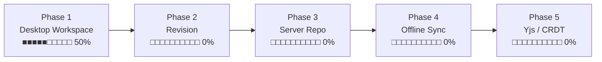

# 구현 현황

기준: 2026-08-30 · v0.4.1 · 소스 약 1,840줄 (JS 1,330 / Rust 380 / CSS 400 중복 제외 시)

범례 — ✅ 구현됨 · 🟡 일부 · ⬜ 미구현

***

## 한눈에 보기

| 영역                  |  상태 | 비고                    |
| ------------------- | :-: | --------------------- |
| 마크다운 위지윅 편집         |  ✅  | MDXEditor 4 / Lexical |
| Mermaid 다이어그램       |  ✅  | 플러그인 형태로 분리           |
| 파일 열기 / 저장          |  ✅  | Rust 커맨드 + 네이티브 대화상자  |
| 탭 · 드래그앤드롭          |  ✅  | MD Editor             |
| 이미지 붙여넣기            |  ✅  | 저장 폴더 동적 설정           |
| 표 셀 안 줄바꿈 (Alt+Enter) |  ✅  | 두 앱 공통, 파일에는 `<br />`   |
| `<br>` 자동 교정          |  ✅  | 열 때 `<br />` 로. 코드블록은 예외    |
| 저장소 트리 (다중)         |  ✅  | MDSyncNote, 로컬 폴더만    |
| 자동 저장               |  ✅  | MDSyncNote, 기본 60초       |
| Windows 파일 연결        |  ✅  | MD Editor, 우클릭 메뉴·연결 프로그램 |
| 저장소 git init · 자동 commit |  ✅  | MDSyncNote, 저장이 일어날 때만  |
| 파일/폴더 CRUD          |  ⬜  | 생성·이름변경·삭제·이동         |
| File Watcher        |  ⬜  | 외부 변경 감지              |
| SQLite 메타데이터        |  ⬜  |                       |
| FTS 전문 검색           |  ⬜  |                       |
| 변경 이력 / Revision    |  🟡 | 자동 commit 됨. 이력 보기·되돌리기 UI 없음 |
| 서버 저장소 (WebDAV·FTP) |  ⬜  | 인터페이스 자리만 있음          |
| 동기화 / Yjs           |  ⬜  |                       |

**전체 계획 대비 대략 35%.** Phase 1(Desktop Markdown Workspace)의 절반을 조금 넘겼다.

***

## 앱별 상세

### MD Editor — 단일 창 에디터

계획서 **MD Editor V1** 두 줄은 **모두 구현 완료**.

| 기능                                               |  상태 | 위치                             |
| ------------------------------------------------ | :-: | ------------------------------ |
| 위지윅 편집 (`#` → 제목 등 즉시 렌더링)                       |  ✅  | `editor-core/Editor.jsx`       |
| 툴바 — 굵게·목록·표·링크·코드블록·구분선                         |  ✅  | 〃                              |
| 위지윅 ↔ 원본 ↔ 변경점 3모드 전환                            |  ✅  | 〃                              |
| 코드블록 문법 강조 (7개 언어)                               |  ✅  | 〃                              |
| Mermaid 다이어그램 + 소스 편집 + 오류 표시                    |  ✅  | `editor-core/MermaidBlock.jsx` |
| 파일 열기 / 저장 / 다른 이름으로                             |  ✅  | `md-editor/App.jsx`            |
| **드래그앤드롭으로 파일 열기** (상단 드롭존)                    |  ✅  | 〃 + `useFileDrop.js`            |
| **탐색기 우클릭 → MD Editor로 열기**                       |  ✅  | `win_assoc.rs` · `WinAssoc.jsx` |
| **명령줄 인자로 받은 파일 열기**                              |  ✅  | `cli.rs` (`startup_file`)       |
| **탭으로 여러 문서 열고 전환**                              |  ✅  | 〃                              |
| 탭별 수정 표시(●) · 닫기 확인                              |  ✅  | 〃                              |
| 단축키 N/O/S/Shift+S/T/W/Tab                        |  ✅  | 〃                              |
| **이미지 붙여넣기 → 자동 저장 + 링크**                        |  ✅  | `editor-core/images.js`        |
| **이미지 폴더 동적 설정** (`images` / `.` / `assets/img`) |  ✅  | 〃 + 설정 UI                      |
| **표 셀 안 Alt+Enter 줄바꿈**                          |  ✅  | `editor-core/tableCellBreak.jsx` |
| **`<br>` 이 든 파일 열기** (자동 교정)                     |  ✅  | `editor-core/normalizeMarkdown.js` |
| 툴바 상단 고정                                         |  ✅  | `editor-core/editor.css`       |

### MDSyncNote — 저장소 워크스페이스 (V2)

계획서 **MDSyncNote** 항목 대조.

| 계획 문장                                |  상태 | 비고                                         |
| ------------------------------------ | :-: | ------------------------------------------ |
| 왼편 저장소 아코디언 트리 뷰                     |  ✅  | 펼침/접힘, 저장소별                                |
| 오른편 선택 Note 내용 뷰 (MD Editor 내용뷰를 따름) |  ✅  | 공유 패키지로 **완전히 동일**                         |
| 사용자 폴더를 저장소로 선택                      |  ✅  | 여러 개 등록, localStorage 유지                   |
| 차후 ftp / webdav 지원 가능해야 함            |  🟡 | `listDir(repo, path)` 한 곳만 분기하면 됨. 구현은 안 됨 |
| 수정 후 일정 시간 뒤 자동 저장 (기본 1분, 조정 가능)    |  ✅  | 기본 60초, 설정에서 초 단위                          |
| 변경사항이 있을 때만 저장                       |  ✅  | dirty 플래그                                  |
| 폴더 구조 표시                             |  ✅  | 지연 로딩, 마크다운만, 폴더 우선 정렬                     |
| 새 폴더 생성 / 이름변경 / 삭제                  |  ⬜  |                                            |
| Note 추가 / 이름변경 / 삭제                  |  ⬜  |                                            |
| 저장소별 git local 자동 추가                 |  ✅  | 트리 머리의 [Git 초기화] 버튼 (init + 첫 커밋)          |
| 변경 저장 시 자동 commit                    |  ✅  | 저장이 실제로 일어났을 때만. 설정에서 끌 수 있음                |
| SQLite 변경 관리                         |  ⬜  |                                            |
| sync (공유폴더·ftp·webdav, 단방향/양방향)      |  ⬜  |                                            |

***

## 계획서 절별 대조

| 절   | 항목                                                                        |                                 상태                                |
| --- | ------------------------------------------------------------------------- | :---------------------------------------------------------------: |
| 3.1 | Local Folder Repository                                                   |                                 ✅                                 |
| 3.2 | Multiple Repositories                                                     |                                 ✅                                 |
| 3.3 | Repository Provider 추상화                                                   |                  🟡 JS 쪽 `listDir` 만. Rust 계층은 없음                 |
| 4   | File Tree — expand/collapse, 클릭 열기, 다중 저장소                                |                                 ✅                                 |
| 4   | File Tree — 새 파일/폴더, rename, delete, move                                 |                                 ⬜                                 |
| 4   | File Tree — 최근 파일, 즐겨찾기                                                   |                                 ⬜                                 |
| 4   | File Watcher 로 외부 변경 감지                                                   |                                 ⬜                                 |
| 5   | Clipboard 이미지 붙여넣기 → 자동 저장 + 링크                                           |                                 ✅                                 |
| 5   | 이미지 파일명 자동 생성                                                             |                             ✅ 타임스탬프+난수                            |
| 5   | attachment 폴더 방식                                                          | 🟡 **문서 기준 상대 폴더**로 구현 (계획서의 저장소 공용 `.attachments/` 와 다름 — 아래 참고) |
| 5   | 중복 이미지 hash 검사                                                            |                                 ⬜                                 |
| 5   | 미사용 attachment 검색                                                         |                                 ⬜                                 |
| 5   | 이미지 Drag & Drop                                                           |                 ⬜ Tauri 가 OS 레벨 드롭을 가로채므로 별도 처리 필요                |
| 5   | 이미지 크기 조정 / 압축                                                            |                                 ⬜                                 |
| 6   | SQLite (repositories / documents / revisions / sync\_state / sync\_queue) |                                 ⬜                                 |
| 7   | FTS5 전문 검색                                                                |                                 ⬜                                 |
| 8   | File Watcher                                                              |                                 ⬜                                 |
| 9   | Revision History (hash, revision, device id, compare, restore)            |                     🟡 git 자동 커밋으로 이력은 쌓인다. 비교·복원 UI 없음                     |
| 10  | Offline-first 동기화                                                         |                                 ⬜                                 |
| 11  | Yjs / CRDT                                                                |                                 ⬜                                 |

### 계획과 달라진 점 — 이미지 저장 위치

계획서 5절은 **저장소 공용 `.attachments/`** 를 우선 검토한다고 했는데, 실제로는
**문서 옆의 설정 가능한 폴더**(기본 `images/`)로 구현했다. MD Editor V1 문장이
"현재 md 폴더 아래 images 라는 폴더" 였기 때문이다.

MDSyncNote 로 오면 계획서 쪽 논리(문서를 옮겨도 경로가 안 깨진다)가 더 맞다.
설정값 하나만 저장소 루트 기준으로 해석하도록 바꾸면 되므로, 나중에 전환 가능하다.

***

## Phase 진척 (계획서 12절)



**Phase 1 세부**

| 항목                      |     상태    |
| ----------------------- | :-------: |
| Tauri                   |     ✅     |
| Local Folder Repository |     ✅     |
| Multiple Repositories   |     ✅     |
| File Tree               | ✅ (읽기 전용) |
| Markdown Editor         |     ✅     |
| Image Paste             |     ✅     |
| File Watcher            |     ⬜     |
| SQLite Metadata         |     ⬜     |
| SQLite FTS5             |     ⬜     |

***

## 코드 위치

```
md-workspace/
├─ packages/editor-core/src/
│  ├─ Editor.jsx          67줄  MDXEditor 플러그인·툴바 구성
│  ├─ MermaidBlock.jsx    94줄  Mermaid 렌더러 + 툴바 버튼
│  ├─ tableCellBreak.jsx  89줄  표 셀 Alt+Enter 줄바꿈 (<br /> 전용 노드)
│  ├─ images.js           79줄  이미지 저장 경로 계산·저장·미리보기 변환
│  ├─ settings.js         19줄  설정 로드/저장
│  ├─ tauriBridge.js       2줄  Tauri 환경 판별
│  └─ editor.css         107줄  에디터 공용 스타일
├─ crates/md-core/src/
│  └─ commands.rs         77줄  read_file, write_file, save_binary_b64,
│                               read_binary_base64, read_dir
└─ apps/
   ├─ md-editor/
   │  ├─ src/App.jsx     215줄  탭 상태·열기/저장·조립
   │  ├─ src/useFileDrop.js 52줄 상단 드롭존 좌표 판정
   │  ├─ src/useShortcuts.js 24줄 Ctrl 단축키
   │  ├─ src/TabBar.jsx   23줄
   │  ├─ src/SettingsBar.jsx 27줄
   │  ├─ src/WinAssoc.jsx 55줄  파일 연결 등록 UI
   │  ├─ src/paths.js      7줄  열 수 있는 확장자·파일명
   │  ├─ src/app.css     127줄  탭바·설정·드롭존
   │  └─ src-tauri/src/
   │     ├─ win_assoc.rs 183줄  HKCU 파일 연결 등록/해제
   │     └─ cli.rs        33줄  startup_file · --register 인자
   └─ md-sync-note/
      ├─ src/App.jsx     198줄  저장소 관리·문서 열기·자동 저장/커밋·설정
      ├─ src/RepoTree.jsx 133줄  아코디언 트리 + git 상태 줄
      ├─ src/repos.js     56줄  저장소 목록·listDir·repoOf
      ├─ src/git.js       33줄  git 커맨드 래퍼·커밋 메시지
      ├─ src/app.css     147줄  사이드바·트리·git 줄
      └─ src-tauri/src/
         └─ git.rs       230줄  git status/init/commit (+ 테스트 3건)
```

***

## 검증 상태

| 대상                       | 방법                         |      결과      |
| ------------------------ | -------------------------- | :----------: |
| 두 앱 프론트엔드 빌드             | `vite build`               |      통과      |
| Rust 워크스페이스              | `cargo check --workspace`  |      통과      |
| **실제 데스크톱 앱 실행**         | Xvfb 가상 디스플레이에서 바이너리 직접 실행 | 창 정상, 크래시 없음 |
| 위지윅 · Mermaid · 이미지 붙여넣기 | 헤들리스 브라우저                  |      통과      |
| 탭 전환 시 내용 보존             | 헤들리스 브라우저                  |      통과      |
| 저장소 트리 2단계 펼침 → 파일 열기    | 헤들리스 브라우저                  |      통과      |
| 이미지 경로 조합 6종             | 단위 테스트                     |      통과      |
| git 초기화·커밋·중첩 저장소 범위      | `cargo test -p md-sync-note` 3건 |      통과      |
| 파일 연결 등록/해제             | `--register` 후 `reg query`, 해제 후 원복 |   통과   |
| 인자 파일 열기·드롭존 배치·연결 UI    | 헤들리스 브라우저 8건               |      통과      |
| git 버튼·저장→커밋·자동커밋 끄기     | 헤들리스 브라우저 12건              |      통과      |
| 표 셀 Alt+Enter — 삽입·왕복·기존 Enter 유지 | 헤들리스 브라우저 3개 시나리오      |      통과      |
| `<br>` 정규화 (코드블록 예외 포함)      | 단위 테스트 14건                |      통과      |
| `<br>` 든 표 파일 열기 — 오류 없이 렌더 | 헤들리스 브라우저 7건             |      통과      |

**아직 검증하지 못한 것**: 실제 드래그앤드롭(OS 이벤트라 스텁으로 흉내 낼 수 없다),
탐색기 우클릭 메뉴 모양, 이미지 붙여넣기. 사람이 앱을 띄워 한 번 확인해야 한다.

***

## 다음 작업 후보

계획서 13절 우선순위와 지금 상태를 맞춰본 순서.

|  순위 | 작업                      | 이유                                                 |
| :-: | ----------------------- | -------------------------------------------------- |
|  1  | 파일/폴더 CRUD (생성·이름변경·삭제) | 트리가 읽기 전용이면 실사용이 안 된다. 가장 체감 큼                     |
|  2  | File Watcher            | 외부 편집기와 공존하려면 필수. 이후 모든 기능의 토대                     |
|  3  | ~~git local 자동 commit~~  | ✅ v0.4.0 에서 완료. 다음은 이력 보기·되돌리기 UI                    |
|  4  | SQLite + FTS5           | 문서가 쌓여야 의미. 한국어는 trigram 이중 인덱스 필요                 |
|  5  | 서버 저장소 (WebDAV 등)       | Provider 계층 실제 분리                                  |
|  6  | 동기화                     | 위가 다 있어야 함                                         |
|     |                         |                                                    |
|     |                         |                                                    |

**추가 기능필요**

- ~~표 안에서 줄바꿈~~ → ✅ v0.4.1 에서 Alt+Enter 로 해결
- **표를 여러 셀에 걸쳐 긁어 복사하기** — 지금은 셀 하나 안에서만 선택된다.
  구조적인 제약이라 값이 싸지 않다. 아래 "표 복사 제약" 참고

***

## 표 복사 제약 (2026-08-30 확인)

표를 드래그해 여러 셀을 한 번에 복사할 수 없다. **셀 하나 안에서만 선택된다.**

### 왜

MDXEditor 의 표는 `DecoratorNode` 로 되어 있고, **셀 하나하나가 독립된 lexical
에디터**다 (`plugins/table/TableEditor.js` — 셀마다 `ContentEditable` 을 따로 만든다).
브라우저의 선택 영역은 `contenteditable` 경계를 넘지 못하므로, 셀 사이를 가로지르는
선택 자체가 만들어지지 않는다. 설정이나 옵션 문제가 아니다.

### 고치려면 (둘 중 하나)

| 방법 | 드는 일 | 얻는 것 |
|---|---|---|
| **A. 표를 lexical 기본 표로 교체** — `@lexical/table` 의 TableNode/RowNode/CellNode 는 한 에디터 안의 ElementNode 라 grid selection 이 딸려 온다 | MDXEditor 의 표 가져오기/내보내기 방문자, 툴바(행·열 추가·삭제·정렬), 우리가 붙인 Alt+Enter 플러그인(`addTableCellEditorChild$`)을 전부 다시 만들어야 한다. **사실상 표 플러그인 재구현** | 드래그 선택·복사·붙여넣기가 전부 정상 동작 |
| **B. 선택 대신 명령** — "표 전체 복사 / 행 복사 / 열 복사" 버튼을 달고 노드 트리에서 마크다운·TSV 를 만들어 클립보드에 넣는다 | 몇 시간 수준 | 드래그는 여전히 안 되지만 실용적인 복사는 된다 |

당장 급하면 **원본 모드**(툴바 오른쪽 끝 3모드 토글)로 바꿔 표 블록을 통째로 긁으면 된다.

***

세부 기술 검토는 [Update\_History.md](Update_History.md) 의 "향후 계획 (기술 검토)" 절 참고.