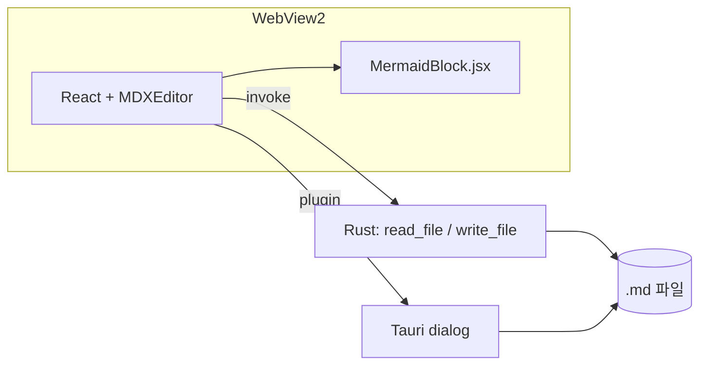
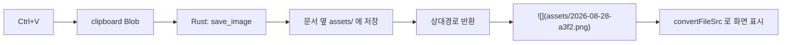
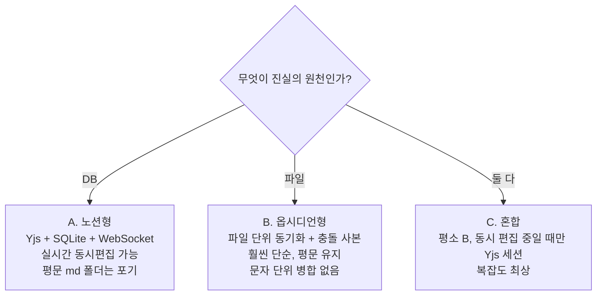

# 변경 이력 (Update History)

MD Editor — 마크다운 위지윅 에디터 데스크톱 앱

---

## 2026-08-28 — v0.1.0 최초 구현

### 개요

마크다운을 **위지윅(WYSIWYG)으로 바로 편집**하는 데스크톱 앱을 처음부터 만들었다.
웹 기술로 에디터를 구현하고 네이티브 셸로 감싸는 2단 구성.

| 구성 | 선택 | 이유 |
|---|---|---|
| 에디터 | MDXEditor 4.x (Lexical 기반) | 마크다운 왕복 정확도가 좋고, 코드블록 렌더러 교체 확장점을 제공 |
| 데스크톱 셸 | Tauri v2 | Windows 11에 WebView2가 내장돼 런타임 동봉 불필요, 설치본 10MB대 |
| 빌드 | Vite 8 + React 19 | — |



### 추가한 기능

**1. 마크다운 위지윅 편집**

- 입력하는 즉시 렌더링. `#` 를 치면 바로 제목이 되고, `-` 는 목록이 된다
- 툴바: 실행취소/재실행, 굵게·기울임·밑줄, 블록 타입 선택, 목록(불릿/번호/체크),
  링크, 표, 코드블록, 구분선
- 툴바 오른쪽 끝에서 **위지윅 / 변경점 비교 / 마크다운 원본** 3가지 모드 전환
- 코드블록은 CodeMirror 문법 강조 (txt, js, ts, python, bash, json, sql)

**2. 파일 열기 / 저장**

- 네이티브 파일 대화상자 사용 (`.md`, `.markdown`, `.mdx`, `.txt`)
- 상단 바에 파일명 표시, 수정된 상태는 주황색 점(●)으로 표시
- 단축키

  | 키 | 동작 |
  |---|---|
  | Ctrl+N | 새로 만들기 |
  | Ctrl+O | 열기 |
  | Ctrl+S | 저장 |
  | Ctrl+Shift+S | 다른 이름으로 저장 |

- 파일 입출력은 Rust 커맨드 `read_file` / `write_file` 두 개로 처리.
  Tauri fs 플러그인 대신 직접 구현해서 권한 스코프 설정을 통째로 없앴다 (12줄)

**3. Mermaid 다이어그램 렌더링** *(플러그인 형태)*

- 코드블록 언어가 `mermaid` 면 텍스트 대신 **다이어그램이 그려진다**
- 툴바 `M` 버튼으로 예제와 함께 삽입
- 블록 우상단 **"소스 편집"** 으로 문법 수정 → 250ms 후 자동 재렌더링
- 문법 오류는 빨간 박스로 표시, 고치면 즉시 복구
- 저장하면 평범한 ` ```mermaid ` 코드블록이라 GitHub 등에서도 그대로 렌더링

  MDXEditor 의 `CodeBlockEditorDescriptor` 확장점을 사용해서
  `src/MermaidBlock.jsx` 한 파일이 곧 플러그인이 되도록 분리했다.
  `App.jsx` 에는 3줄만 추가된다.

  ```js
  codeBlockPlugin({
    defaultCodeBlockLanguage: 'txt',
    codeBlockEditorDescriptors: [mermaidDescriptor],
  }),
  ```

### 고친 문제

**툴바가 아래로 스크롤하면 사라지는 현상**

- 증상: 문서 아래쪽으로 내려가면 상단 툴바가 같이 밀려 올라가 사라짐
- 원인: 툴바는 `position: sticky` 인데, 에디터 본문에 `height: 100%` 를 주는 바람에
  sticky 의 기준 박스가 **화면 높이에서 끝나버렸다.** 한 화면 분량까지는 붙어 있다가
  그 아래로는 기준 박스를 벗어나 같이 스크롤된 것
- 조치: `height: 100%` → `min-height: 100%` 로 변경해 기준 박스를 본문 전체 높이로
  확장. 툴바에 흰 배경과 `z-index: 20` 을 줘서 본문이 비쳐 보이지 않게 함
- 파일: `src/styles.css`

### 빌드 · 실행 스크립트

| 파일 | 용도 |
|---|---|
| `run.bat` | Node / VS C++ 빌드 도구 / Rust 를 순서대로 확인하고 없으면 winget 으로 설치 후 앱 실행 |
| `build-exe.bat` | 배포 파일 생성. `release-out\` 에 설치 프로그램과 포터블 exe 를 모아줌. 로그는 `build-log.txt` |
| `diagnose.bat` | 실행 문제 진단. 결과를 `diagnose-log.txt` 로 출력 |

배포 산출물 2종

- `MD Editor_0.1.0_x64-setup.exe` — 설치 프로그램
- `MD-Editor-portable.exe` — 설치 없이 바로 실행

### 파일 구조

```
md-editor/
├─ src/
│  ├─ App.jsx              에디터 UI + 열기/저장/단축키 (약 120줄)
│  ├─ MermaidBlock.jsx     Mermaid 렌더링 플러그인 + 툴바 버튼
│  ├─ main.jsx             진입점
│  └─ styles.css           상단 바 · Mermaid 블록 · 툴바 고정
├─ src-tauri/
│  ├─ src/lib.rs           read_file / write_file 커맨드
│  ├─ tauri.conf.json      창 크기 · 앱 이름 · 번들 설정
│  ├─ capabilities/        권한 (core + dialog 만)
│  └─ icons/               앱 아이콘
├─ docs/
│  └─ Update_History.md    이 문서
├─ run.bat / build-exe.bat / diagnose.bat
└─ README.md
```

### 검증 내역

헤들리스 브라우저(Chromium)로 실제 동작을 확인한 항목

- [x] 마크다운 단축 입력 — `#` → H1, `**` → 굵게, `-` → 불릿 목록
- [x] Mermaid 툴바 버튼 삽입 → SVG 생성 (노드 22개 확인)
- [x] `graph` → `sequenceDiagram` 으로 소스 변경 시 재렌더링
- [x] Mermaid 한글 라벨 정상 표시
- [x] Source mode 에서 ` ```mermaid ` 펜스로 왕복 저장
- [x] 45문단 입력 후 최하단(스크롤 1205px)까지 내려도 툴바가 상단에 고정
- [x] 콘솔 에러 없음
- [x] Rust `cargo check` 통과 (Linux 타깃 기준)

### 알려진 제약

- **코드 서명 없음** — 배포한 exe 를 처음 실행하면 Windows SmartScreen 경고가 뜬다.
  "추가 정보 → 실행" 으로 넘어갈 수 있으나, 외부 배포 시에는 코드 서명 인증서 필요
- **다크 모드 미대응** — 라이트 테마 고정
- **Mermaid 다이어그램 확대/축소 없음** — 큰 다이어그램은 가로 스크롤로만 볼 수 있다
- **자동 저장 없음** — Ctrl+S 수동 저장
- 첫 빌드 시 Rust 릴리스 컴파일에 5~15분 소요

### 다음에 할 것

아래 **"향후 계획 (기술 검토)"** 절 참고.

---

## 2026-08-30 — v0.2.0 · MD Editor V1 기능

`docs/MD_Editor_Tauri_Planned_Features.md` 의 **MD Editor V1** 두 줄을 구현했다.

### 1. 드래그 앤 드롭 + 탭

- 마크다운 파일을 창에 끌어다 놓으면 **새 탭으로 열린다** (`.md` `.markdown` `.mdx` `.txt`).
  이미 열려 있는 파일이면 새로 열지 않고 그 탭으로 이동한다
- 여러 문서를 탭으로 열고 전환. 탭마다 내용·수정 여부를 따로 들고 있다
- 수정된 탭은 주황색 점(●). 닫을 때 저장하지 않은 변경이 있으면 확인을 묻는다
- 탭 닫기: × 버튼 또는 가운데 클릭
- 단축키 추가: `Ctrl+T` 새 탭, `Ctrl+W` 탭 닫기, `Ctrl+Tab` 다음 탭

  구현 메모 — 탭 전환은 `key={activeId}` 로 에디터를 다시 마운트한다. 하나의 인스턴스에
  `setMarkdown` 을 호출하는 방식보다 상태가 섞일 여지가 없고, 되돌리기 이력도 탭별로 분리된다.

  Tauri 는 OS 레벨에서 파일 드롭을 가로채므로 HTML5 `drop` 이벤트 대신
  `getCurrentWebview().onDragDropEvent()` 를 쓴다. 그 대가로 에디터 안으로 이미지 파일을
  끌어다 놓는 동작은 막힌다 — 이미지는 붙여넣기(`Ctrl+V`)로 넣는다.

### 2. 이미지 붙여넣기 (저장 폴더 동적 설정)

- 에디터에 이미지를 `Ctrl+V` 하면 **문서 옆 `images/` 폴더가 자동 생성되고**
  파일이 저장된 뒤 마크다운 링크가 삽입된다

  ```markdown
  
  ```

- 파일명은 `YYYYMMDD-HHMMSS-<난수>.<확장자>` 로 충돌하지 않게 생성
- **저장 폴더는 상단 `⚙` 버튼에서 언제든 바꿀 수 있다** (설정은 localStorage 에 유지)

  | 설정값 | 저장 위치 |
  |---|---|
  | `images` (기본) | 문서 옆 `images/` |
  | 비움 또는 `.` | 문서와 같은 폴더 |
  | `assets/img` | 문서 옆 `assets/img/` (중첩 폴더도 생성됨) |

**WebView 의 `file://` 제약 처리**

WebView2 는 보안상 `file://` 을 직접 읽지 못한다. 그래서 표현을 둘로 나눴다.

- **파일에 기록되는 것**: 상대 경로 (`images/xxx.png`) — 다른 편집기·GitHub 에서 그대로 보임
- **화면에 그릴 때만**: Rust 로 파일을 읽어 data URI 로 변환 (`imagePreviewHandler`, 결과는 캐시)

asset 프로토콜 스코프 설정 대신 이 방식을 택했다. 설정 파일을 건드리지 않아 확실히 동작하고,
저장되는 마크다운이 오염되지 않는다. 문서가 커지면 asset 프로토콜로 옮기는 것을 재검토한다.

### 추가된 Rust 커맨드

| 커맨드 | 용도 |
|---|---|
| `save_binary_b64(path, b64)` | 붙여넣은 이미지 저장. 상위 폴더가 없으면 생성 |
| `read_binary_base64(path)` | 화면 표시용으로 이미지 바이트를 넘김 |

`base64 = "0.22"` 의존성 추가.

### 파일 구성 변경

`App.jsx` 가 비대해져 역할별로 나눴다.

```
src/App.jsx           탭 관리 · 파일 열기/저장 · 드래그앤드롭 · 단축키 · 설정 UI
src/Editor.jsx        MDXEditor 플러그인 · 툴바 구성
src/images.js         이미지 저장 경로 계산 · 저장 · 미리보기 변환
src/settings.js       설정 로드/저장
src/tauriBridge.js    Tauri 환경 판별 (브라우저에서도 UI 가 뜨도록)
```

### 검증 내역

- [x] 초기 탭 1개, `+` 로 탭 추가
- [x] 탭 전환 후에도 각 탭 내용 보존 (탭1/탭2 교차 확인)
- [x] 수정 시 dirty 표시(●) 표시
- [x] 탭 닫기 시 확인 후 제거
- [x] 설정 기본값 `images`, 변경 시 localStorage 반영
- [x] `.` 입력 시 "문서와 같은 폴더" 로 해석
- [x] 이미지 붙여넣기 → `` 삽입까지 파이프라인 동작
- [x] 경로 조합 6종 검증 (Windows/POSIX, 빈값, `.`, `./assets/`, 중첩)
- [x] `cargo check` 통과 · 프론트엔드 빌드 통과 · 콘솔 에러 없음

### 남은 것

- 이미지 크기 조정·압축, 중복 이미지 hash 검사
- 문서 삭제 시 고아 이미지 정리
- 자동 저장 (계획서의 MDSyncNote 단계)

---

## 2026-08-30 — v0.3.0 · 모노레포 전환 + MDSyncNote 골격

MD Editor 를 V2(MDSyncNote)로 확장하기 위해, 두 앱이 소스를 공유하면서도
각각 별도 exe 로 빌드되는 구조로 바꿨다.

### 왜 지금인가

전체 코드가 530줄일 때가 구조를 바꾸기 가장 싼 시점이었다. V2 에 트리·SQLite·동기화가
들어간 뒤에 나누면 훨씬 비싸진다. 단순 복사(fork)는 Mermaid 버그 하나를 두 번 고쳐야 하고
두 벌이 갈라지기 시작하면 되돌리기 어려워 배제했다.

### 구조

```
md-workspace/
├─ packages/editor-core/    공유 JS — Editor.jsx, MermaidBlock.jsx, images.js,
│                           settings.js, tauriBridge.js, editor.css
├─ crates/md-core/          공유 Rust — read_file, write_file, save_binary_b64,
│                           read_binary_base64, read_dir
└─ apps/
   ├─ md-editor/            단일 창 에디터 (탭 · 드래그앤드롭) — App.jsx 만 고유
   └─ md-sync-note/         저장소 트리 + 노트 뷰 (V2)
```

- **npm workspaces** — `@md/editor-core` 를 두 앱이 참조. 고치면 즉시 양쪽 반영
- **cargo workspace** — `target/` 을 공유하므로 두 번째 앱 빌드가 훨씬 빠르다
- `App.jsx` 는 공유하지 않는다. 두 앱의 레이아웃이 근본적으로 다르기 때문

**구현 함정** — `#[tauri::command]` 는 보조 매크로(`__cmd__*`)를 만드는데, 이걸 크레이트
루트에 두면 이름이 충돌해 컴파일이 안 된다. 반드시 `md_core::commands` 처럼 별도 모듈에
넣고 `generate_handler![md_core::commands::read_file, ...]` 로 등록해야 한다.

### MDSyncNote 골격 (신규)

계획서 4·3.2 절에 해당하는 첫 단계를 만들었다.

- 왼쪽 **아코디언 저장소 트리** — 폴더를 저장소로 등록/제거, 목록은 localStorage 에 유지
- **지연 로딩** — 폴더를 펼칠 때만 `read_dir` 호출. 루트에서 전체를 재귀 스캔하지 않는다
- 마크다운만 표시(`.md` `.markdown` `.mdx`), 숨김 항목 제외, 폴더 먼저 정렬
- 파일 클릭 → 오른쪽에 열림. 활성 문서 하이라이트
- **자동 저장** — 기본 60초, 변경이 있을 때만. 설정에서 초 단위 조정(0이면 사용 안 함)
- 오른쪽 뷰는 md-editor 와 **완전히 같은 에디터** (Mermaid·이미지 붙여넣기 포함)
- 저장소 접근은 `listDir(repo, path)` 한 곳을 거치므로, WebDAV·FTP 는 여기서 갈라내면 된다

아직 없는 것: 폴더/노트 생성·이름변경·삭제, git 자동 commit, sync, SQLite, FTS.

### 실행 방법 변경

```bat
npm install              :: 루트에서 한 번

run-md-editor.bat        :: 또는  npm run editor
run-md-sync-note.bat     :: 또는  npm run sync-note
build-all.bat            :: 두 앱 배포 파일을 release-out\ 에
```

### 검증 내역

- [x] `npm install` (워크스페이스 382 패키지) · 두 앱 vite build 통과
- [x] `cargo check --workspace` — md-core / md-editor / md-sync-note 전부 통과
- [x] MDSyncNote: 저장소 추가 → 트리 2단계 펼침 → 파일 열기 → 활성 표시
- [x] MDSyncNote 안에서 공유 Mermaid 툴바 버튼 존재 확인 (공유 패키지 연결 확인)
- [x] md-editor 회귀 — 탭바·위지윅 정상, 콘솔 에러 없음

### v0.3.1 — 실행 스크립트 수정 (2026-08-30)

**증상**: `run-md-editor.bat` 실행 시 오류.

**원인**: 모노레포 전환 때 기존 `md-editor/node_modules` 를 워크스페이스 루트로 옮겼는데,
그 안에는 워크스페이스 링크(`node_modules/@md/editor-core`)가 없었다. 그런데 스크립트가
`if not exist node_modules ( npm install )` 로 **폴더 유무만** 보고 설치를 건너뛰어,
vite 가 `@md/editor-core` 를 찾지 못하고 실패했다.

```
Rolldown failed to resolve import "@md/editor-core/editor.css" from ".../src/main.jsx"
```

**조치** — `run-md-editor.bat` / `run-md-sync-note.bat` / `build-all.bat` 공통

- 폴더 유무가 아니라 **워크스페이스 링크 유무**(`node_modules\@md\editor-core\package.json`)로 판단
- `npm install` 을 매번 실행 (이미 맞으면 3초 내로 끝난다)
- 그래도 링크가 없으면 `node_modules` 를 지우고 재설치
- 모든 출력을 `run-log.txt` / `build-log.txt` 에 남기고, 실패 시 마지막 30줄을 화면에 표시

**검증** — 리눅스 환경에서 동일 상황(링크만 삭제)을 재현해 같은 오류를 확인하고,
`npm install` 로 복구되는 것과 이후 두 앱 빌드가 통과하는 것을 확인했다.
추가로 **Xvfb 가상 디스플레이에서 실제 Tauri 앱 두 개를 실행**해
창이 정상적으로 뜨고 UI 가 렌더링되는 것까지 확인했다 (`cargo build` → 바이너리 직접 실행).


---

## 2026-08-30 — v0.4.0 · 파일 연결 · 상단 드롭존 · 저장소 Git

### 1. MD Editor — 상단에 놓으면 열리는 드롭존

전에는 창 어디에 놓아도 파일이 열렸다. 이제 **제목줄+탭바(`.topzone`)** 에 놓았을
때만 열린다.

- 드래그 중에 드롭존이 파랗게 강조되고, 본문 위에서는 "↑ 상단에 놓으세요" 로 바뀐다
- 본문에 놓으면 아무 일도 하지 않고 안내만 띄운다
- 마크다운이 아닌 파일을 놓으면 그 사실을 알려준다

Tauri 는 OS 레벨에서 드롭을 가로채므로 HTML5 `dragover`/`drop` 이 오지 않는다.
`onDragDropEvent` 가 주는 **좌표를 드롭존 사각형과 직접 비교**하는 수밖에 없다.
좌표는 물리 픽셀이라 `devicePixelRatio` 로 나눠 CSS 픽셀에 맞춘다
(`apps/md-editor/src/useFileDrop.js`).

이 구조는 나중에 "본문에 이미지를 놓으면 삽입" 을 붙일 자리이기도 하다.
지금은 의도적으로 열어 두지 않았다 — 요청 범위가 아니었고, 삽입 위치(커서) 문제가
따로 있다.

### 2. MD Editor — Windows 파일 연결

탐색기에서 `.md` 를 우클릭해 여는 길을 열었다. 설정(⚙) → **Windows 연결** →
[등록] / [해제], 또는 `md-editor.exe --register`.

- `.md` `.markdown` `.mdx` 우클릭 메뉴에 "MD Editor로 열기"
- 우클릭 → 연결 프로그램 목록에 MD Editor
- 명령줄로 받은 파일은 창이 뜬 뒤 `startup_file` 로 물어봐서 연다
- 모두 `HKCU` 라 관리자 권한이 필요 없고, 기존 `.md` 연결을 빼앗지 않는다

**기본 앱 지정은 프로그램이 못 한다.** Win8 부터 `UserChoice` 에 비공개 해시가
붙어 사용자가 직접 골라야만 한다. 자세한 내용·레지스트리 키·NSIS 연동은
[Windows_File_Association.md](Windows_File_Association.md).

### 3. MDSyncNote — 저장소 Git

계획서의 Revision History 를 직접 만들지 않고 git 으로 대체하는 첫 걸음.

- 저장소 트리 머리에 git 상태 줄 — `⎇ master`, 변경 개수, 아니면 **[Git 초기화]** 버튼
- 초기화는 `git init` + 첫 커밋까지 한 번에
- **자동 저장이 실제로 파일을 썼을 때만 커밋한다** (변경이 없으면 커밋도 없다)
- 설정에 "저장할 때 git commit" 체크박스 (기본 켬)
- 커밋 메시지: `a.md 저장 (2026-08-30 19:48)`

#### git2 대신 git 실행 파일을 부른다

| | git2 (libgit2) | **`git` CLI (선택)** |
|---|---|---|
| 빌드 | C 라이브러리를 함께 컴파일 | 의존성 0 |
| 자격증명·훅·gitignore | 따로 구현 | 사용자의 git 설정 그대로 |
| 전제 | 없음 | git 설치 필요 |

git 이 없으면 `has_git: false` 로 돌려주고 UI 에서 git 줄 자체를 숨긴다.
동기화(push/pull)까지 가면 자격증명 헬퍼를 그대로 쓸 수 있는 쪽이 유리하다.

#### 남의 저장소를 휩쓸지 않기

등록한 폴더가 이미 다른 git 저장소의 **하위 폴더**일 수 있다. 이때

- 새로 `git init` 하지 않는다 (중첩 저장소는 사고의 근원) — 상위 저장소 경로를 보여준다
- `add`·`status`·`commit` 을 모두 `-- .` 로 **등록한 폴더 아래로 범위를 좁힌다**

그래서 저장소 루트에 있는 다른 작업물이 노트 저장 커밋에 딸려 들어가지 않는다.
이 동작은 테스트로 못 박아 뒀다.

#### 커밋 이름

`user.name` / `user.email` 이 없으면 커밋이 실패한다. 없을 때만 **그 저장소 안에만**
`MDSyncNote <mdsyncnote@localhost>` 를 넣는다. 전역 설정은 건드리지 않는다.

### 추가된 Rust 커맨드

| 커맨드 | 앱 | 내용 |
|---|---|---|
| `startup_file` | MD Editor | 명령줄 인자 중 마크다운 파일 |
| `assoc_status` / `assoc_register` / `assoc_unregister` | MD Editor | HKCU 파일 연결 |
| `git_status` / `git_init` / `git_commit` | MDSyncNote | 저장소별 로컬 git |

둘 다 한 앱에만 필요하므로 `md-core` 가 아니라 **앱 크레이트**에 뒀다
(`win_assoc.rs`, `cli.rs`, `git.rs`).

### 파일 구성 변경

App.jsx 가 200줄을 넘어 역할별로 나눴다.

```
apps/md-editor/src/
  App.jsx           215줄  탭 상태 + 조립
  useFileDrop.js     52줄  상단 드롭존 좌표 판정
  useShortcuts.js    24줄  Ctrl 단축키
  TabBar.jsx         23줄
  SettingsBar.jsx    27줄
  WinAssoc.jsx       55줄  파일 연결 등록 UI
  paths.js            7줄  열 수 있는 확장자 · 파일명
apps/md-sync-note/src/
  git.js             33줄  git 커맨드 래퍼 + 커밋 메시지
  RepoTree.jsx      133줄  (+ GitLine)
```

### 검증 내역

| 대상 | 방법 | 결과 |
|---|---|---|
| 두 앱 프론트엔드 빌드 | `vite build` | 통과 |
| Rust 워크스페이스 | `cargo check --workspace` | 통과 |
| git 초기화·커밋·중첩 저장소 | `cargo test -p md-sync-note` (3건) | 통과 |
| 파일 연결 등록/해제 | `md-editor.exe --register` 후 `reg query`, 해제 후 원상복구 확인 | 통과 |
| 명령줄 인자로 실행 | 빌드한 exe 에 `.md` 경로를 주고 실행 | 창 정상 |
| 인자 파일이 탭으로 열림 · 드롭존 배치 · 연결 UI | 헤들리스 브라우저 (Tauri IPC 스텁) 8건 | 통과 |
| git 초기화 버튼 · 저장→커밋 · 자동커밋 끄기 | 헤들리스 브라우저 12건 | 통과 |

**아직 사람 손으로 확인해야 하는 것** — 실제 드래그앤드롭(OS 이벤트라 스텁 불가),
탐색기 우클릭 메뉴 모양.

### 남은 것

- 파일을 여러 개 열면 창이 여러 개 뜬다 → `tauri-plugin-single-instance`
- 본문에 이미지 드롭 → 삽입
- 커밋 이력 보기 / 되돌리기 UI (지금은 커밋만 쌓인다)

---

## 2026-08-30 — v0.4.1 · 표 셀 안 Alt+Enter 줄바꿈

표 셀 안에서 **Alt+Enter** 를 누르면 커서 자리에서 줄이 나뉜다. 그냥 Enter 는
예전대로 아래 셀로, Shift+Enter 는 위 셀로 이동한다.

공유 에디터(`packages/editor-core`)에 넣었으므로 **MD Editor 와 MDSyncNote 에
동시에** 적용된다. 구현은 `packages/editor-core/src/tableCellBreak.jsx` 한 곳.

### 파일에는 `<br />` 로 적는다

GFM 표는 셀 안에 진짜 개행을 담지 못한다. lexical 의 기본 줄바꿈 노드를 그대로
저장하면 `&#xA;` 로 이스케이프되어 **어느 뷰어에서도 줄이 나뉘지 않는다.** 그래서
`<br />` 로 쓴다 — GitHub · VS Code · Obsidian 이 모두 알아본다.

```
| 항목 | 설명            |
| -- | ------------- |
| 가  | 첫줄<br />둘째줄 |
```

### 구현에서 걸렸던 것 두 가지

**1. Enter 를 MDXEditor 보다 먼저 받아야 한다.** 셀 하나하나가 독립된 lexical
에디터고, MDXEditor 가 Enter 를 `COMMAND_PRIORITY_CRITICAL` 로 가로채 "아래 셀로
이동" 에 쓴다. 같은 큐의 **맨 앞에 꽂히는** `COMMAND_PRIORITY_BEFORE_CRITICAL` 로
등록해야 등록 순서와 관계없이 먼저 돌아간다.

**2. `<br />` 를 GenericHTMLNode 로 두면 커서가 깨진다.** MDXEditor 의 기본 HTML
처리는 자식 없는 빈 인라인 요소를 만든다. 그 뒤에는 커서가 서지 못해서, 줄바꿈
뒤에 이어 친 글자가 **위쪽 줄로 들어간다.** 그래서 `LineBreakNode` 를 상속한 전용
노드(`md-html-br`)를 만들고 가져오기/내보내기 방문자를 따로 붙였다. 커서 처리는
lexical 이 알아서 한다.

타입을 따로 판 이유는, 그냥 `LineBreakNode` 로 두면 본문에서 Shift+Enter 로 만든
기존 줄바꿈까지 전부 `<br />` 로 다시 쓰여 **건드리지도 않은 문서가 바뀌기
때문이다.** 전용 타입이면 `<br />` ↔ 전용 노드 로 왕복이 닫히고 나머지는 그대로다.

### 확인한 것

헤들리스 브라우저(playwright)로 실제 앱을 조작해 확인했다.

- 셀 안 Alt+Enter → 커서 자리에 줄바꿈, 소스에 `첫줄<br />둘째줄`
- 그냥 Enter 는 아래 셀로 이동 (기존 동작 유지), 표 밖 Alt+Enter 는 문단 나누기
- `<br />` 가 들어 있는 문서를 불러와도 줄바꿈으로 보이고, 그 뒤에 이어 쓰기 정상
- 빈 셀 · 머리글 셀에서도 동작, 되돌리기 정상, 콘솔 오류 없음

### 알아둘 제약 (이번 변경과 무관한 기존 문제)

- ~~닫는 태그가 없는 `<br>` 이 들어있는 파일은 MDXEditor 가 파싱하지 못한다~~
  → v0.4.2 에서 해결 (열 때 `<br />` 로 맞춰 준다)
- 본문의 하드브레이크(줄 끝 백슬래시 / 공백 두 칸)는 저장하면 소프트브레이크로 바뀐다

### 배포 (v0.4.1 시점)

버전이 파일마다 0.3.0/0.4.0 으로 갈려 있어 **전부 0.4.1 로 맞췄다**
(루트·두 앱·editor-core 의 package.json, 세 Cargo.toml, 두 tauri.conf.json).

설치본 없이 exe 두 개만 만드는 **`build-portable.bat`** 을 추가했다.
`tauri build --no-bundle` 이라 NSIS 를 받지 않아 그만큼 빠르다. 설치 프로그램까지
필요하면 기존 `build-all.bat`.

```
release-out\MD-Editor-portable.exe     7.7 MB
release-out\MDSyncNote-portable.exe    7.7 MB
```

exe 하나가 전부다 — WebView2 는 Windows 11 에 내장돼 있어 동봉할 것이 없다.
릴리스 프로필은 `opt-level = "s"` + LTO + strip 이라 빌드에 앱당 5분쯤 걸린다.

**확인한 것**: 두 exe 실행(창 정상), 번들에 `md-html-br`(Alt+Enter) 포함,
파일 경로를 인자로 준 실행. **코드 서명은 없어서** 처음 실행 시 SmartScreen 경고가
뜬다(추가 정보 → 실행).

---

## 2026-08-30 — v0.4.2 · `<br>` 이 든 파일 열기

실제로 걸렸다.

```
Error parsing markdown: Expected a closing tag for `<br>` (88:115-88:119)
before the end of `tableData`.
```

### 무엇이 문제였나

MDXEditor 는 마크다운을 **MDX 로** 읽는다. MDX 에서 `<br>` 은 JSX 여는 태그이므로
닫는 태그를 기다리다 파싱이 통째로 실패한다. 표 셀 안에 `<br>` 을 쓰는 것은 GFM 에서
아주 흔한 관행이고 GitHub·VS Code·Obsidian 은 문제없이 읽는다. 즉 **파일이 잘못된
게 아니라 이 에디터만 못 읽는다.**

파서 설정으로는 끌 수 없다. mdx-jsx 확장이 MDXEditor 코어의 `fromMarkdown` 호출에
박혀 있고 빼는 API 가 없다(`dist/importMarkdownToLexical.js`). 표 플러그인처럼
갈아끼우는 수밖에 없는데, 그건 이 문제에 비해 너무 크다.

### 어떻게 고쳤나

**파일을 열 때 `<br>` → `<br />` 로 맞춘다.** 두 표기는 어느 도구에서나 결과가 같다.
`packages/editor-core/src/normalizeMarkdown.js` 한 곳이고, 두 앱이 파일을 읽는
지점(`openPath`, `openDoc`)에서 부른다.

건드리지 않는 것 — 여기가 이 함수의 전부다.

| 대상 | 왜 |
|---|---|
| 코드블록(``` ~~~) 안 | `<br>` 을 설명하는 예제 코드를 고쳐 버리면 안 된다 |
| 인라인 코드 안 | 같은 이유 |
| 이미 `<br />` · `<br/>` | MDX 가 알아본다. 굳이 다시 쓸 이유가 없다 |
| 속성이 붙은 `<br class="x">` | 속성을 지우거나 옮기는 판단은 하지 않는다. 드물고, 원본 모드에서 고치면 된다 |

`<hr>` 도 같은 이유로 깨지므로 함께 처리한다. 대상 태그는 상수 하나(`VOID_TAGS`)다.

**파일은 열었다고 바뀌지 않는다.** 화면에만 반영되고, 실제로 디스크가 바뀌는 시점은
사용자가 저장할 때다. 몇 개를 고쳤는지 화면에 알려 준다
(MD Editor 는 안내 토스트, MDSyncNote 는 상태줄).

### 검증

| 대상 | 방법 | 결과 |
|---|---|---|
| 정규화 규칙 — 표·대문자·공백·자가닫힘·속성·인라인코드·코드블록·펜스 두 개 | 단위 테스트 14건 | 통과 |
| `<br>` 든 표 파일 열기 — 오류 없음, 표 렌더, 줄바꿈 뒤 글자, 안내 표시, 인라인 코드 보존, 콘솔 오류 없음 | 헤들리스 브라우저 7건 | 통과 |
| 두 앱 빌드 | `vite build` | 통과 |

---

## 2026-08-30 — v0.4.3 · `<` 파싱 실패 · 열기만 해도 수정됨으로 잡히던 문제

실사용 문서(`LGE멕시코_MES_테스트케이스.md`)에서 두 가지가 한꺼번에 드러났다.

```
Error parsing markdown: Unexpected character `-` (U+002D) before name,
expected a character that can start a name, such as a letter, `$`, or `_`.
```

그리고 "에디터에서 본 것과 PDF 로 뽑은 것이 다르다".

### 1. 태그가 아닌 `<` 를 못 읽던 문제 (해결)

v0.4.2 에서 `<br>` 만 고쳤는데, 원인은 더 넓었다. **MDX 에서 `<` 는 전부 JSX 의
시작**이라 태그로 이어지지 않으면 파싱이 통째로 실패한다. 실제 파서로 확인한 목록:

| 원본 | 결과 |
|---|---|
| `A <- B` · `x <-- y` | 실패 — `-` 는 태그 이름을 시작할 수 없다 |
| `2 <3` · `p<0.05` | 실패 — 숫자도 마찬가지 |
| `a <= b` | 실패 — `=` 도 마찬가지 |
| `x<y` | 실패 — 태그가 열리고 `>` 가 안 나온다 |
| `<https://example.com>` · `<user@example.com>` | 실패 — MDX 는 자동링크를 모른다 |
| `A < B` · `x < 1` | 통과 — 공백이 있으면 태그로 보지 않는다 |
| `<br />` · `<b>x</b>` · `<!-- 주석 -->` | 통과 |

그래서 여는 태그로 **읽힐 수 없는 `<` 만** `&lt;` 로 바꾼다. 판정은 "여기서부터
온전한 태그·닫는태그·주석이 시작되는가" 한 가지다(`normalizeMarkdown.js`).
자동링크는 의미를 잃지 않게 `[url](url)` · `[mail](mailto:mail)` 로 바꾼다.
`&lt;` 는 GitHub·VS Code·Obsidian 모두 `<` 로 보여 준다.

검증은 **정규화한 결과를 MDXEditor 와 같은 확장 구성의 실제 파서에 다시 통과**시키는
방식으로 했다. 출력 문자열만 비교하면 "고쳤는데 여전히 안 열리는" 경우를 놓친다.

### 2. 열기만 해도 수정됨으로 잡히던 문제 (해결) ← PDF 가 달랐던 진짜 원인

MDXEditor 는 파일을 연 직후 마크다운을 자기 표기법으로 다시 쓰고 `onChange` 를
부른다. 두 앱은 그 두 번째 인자(`initialMarkdownNormalize`)를 **무시하고 있었다.**
그래서

```
파일 열기 → 곧바로 "수정됨(●)" → MDSyncNote 자동 저장(기본 60초)
         → 손대지도 않은 파일이 MDXEditor 표기법으로 다시 쓰인다
```

이때 `p.62~65` 가 `p.62~~65` 로, `BUFFER_TYPE` 이 `BUFFER\_TYPE` 으로 바뀐다.
**에디터에서 본 것과 PDF 가 다른 이유가 이것이다** — 파일 자체가 바뀌어 있었다.

이제 초기 정규화는 수정으로 치지 않는다. **사용자가 실제로 편집하기 전에는 파일이
바뀌지 않는다.** (편집하면 여전히 정상적으로 수정 표시가 뜬다 — 회귀 검사 포함)

### 3. 남은 문제 — 저장하면 MDXEditor 표기법이 적용된다

한 번이라도 편집해서 저장하면, 그 파일은 MDXEditor 의 직렬화 규칙대로 다시 쓰인다.
이건 **고치지 못했고, 값싼 해법도 없다.**

| 증상 | 왜 |
|---|---|
| `p.62~65` → `p.62~~65` | GFM 취소선은 물결 하나로도 성립한다. `~65 (항목 1~` 가 취소선으로 읽히고, 저장할 때 `~~` 로 다시 쓰인다. **GitHub 도 똑같이 읽는다** |
| `BUFFER_TYPE` → `BUFFER\_TYPE` | 직렬화기가 오해를 막으려 밑줄·별표를 이스케이프한다 |
| PDF·인쇄에서 `\` 가 그대로 보임 | 그 도구가 마크다운 이스케이프를 풀지 않기 때문. 파일에는 원래 없던 `\` 가 들어 있다 |

**왜 못 고치나**

- 단일 물결 취소선은 `gfmStrikethrough({ singleTilde: false })` 로 끌 수 있지만,
  MDXEditor 코어가 기본값으로 등록하고 **확장은 더하기만 되고 빼기가 안 된다**
- 이스케이프 양은 `mdast-util-to-markdown` 이 정한다. `toMarkdownOptions` 로 기호
  선택(`*` vs `_`)은 바꿔도 **이스케이프를 줄이는 옵션은 없다**
- 저장할 때 역슬래시를 걷어내는 후처리는 가능하지만, 진짜로 필요한 이스케이프까지
  지우면 문서가 깨진다. 추측으로 지울 문제가 아니다

**지금 쓸 수 있는 방법**

- 범위를 뜻하는 물결은 원본에서 `\~` 나 `&#126;` 로 쓰거나 백틱으로 감싼다
  (`` `62~65` ``). 우리가 자동으로 바꾸지 않는 이유는 **진짜 취소선을 의도한 문서를
  망가뜨리기 때문**이다
- 편집하지 않을 문서는 열어만 두면 파일이 그대로다 (2번 수정의 효과)

### 검증

| 대상 | 방법 | 결과 |
|---|---|---|
| 정규화 규칙 20종 + 정규화 결과를 실제 MDX 파서로 재파싱 | 단위 테스트 | 통과 |
| 원본이 실제로 깨지는지 (전제 확인) 5종 | 단위 테스트 | 통과 |
| `<!-- 주석 -->` 보존 (MDXEditor comment 확장 포함) | 단위 테스트 | 통과 |
| `A <- B` 든 파일 열기 · 표 렌더 · 열었을 때 수정표시 없음 · 편집하면 수정표시 | 헤들리스 브라우저 5건 | 통과 |
| 두 앱 빌드 | `vite build` | 통과 |

---

## 2026-08-31 — v0.4.4 · "태그처럼 생긴 것"과 진짜 HTML 태그를 가른다

v0.4.3 으로도 실제 문서(`LGE멕시코_MES_테스트케이스.md`)가 열리지 않았다.

```
Error parsing markdown: Unexpected character `2` (U+0032) before member name,
expected a character that can start an attribute name ...
```

### 무엇을 놓쳤나

그 문서는 **XML 로그를 표 셀 안에 그대로 붙여 넣고** 있었다.

```
| <GROUP NAME="0" VALUE="20260526034836_group_barcode_0"> |
| <P_20260525161121.222>Line : 1 Lane : 1 WorkFace : BOT ... |
| </root> |
```

v0.4.3 의 규칙은 "온전한 태그 모양이면 통과"였다. 위의 것들은 전부 태그 모양이라
그대로 통과했고, MDX 는 그것들을 JSX 로 읽으려다 실패했다.

- `<P_20260525161121.222>` — `.` 뒤가 숫자라 JSX 멤버 이름이 될 수 없다
- `<GROUP ...>` — 닫는 태그가 없어 문단 끝까지 찾다 실패한다
- `</root>` — 여는 태그 없이 닫는 태그만 있다

**그건 마크업이 아니라 보여 줄 텍스트였다.** 판정 기준이 틀렸던 것이다.

### 어떻게 고쳤나

두 가지를 더한다.

1. **실제 HTML 태그 이름만 태그로 인정한다.** 목록(`HTML_TAGS`)에 없는 이름은
   텍스트로 본다. 마크다운 문서에 들어갈 수 있는 마크업은 HTML 이지 임의의 XML 이
   아니다. 이름 뒤에는 공백·`/`·`>` 만 올 수 있게 해서 `<P_2026...>` 처럼 이름이
   이어지는 것도 걸러낸다
2. **짝이 맞지 않는 태그는 텍스트로 본다.** 문서 전체에서 여는/닫는 개수를 세어
   맞지 않는 이름(`<div>` 만 있고 `</div>` 가 없는 경우 등)은 태그로 취급하지 않는다.
   MDX 는 짝이 안 맞으면 어차피 파싱에 실패한다

덤으로 void 태그 처리를 `` · `<input>` 등으로 넓혔다. `` 도
MDX 에서는 자가닫힘이어야 한다.

### 검증 — 실제 파일로

이번에는 **문제가 난 파일 자체**를 재료로 썼다.

| 대상 | 방법 | 결과 |
|---|---|---|
| 실제 파일(115KB, 1711줄) 파싱 | 정규화 전/후를 실제 MDX 파서에 통과 | 전 실패 → **후 성공** (`<` 435개 교정) |
| 실제 파일을 앱에서 열기 | 헤들리스 브라우저 | 오류 없음 · 표 24개 렌더 · XML 이 텍스트로 보임 · 수정 표시 없음 · 콘솔 오류 없음 |
| 규칙 28종 (XML 로그 · 진짜 HTML · 짝 안 맞는 태그 · 자동링크 · 코드블록 예외) | 단위 테스트 + 결과 재파싱 | 통과 |
| 원본이 실제로 깨지는지 (전제) 8종 | 단위 테스트 | 통과 |

큰 문서는 렌더가 오래 걸려 안내 문구가 뜨자마자 사라지던 것도 함께 고쳤다(6초).

---

## 2026-08-31 — v0.5.0 · File Watcher (MD Editor)

계획서 8절, 다음 작업 2순위. **밖에서 파일이 바뀌면 알아채고 사용자가 고른다.**

### 동작

| 상황 | 어떻게 |
|---|---|
| 열어 둔 파일이 밖에서 바뀜, **내 편집분 없음** | 묻지 않고 조용히 다시 읽는다. 잃을 게 없으니 물을 것도 없다 |
| 열어 둔 파일이 밖에서 바뀜, **내 편집분 있음** | 대화상자로 고르게 한다 — **바뀐 파일 불러오기** / **내 내용으로 덮어쓰기** |

"다른 이름으로 저장" 은 **일부러 넣지 않았다**. 선택지가 셋이 되면 매번 고민이
늘고, 실제로 필요한 결정은 "누구를 남길까" 둘뿐이다.

다시 읽을 때는 탭의 `key` 를 바꿔 에디터를 **다시 마운트**한다. 한 인스턴스에 새
내용을 밀어 넣으면 되돌리기 이력이 엉킨다(CLAUDE.md 규약).

### 만들면서 정한 것 두 가지

**폴더를 감시한다, 파일이 아니라.** 많은 편집기가 "임시 파일에 쓰고 이름 바꾸기"
로 저장한다. 파일 자체를 감시하면 원본이 지워졌다 새로 생기는 것으로 보여 **감시가
조용히 죽는다.** 상위 폴더를 감시하고 파일 이름으로 걸러낸다. 이 전제가 맞는지
테스트로 못 박아 뒀다(`폴더를_감시하면_그_안의_파일_저장이_잡힌다`).

**내용 해시로 판단한다, 시간이 아니라.** "우리가 저장한 것"과 "밖에서 바뀐 것"을
시간차나 이벤트 종류로 가르려 하면 반드시 틀린다. 마지막으로 아는 내용의 해시를
들고 있다가 이벤트가 오면 파일을 다시 읽어 비교한다. 같으면 알리지 않는다.
저장 직후 돌아오는 자기 이벤트도, 편집기가 같은 내용을 다시 쓴 경우도 함께 걸러진다.
`write_file` 이 쓴 내용을 감시기에 알려 주는 한 줄이 그 연결이다.

### 구조

```
crates/md-core/src/watcher.rs   174줄  notify 8 · watch_file / unwatch_file
apps/md-editor/src/
  useFileWatch.js                44줄  탭 목록과 감시 목록을 맞춘다
  useExternalChanges.js          58줄  다시 읽기 · 덮어쓰기 · 충돌 목록
  ReloadDialog.jsx               33줄  선택 대화상자
```

`md-core` 에 둔 이유는 MDSyncNote 도 같은 것이 필요하기 때문이다(계획서 8절).
지금은 MD Editor 만 커맨드를 등록해 쓴다.

App.jsx 가 다시 200줄을 넘어 파일 열기·저장을 `useFiles.js` 로 분리했다.

### 검증

| 대상 | 방법 | 결과 |
|---|---|---|
| 해시 판단 (같음/다름/두 번 알림 방지/지워짐/자기 저장) | `cargo test -p md-core` 4건 | 통과 |
| **폴더 감시로 파일 저장이 잡히는가** (notify 배선) | 임시 폴더에 실제 쓰기 | 통과 |
| 감시 등록·해제, 편집분 없을 때 조용히 다시 읽기, 있을 때 대화상자, 덮어쓰기, 불러오기, 탭 닫을 때 해제 | 헤들리스 브라우저 13건 | 통과 |
| 실제 exe 로 파일 열고 밖에서 수정 | 수동 실행 | 앱 정상 |

### 남은 것

- **MDSyncNote 에는 아직 안 붙였다.** 커맨드는 공유 크레이트에 있으니 등록 + UI 만
  하면 된다. 자동 저장이 있어 충돌 처리 방식은 조금 다르게 가야 한다
- 파일이 **지워졌을 때**는 알리지 않는다(편집기가 저장 중일 수 있어 구분이 어렵다)

---

## 향후 계획 (기술 검토)

*검토일: 2026-08-28 · 요청하신 기능들을 구현 난이도와 선행 조건 기준으로 정리*

### 요약

| # | 기능 | 난이도 | 핵심 쟁점 |
|---|---|:---:|---|
| 1 | 복사·붙여넣기 / 이미지 붙여넣기 | 낮음 | WebView 는 `file://` 를 못 읽는다 → asset 프로토콜 필요 |
| 2 | 왼쪽 파일 트리 | 낮음~중 | 지연 로딩, 파일 변경 감시, 상태 관리 도입 시점 |
| 3 | 다중 저장소 | 중 | "서버 경로"의 정체를 먼저 정해야. 인터페이스 설계가 8할 |
| 4 | 동기화 · 변경관리 | **매우 높음** | **파일이 진실인가, DB 가 진실인가** — 이 결정이 나머지를 지배 |
| 5 | 전문 검색 (FTS) | 중 | 기본 토크나이저는 한국어에 사실상 무용 |

---

### 1. 복사·붙여넣기 / 이미지 붙여넣기

텍스트 복붙은 Lexical 기본 기능으로 이미 동작한다. 실제 과제는 **이미지 붙여넣기**다.

**흐름**



MDXEditor 의 `imagePlugin({ imageUploadHandler })` 가 붙여넣기·드롭을 모두 받아준다.
핸들러가 Blob 을 받아 저장 후 **문서 기준 상대 경로**를 돌려주면 된다.

**함정 — 여기서 대부분 막힌다**

WebView2 는 보안상 `file://` 을 직접 로드하지 못한다. 저장은 됐는데 화면에 깨진 이미지만
나오는 상황이 정확히 이것이다. 해결하려면 세 곳을 손봐야 한다.

1. `tauri.conf.json` 의 `app.security.assetProtocol.enable = true`
2. 같은 곳 `assetProtocol.scope` 에 허용 경로 등록
3. JS 에서 `convertFileSrc(절대경로)` 로 변환한 URL 을 `` 에 사용

즉 **마크다운에는 상대 경로를 쓰고, 렌더링 직전에만 asset URL 로 바꾸는** 2중 표현이 필요하다.
이걸 처음부터 분리해 두지 않으면 나중에 저장 파일이 오염된다.

**base64 data URI 방식은 권하지 않는다.** 구현은 제일 쉽지만 (파일 하나로 끝) 마크다운 파일이
수 MB 로 부풀고, git diff 가 통째로 뒤집히고, 다른 편집기에서 열면 본문을 읽을 수 없게 된다.

**남는 문제**: 문서를 지웠을 때 `assets/` 에 남는 고아 이미지 정리. 나중에 "사용하지 않는
이미지 찾기" 기능이 따로 필요하다.

---

### 2. 왼쪽 파일 트리

- Rust 에 `read_dir` 커맨드를 추가하고, **폴더를 펼칠 때만 그 안을 읽는 지연 로딩**으로 간다.
  루트에서 전체를 재귀 스캔하면 문서가 수천 개일 때 앱이 멈춘다.
- 파일 변경 감시는 `tauri-plugin-fs` 의 watch (내부적으로 `notify` 크레이트). 밖에서 파일을
  추가·삭제해도 트리가 따라오게 하려면 필요하다.
- 항목이 1,000개를 넘어가면 가상 스크롤을 붙인다. 그 전엔 불필요.

**여기가 구조 전환점이다.** 지금은 `App.jsx` 하나에 상태가 다 있는데, 트리 + 열린 문서 +
수정 여부 + 저장소 목록이 얽히기 시작하면 감당이 안 된다. 이 기능을 시작할 때
가벼운 상태 저장소(zustand 정도)를 함께 도입하는 게 맞다.

**먼저 정할 것**: 문서를 **탭으로 여러 개** 열 것인가, **한 번에 하나만** 열 것인가.
탭이면 "수정됨" 표시·저장 확인·단축키가 전부 탭 단위로 바뀐다.

---

### 3. 다중 저장소

구현보다 **인터페이스 설계가 8할**이다. 저장소 종류를 나중에 추가할 수 있도록 먼저 이 모양을
확정하고, 로컬 폴더를 그 참조 구현으로 만든다.

```ts
interface Repository {
  id: string
  name: string
  kind: 'local' | 'git' | 'webdav' | 'http'
  list(dir: string): Promise<Entry[]>
  read(path: string): Promise<string>
  write(path: string, content: string): Promise<void>
  watch(cb: (ev: ChangeEvent) => void): Unsubscribe
}
```

**"서버 경로"의 현실적 후보**

| 방식 | 서버 구축 | 변경관리 | 오프라인 | 비고 |
|---|:---:|:---:|:---:|---|
| **Git** (GitHub / Gitea / 사내 GitLab) | 불필요 | **내장** | **기본** | 이미지 많으면 LFS 고려. 충돌 UI 는 직접 만들어야 |
| WebDAV (Nextcloud 등) | 필요 | 없음 | 캐시 직접 구현 | 프로토콜은 단순 |
| S3 호환 (MinIO 등) | 필요 | 버전관리 옵션 | 캐시 직접 구현 | 목록 조회가 느림 |
| 자체 HTTP API | 필요 (직접 개발) | 직접 구현 | 직접 구현 | 자유롭지만 할 일이 가장 많다 |

**추천은 Git 이다.** 서버를 한 줄도 안 짜도 되고, 4번에서 필요한 변경관리·이력·되돌리기가
공짜로 따라온다. Rust 쪽은 `git2` 또는 `gitoxide` 를 쓴다.

저장소 목록은 앱 설정 파일(JSON)에 보관한다. 로컬 폴더는 경로만, Git 은 원격 URL 과
자격증명 참조를 함께.

---

### 4. 동기화 · 변경관리 — 가장 중요한 결정

> "노션 수준의 매끄러운 다중 기기 오프라인 동기화"

먼저 짚어야 할 게 있습니다. **"노션 수준"과 "폴더 안의 .md 파일"은 서로 반대 방향으로 당깁니다.**

노션이 매끄러운 이유는 문서가 **곧 그들 DB 안의 CRDT 문서**이기 때문입니다. 사용자가 바깥에서
건드릴 수 있는 파일이 애초에 없어요. 반면 지금 이 앱은 "내 폴더에 있는 평범한 md 파일"이
장점이고, 그러면 이런 일이 벌어집니다.

- 다른 편집기(VS Code, 메모장)로 같은 파일을 고칠 수 있다
- `git pull` 이나 드롭박스가 파일을 통째로 바꿔놓을 수 있다
- 파일을 밖에서 옮기거나 이름을 바꿀 수 있다

CRDT(Yjs)는 **"누가 어느 위치에 무엇을 했다"는 연산 기록**으로 병합합니다. 그런데 외부에서 바뀐
파일에는 그 기록이 없고 결과 텍스트만 있어요. 그래서 diff 를 떠서 Yjs 연산으로 되번역해야
하는데, **바로 이 순간 CRDT 가 약속하는 "충돌 없음"이 깨집니다.** 게다가 파일마다 Yjs 업데이트
로그를 사이드카 DB 에 들고 있어야 하고, 밖에서 파일을 옮기면 그 매핑이 끊깁니다.

**세 갈래**



| | A. DB 가 진실 | B. 파일이 진실 |
|---|---|---|
| 오프라인 편집 | 매끄러움 | 매끄러움 |
| 같은 문서 동시 편집 | 문자 단위 자동 병합 | 충돌 사본 생성 or 3-way 병합 UI |
| 외부 편집기와 공존 | 사실상 불가 | 자연스러움 |
| 서버 | WebSocket 서버 필요 (직접 운영) | Git 호스팅으로 충분 |
| 구현 규모 | 수 개월 | 수 주 |
| 되돌리기 · 이력 | 직접 구현 | Git 이 해결 |

**추천: B + Git 부터.**

혼자서 여러 기기를 오가는 게 목적이라면 B 의 비용 대비 효과가 압도적입니다. 동기화·변경관리·
이력·되돌리기가 한 번에 해결되고, 서버를 직접 운영하지 않아도 됩니다. 실제로 옵시디언도 B
계열이고, 대부분의 "노션처럼 부드럽다"는 체감은 실시간 동시편집이 아니라 **저장이 즉각적이고
충돌이 눈에 안 띄는 것**에서 옵니다.

A 가 정말 필요한 경우는 하나뿐입니다 — **두 사람이 같은 문단을 동시에 타이핑**해야 할 때.
혼자 쓰는 앱이라면 이 요구가 없고, 없으면 난이도가 급격히 떨어집니다.

**단계적 접근**

1. **외부 변경 감지** — 파일을 열 때 해시를 기록해 두고, 저장 직전에 디스크의 해시와 비교.
   달라졌으면 "디스크의 파일이 바뀌었습니다" 배너를 띄우고 덮어쓸지 묻는다. *이것만 해도
   데이터 유실의 90%는 막힌다.*
2. **3-way 병합 UI** — 원본 / 내 편집 / 디스크 세 버전을 나란히 보여주고 고르게 한다.
3. **Git 저장소 종류 추가** — 열 때 pull, 저장 후 자동 commit, 주기적 push.
   충돌 시 위 3-way UI 재사용.
4. **(정말 필요할 때만) Yjs 도입** — 이때 필요한 구성요소는 `yjs` + `y-indexeddb`(로컬 캐시)
   + `y-websocket` 또는 `y-sweet`(서버) + 인증 + 스냅샷 압축. 서버 운영이 시작된다.

---

### 5. 전문 검색 (FTS)

**SQLite FTS5** 가 맞는 선택이다. Rust 쪽에서 `rusqlite`(bundled 피처) 또는 공식
`tauri-plugin-sql` 로 붙인다. *FTS5 가 컴파일에 포함된 빌드인지 확인이 필요하다.*

**핵심 문제는 한국어다.** 기본 `unicode61` 토크나이저는 공백으로 단어를 자르기 때문에, 조사가
붙는 한국어에서는 사실상 쓸 수 없다 — "검색어"로 찾으면 "검색어를", "검색어가"가 안 걸린다.

**해결: `tokenize='trigram'`** (SQLite 3.34+, 2020년부터 내장). 텍스트를 3글자 단위로 쪼개
인덱싱해서 부분 문자열 검색이 되므로 한국어에 잘 맞는다.

단, 두 가지 제약이 있다.

- **2글자 이하 질의는 찾지 못한다.** 트라이그램 인덱스에 3글자 미만이 안 들어가기 때문.
  → `LIKE` 폴백 질의를 따로 둬야 한다 (느리지만 짧은 질의는 드물다)
- 인덱스 크기가 커진다 (원문 대비 수 배)
- MATCH 식에 `*` 와일드카드를 붙이면 오히려 결과가 달라진다 → 붙이지 않는다

**권장 구성 — 이중 인덱스**

| 인덱스 | 토크나이저 | 용도 |
|---|---|---|
| `docs_fts` | `unicode61` | 영문·숫자·코드 |
| `docs_fts_tri` | `trigram` | 한국어 |

질의 문자열에 한글이 있는지 정규식으로 판별해 라우팅하고, 2글자 이하면 `LIKE` 로 폴백한 뒤
점수를 합쳐 정렬한다. 두 인덱스는 트리거로 동기화한다.

**대안**: `Tantivy` (Rust 제 Lucene 계열) + CJK 토크나이저. 검색 품질은 더 좋지만 의존성이
무겁고 색인 파일을 따로 관리해야 한다. 문서가 수만 개를 넘어갈 때 고려한다.

**하지 말 것**: JS 측 검색 라이브러리(FlexSearch, Lunr 등)로 처리하는 것. 문서 수천 개부터
전체를 메모리에 올려야 해서 앱이 무거워진다. 검색은 Rust/SQLite 쪽에 두는 게 맞다.

---

### 권장 순서

| 버전 | 내용 | 근거 |
|---|---|---|
| **v0.2** | 이미지 붙여넣기, 자동 저장, 다크 모드, 저장 안 함 경고 | 즉시 체감되고 서로 독립적 |
| **v0.3** | 파일 트리 + 상태 저장소 도입 + 탭 | 구조 전환. 이후 기능들의 토대 |
| **v0.4** | 저장소 추상화 + 로컬 폴더 다중 등록 | 인터페이스만 잡으면 나머지는 확장 |
| **v0.5** | FTS 검색 (SQLite + trigram 이중 인덱스) | 문서가 쌓여야 의미가 생김 |
| **v0.6** | 외부 변경 감지 → 3-way 병합 → Git 저장소 | 가장 크고 위험. 앞의 토대가 있어야 함 |
| 이후 | (필요 시) Yjs 실시간 동기화 | 요구가 확인된 뒤에 |

---

### 아직 정해야 할 것

이것들이 정해지기 전에는 4번 이후를 설계할 수 없다.

1. **파일이 진실인가, DB 가 진실인가** — 나머지 전부가 여기에 종속된다
2. **"서버 경로"의 정체** — Git 인가, WebDAV 인가, 직접 만든 API 인가
3. **실시간 동시편집이 정말 필요한가** — 혼자 쓴다면 불필요하고, 그러면 난이도가 급락한다
4. **탭 UI 인가, 한 번에 한 문서인가**
5. **이미지 저장 규칙** — 문서 옆 `assets/` 인가, 저장소 루트의 공용 폴더인가

### 참고

- [SQLite FTS5 트라이그램 토크나이저와 CJK 검색 전략](https://zenn.dev/kanseilink/articles/kanseilink-fts5-trigram-cjk-20260507?locale=en)
- [Tauri v2 — Asset protocol scope](https://v2.tauri.app/security/asset-protocol/)
- [Tauri v2 discussion — asset 프로토콜로 이미지 표시하기](https://github.com/tauri-apps/tauri/discussions/11498)
- [Yjs 공식 문서](https://docs.yjs.dev/)
