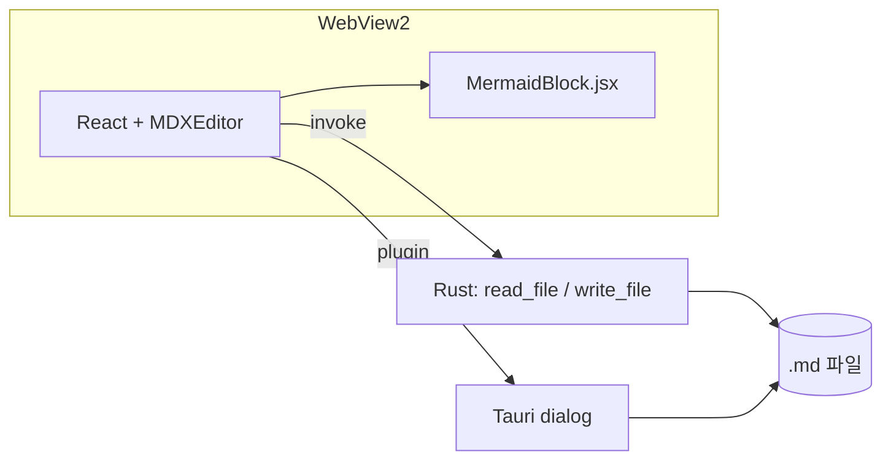
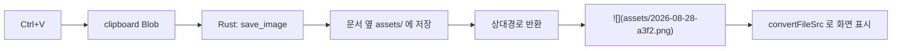
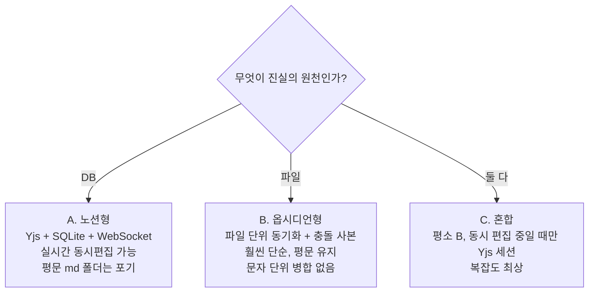

# 변경 이력 (Update History)

MD Editor — 마크다운 위지윅 에디터 데스크톱 앱

---

## 2026-08-28 — v0.1.0 최초 구현

### 개요

마크다운을 **위지윅(WYSIWYG)으로 바로 편집**하는 데스크톱 앱을 처음부터 만들었다.
웹 기술로 에디터를 구현하고 네이티브 셸로 감싸는 2단 구성.

| 구성 | 선택 | 이유 |
|---|---|---|
| 에디터 | MDXEditor 4.x (Lexical 기반) | 마크다운 왕복 정확도가 좋고, 코드블록 렌더러 교체 확장점을 제공 |
| 데스크톱 셸 | Tauri v2 | Windows 11에 WebView2가 내장돼 런타임 동봉 불필요, 설치본 10MB대 |
| 빌드 | Vite 8 + React 19 | — |



### 추가한 기능

**1. 마크다운 위지윅 편집**

- 입력하는 즉시 렌더링. `#` 를 치면 바로 제목이 되고, `-` 는 목록이 된다
- 툴바: 실행취소/재실행, 굵게·기울임·밑줄, 블록 타입 선택, 목록(불릿/번호/체크),
  링크, 표, 코드블록, 구분선
- 툴바 오른쪽 끝에서 **위지윅 / 변경점 비교 / 마크다운 원본** 3가지 모드 전환
- 코드블록은 CodeMirror 문법 강조 (txt, js, ts, python, bash, json, sql)

**2. 파일 열기 / 저장**

- 네이티브 파일 대화상자 사용 (`.md`, `.markdown`, `.mdx`, `.txt`)
- 상단 바에 파일명 표시, 수정된 상태는 주황색 점(●)으로 표시
- 단축키

  | 키 | 동작 |
  |---|---|
  | Ctrl+N | 새로 만들기 |
  | Ctrl+O | 열기 |
  | Ctrl+S | 저장 |
  | Ctrl+Shift+S | 다른 이름으로 저장 |

- 파일 입출력은 Rust 커맨드 `read_file` / `write_file` 두 개로 처리.
  Tauri fs 플러그인 대신 직접 구현해서 권한 스코프 설정을 통째로 없앴다 (12줄)

**3. Mermaid 다이어그램 렌더링** *(플러그인 형태)*

- 코드블록 언어가 `mermaid` 면 텍스트 대신 **다이어그램이 그려진다**
- 툴바 `M` 버튼으로 예제와 함께 삽입
- 블록 우상단 **"소스 편집"** 으로 문법 수정 → 250ms 후 자동 재렌더링
- 문법 오류는 빨간 박스로 표시, 고치면 즉시 복구
- 저장하면 평범한 ` ```mermaid ` 코드블록이라 GitHub 등에서도 그대로 렌더링

  MDXEditor 의 `CodeBlockEditorDescriptor` 확장점을 사용해서
  `src/MermaidBlock.jsx` 한 파일이 곧 플러그인이 되도록 분리했다.
  `App.jsx` 에는 3줄만 추가된다.

  ```js
  codeBlockPlugin({
    defaultCodeBlockLanguage: 'txt',
    codeBlockEditorDescriptors: [mermaidDescriptor],
  }),
  ```

### 고친 문제

**툴바가 아래로 스크롤하면 사라지는 현상**

- 증상: 문서 아래쪽으로 내려가면 상단 툴바가 같이 밀려 올라가 사라짐
- 원인: 툴바는 `position: sticky` 인데, 에디터 본문에 `height: 100%` 를 주는 바람에
  sticky 의 기준 박스가 **화면 높이에서 끝나버렸다.** 한 화면 분량까지는 붙어 있다가
  그 아래로는 기준 박스를 벗어나 같이 스크롤된 것
- 조치: `height: 100%` → `min-height: 100%` 로 변경해 기준 박스를 본문 전체 높이로
  확장. 툴바에 흰 배경과 `z-index: 20` 을 줘서 본문이 비쳐 보이지 않게 함
- 파일: `src/styles.css`

### 빌드 · 실행 스크립트

| 파일 | 용도 |
|---|---|
| `run.bat` | Node / VS C++ 빌드 도구 / Rust 를 순서대로 확인하고 없으면 winget 으로 설치 후 앱 실행 |
| `build-exe.bat` | 배포 파일 생성. `release-out\` 에 설치 프로그램과 포터블 exe 를 모아줌. 로그는 `build-log.txt` |
| `diagnose.bat` | 실행 문제 진단. 결과를 `diagnose-log.txt` 로 출력 |

배포 산출물 2종

- `MD Editor_0.1.0_x64-setup.exe` — 설치 프로그램
- `MD-Editor-portable.exe` — 설치 없이 바로 실행

### 파일 구조

```
md-editor/
├─ src/
│  ├─ App.jsx              에디터 UI + 열기/저장/단축키 (약 120줄)
│  ├─ MermaidBlock.jsx     Mermaid 렌더링 플러그인 + 툴바 버튼
│  ├─ main.jsx             진입점
│  └─ styles.css           상단 바 · Mermaid 블록 · 툴바 고정
├─ src-tauri/
│  ├─ src/lib.rs           read_file / write_file 커맨드
│  ├─ tauri.conf.json      창 크기 · 앱 이름 · 번들 설정
│  ├─ capabilities/        권한 (core + dialog 만)
│  └─ icons/               앱 아이콘
├─ docs/
│  └─ Update_History.md    이 문서
├─ run.bat / build-exe.bat / diagnose.bat
└─ README.md
```

### 검증 내역

헤들리스 브라우저(Chromium)로 실제 동작을 확인한 항목

- [x] 마크다운 단축 입력 — `#` → H1, `**` → 굵게, `-` → 불릿 목록
- [x] Mermaid 툴바 버튼 삽입 → SVG 생성 (노드 22개 확인)
- [x] `graph` → `sequenceDiagram` 으로 소스 변경 시 재렌더링
- [x] Mermaid 한글 라벨 정상 표시
- [x] Source mode 에서 ` ```mermaid ` 펜스로 왕복 저장
- [x] 45문단 입력 후 최하단(스크롤 1205px)까지 내려도 툴바가 상단에 고정
- [x] 콘솔 에러 없음
- [x] Rust `cargo check` 통과 (Linux 타깃 기준)

### 알려진 제약

- **코드 서명 없음** — 배포한 exe 를 처음 실행하면 Windows SmartScreen 경고가 뜬다.
  "추가 정보 → 실행" 으로 넘어갈 수 있으나, 외부 배포 시에는 코드 서명 인증서 필요
- **다크 모드 미대응** — 라이트 테마 고정
- **Mermaid 다이어그램 확대/축소 없음** — 큰 다이어그램은 가로 스크롤로만 볼 수 있다
- **자동 저장 없음** — Ctrl+S 수동 저장
- 첫 빌드 시 Rust 릴리스 컴파일에 5~15분 소요

### 다음에 할 것

아래 **"향후 계획 (기술 검토)"** 절 참고.

---

## 2026-08-30 — v0.2.0 · MD Editor V1 기능

`docs/MD_Editor_Tauri_Planned_Features.md` 의 **MD Editor V1** 두 줄을 구현했다.

### 1. 드래그 앤 드롭 + 탭

- 마크다운 파일을 창에 끌어다 놓으면 **새 탭으로 열린다** (`.md` `.markdown` `.mdx` `.txt`).
  이미 열려 있는 파일이면 새로 열지 않고 그 탭으로 이동한다
- 여러 문서를 탭으로 열고 전환. 탭마다 내용·수정 여부를 따로 들고 있다
- 수정된 탭은 주황색 점(●). 닫을 때 저장하지 않은 변경이 있으면 확인을 묻는다
- 탭 닫기: × 버튼 또는 가운데 클릭
- 단축키 추가: `Ctrl+T` 새 탭, `Ctrl+W` 탭 닫기, `Ctrl+Tab` 다음 탭

  구현 메모 — 탭 전환은 `key={activeId}` 로 에디터를 다시 마운트한다. 하나의 인스턴스에
  `setMarkdown` 을 호출하는 방식보다 상태가 섞일 여지가 없고, 되돌리기 이력도 탭별로 분리된다.

  Tauri 는 OS 레벨에서 파일 드롭을 가로채므로 HTML5 `drop` 이벤트 대신
  `getCurrentWebview().onDragDropEvent()` 를 쓴다. 그 대가로 에디터 안으로 이미지 파일을
  끌어다 놓는 동작은 막힌다 — 이미지는 붙여넣기(`Ctrl+V`)로 넣는다.

### 2. 이미지 붙여넣기 (저장 폴더 동적 설정)

- 에디터에 이미지를 `Ctrl+V` 하면 **문서 옆 `images/` 폴더가 자동 생성되고**
  파일이 저장된 뒤 마크다운 링크가 삽입된다

  ```markdown
  
  ```

- 파일명은 `YYYYMMDD-HHMMSS-<난수>.<확장자>` 로 충돌하지 않게 생성
- **저장 폴더는 상단 `⚙` 버튼에서 언제든 바꿀 수 있다** (설정은 localStorage 에 유지)

  | 설정값 | 저장 위치 |
  |---|---|
  | `images` (기본) | 문서 옆 `images/` |
  | 비움 또는 `.` | 문서와 같은 폴더 |
  | `assets/img` | 문서 옆 `assets/img/` (중첩 폴더도 생성됨) |

**WebView 의 `file://` 제약 처리**

WebView2 는 보안상 `file://` 을 직접 읽지 못한다. 그래서 표현을 둘로 나눴다.

- **파일에 기록되는 것**: 상대 경로 (`images/xxx.png`) — 다른 편집기·GitHub 에서 그대로 보임
- **화면에 그릴 때만**: Rust 로 파일을 읽어 data URI 로 변환 (`imagePreviewHandler`, 결과는 캐시)

asset 프로토콜 스코프 설정 대신 이 방식을 택했다. 설정 파일을 건드리지 않아 확실히 동작하고,
저장되는 마크다운이 오염되지 않는다. 문서가 커지면 asset 프로토콜로 옮기는 것을 재검토한다.

### 추가된 Rust 커맨드

| 커맨드 | 용도 |
|---|---|
| `save_binary_b64(path, b64)` | 붙여넣은 이미지 저장. 상위 폴더가 없으면 생성 |
| `read_binary_base64(path)` | 화면 표시용으로 이미지 바이트를 넘김 |

`base64 = "0.22"` 의존성 추가.

### 파일 구성 변경

`App.jsx` 가 비대해져 역할별로 나눴다.

```
src/App.jsx           탭 관리 · 파일 열기/저장 · 드래그앤드롭 · 단축키 · 설정 UI
src/Editor.jsx        MDXEditor 플러그인 · 툴바 구성
src/images.js         이미지 저장 경로 계산 · 저장 · 미리보기 변환
src/settings.js       설정 로드/저장
src/tauriBridge.js    Tauri 환경 판별 (브라우저에서도 UI 가 뜨도록)
```

### 검증 내역

- [x] 초기 탭 1개, `+` 로 탭 추가
- [x] 탭 전환 후에도 각 탭 내용 보존 (탭1/탭2 교차 확인)
- [x] 수정 시 dirty 표시(●) 표시
- [x] 탭 닫기 시 확인 후 제거
- [x] 설정 기본값 `images`, 변경 시 localStorage 반영
- [x] `.` 입력 시 "문서와 같은 폴더" 로 해석
- [x] 이미지 붙여넣기 → `` 삽입까지 파이프라인 동작
- [x] 경로 조합 6종 검증 (Windows/POSIX, 빈값, `.`, `./assets/`, 중첩)
- [x] `cargo check` 통과 · 프론트엔드 빌드 통과 · 콘솔 에러 없음

### 남은 것

- 이미지 크기 조정·압축, 중복 이미지 hash 검사
- 문서 삭제 시 고아 이미지 정리
- 자동 저장 (계획서의 MDSyncNote 단계)

---

## 2026-08-30 — v0.3.0 · 모노레포 전환 + MDSyncNote 골격

MD Editor 를 V2(MDSyncNote)로 확장하기 위해, 두 앱이 소스를 공유하면서도
각각 별도 exe 로 빌드되는 구조로 바꿨다.

### 왜 지금인가

전체 코드가 530줄일 때가 구조를 바꾸기 가장 싼 시점이었다. V2 에 트리·SQLite·동기화가
들어간 뒤에 나누면 훨씬 비싸진다. 단순 복사(fork)는 Mermaid 버그 하나를 두 번 고쳐야 하고
두 벌이 갈라지기 시작하면 되돌리기 어려워 배제했다.

### 구조

```
md-workspace/
├─ packages/editor-core/    공유 JS — Editor.jsx, MermaidBlock.jsx, images.js,
│                           settings.js, tauriBridge.js, editor.css
├─ crates/md-core/          공유 Rust — read_file, write_file, save_binary_b64,
│                           read_binary_base64, read_dir
└─ apps/
   ├─ md-editor/            단일 창 에디터 (탭 · 드래그앤드롭) — App.jsx 만 고유
   └─ md-sync-note/         저장소 트리 + 노트 뷰 (V2)
```

- **npm workspaces** — `@md/editor-core` 를 두 앱이 참조. 고치면 즉시 양쪽 반영
- **cargo workspace** — `target/` 을 공유하므로 두 번째 앱 빌드가 훨씬 빠르다
- `App.jsx` 는 공유하지 않는다. 두 앱의 레이아웃이 근본적으로 다르기 때문

**구현 함정** — `#[tauri::command]` 는 보조 매크로(`__cmd__*`)를 만드는데, 이걸 크레이트
루트에 두면 이름이 충돌해 컴파일이 안 된다. 반드시 `md_core::commands` 처럼 별도 모듈에
넣고 `generate_handler![md_core::commands::read_file, ...]` 로 등록해야 한다.

### MDSyncNote 골격 (신규)

계획서 4·3.2 절에 해당하는 첫 단계를 만들었다.

- 왼쪽 **아코디언 저장소 트리** — 폴더를 저장소로 등록/제거, 목록은 localStorage 에 유지
- **지연 로딩** — 폴더를 펼칠 때만 `read_dir` 호출. 루트에서 전체를 재귀 스캔하지 않는다
- 마크다운만 표시(`.md` `.markdown` `.mdx`), 숨김 항목 제외, 폴더 먼저 정렬
- 파일 클릭 → 오른쪽에 열림. 활성 문서 하이라이트
- **자동 저장** — 기본 60초, 변경이 있을 때만. 설정에서 초 단위 조정(0이면 사용 안 함)
- 오른쪽 뷰는 md-editor 와 **완전히 같은 에디터** (Mermaid·이미지 붙여넣기 포함)
- 저장소 접근은 `listDir(repo, path)` 한 곳을 거치므로, WebDAV·FTP 는 여기서 갈라내면 된다

아직 없는 것: 폴더/노트 생성·이름변경·삭제, git 자동 commit, sync, SQLite, FTS.

### 실행 방법 변경

```bat
npm install              :: 루트에서 한 번

run-md-editor.bat        :: 또는  npm run editor
run-md-sync-note.bat     :: 또는  npm run sync-note
build-all.bat            :: 두 앱 배포 파일을 release-out\ 에
```

### 검증 내역

- [x] `npm install` (워크스페이스 382 패키지) · 두 앱 vite build 통과
- [x] `cargo check --workspace` — md-core / md-editor / md-sync-note 전부 통과
- [x] MDSyncNote: 저장소 추가 → 트리 2단계 펼침 → 파일 열기 → 활성 표시
- [x] MDSyncNote 안에서 공유 Mermaid 툴바 버튼 존재 확인 (공유 패키지 연결 확인)
- [x] md-editor 회귀 — 탭바·위지윅 정상, 콘솔 에러 없음

### v0.3.1 — 실행 스크립트 수정 (2026-08-30)

**증상**: `run-md-editor.bat` 실행 시 오류.

**원인**: 모노레포 전환 때 기존 `md-editor/node_modules` 를 워크스페이스 루트로 옮겼는데,
그 안에는 워크스페이스 링크(`node_modules/@md/editor-core`)가 없었다. 그런데 스크립트가
`if not exist node_modules ( npm install )` 로 **폴더 유무만** 보고 설치를 건너뛰어,
vite 가 `@md/editor-core` 를 찾지 못하고 실패했다.

```
Rolldown failed to resolve import "@md/editor-core/editor.css" from ".../src/main.jsx"
```

**조치** — `run-md-editor.bat` / `run-md-sync-note.bat` / `build-all.bat` 공통

- 폴더 유무가 아니라 **워크스페이스 링크 유무**(`node_modules\@md\editor-core\package.json`)로 판단
- `npm install` 을 매번 실행 (이미 맞으면 3초 내로 끝난다)
- 그래도 링크가 없으면 `node_modules` 를 지우고 재설치
- 모든 출력을 `run-log.txt` / `build-log.txt` 에 남기고, 실패 시 마지막 30줄을 화면에 표시

**검증** — 리눅스 환경에서 동일 상황(링크만 삭제)을 재현해 같은 오류를 확인하고,
`npm install` 로 복구되는 것과 이후 두 앱 빌드가 통과하는 것을 확인했다.
추가로 **Xvfb 가상 디스플레이에서 실제 Tauri 앱 두 개를 실행**해
창이 정상적으로 뜨고 UI 가 렌더링되는 것까지 확인했다 (`cargo build` → 바이너리 직접 실행).


---

## 2026-08-30 — v0.4.0 · 파일 연결 · 상단 드롭존 · 저장소 Git

### 1. MD Editor — 상단에 놓으면 열리는 드롭존

전에는 창 어디에 놓아도 파일이 열렸다. 이제 **제목줄+탭바(`.topzone`)** 에 놓았을
때만 열린다.

- 드래그 중에 드롭존이 파랗게 강조되고, 본문 위에서는 "↑ 상단에 놓으세요" 로 바뀐다
- 본문에 놓으면 아무 일도 하지 않고 안내만 띄운다
- 마크다운이 아닌 파일을 놓으면 그 사실을 알려준다

Tauri 는 OS 레벨에서 드롭을 가로채므로 HTML5 `dragover`/`drop` 이 오지 않는다.
`onDragDropEvent` 가 주는 **좌표를 드롭존 사각형과 직접 비교**하는 수밖에 없다.
좌표는 물리 픽셀이라 `devicePixelRatio` 로 나눠 CSS 픽셀에 맞춘다
(`apps/md-editor/src/useFileDrop.js`).

이 구조는 나중에 "본문에 이미지를 놓으면 삽입" 을 붙일 자리이기도 하다.
지금은 의도적으로 열어 두지 않았다 — 요청 범위가 아니었고, 삽입 위치(커서) 문제가
따로 있다.

### 2. MD Editor — Windows 파일 연결

탐색기에서 `.md` 를 우클릭해 여는 길을 열었다. 설정(⚙) → **Windows 연결** →
[등록] / [해제], 또는 `md-editor.exe --register`.

- `.md` `.markdown` `.mdx` 우클릭 메뉴에 "MD Editor로 열기"
- 우클릭 → 연결 프로그램 목록에 MD Editor
- 명령줄로 받은 파일은 창이 뜬 뒤 `startup_file` 로 물어봐서 연다
- 모두 `HKCU` 라 관리자 권한이 필요 없고, 기존 `.md` 연결을 빼앗지 않는다

**기본 앱 지정은 프로그램이 못 한다.** Win8 부터 `UserChoice` 에 비공개 해시가
붙어 사용자가 직접 골라야만 한다. 자세한 내용·레지스트리 키·NSIS 연동은
[Windows_File_Association.md](Windows_File_Association.md).

### 3. MDSyncNote — 저장소 Git

계획서의 Revision History 를 직접 만들지 않고 git 으로 대체하는 첫 걸음.

- 저장소 트리 머리에 git 상태 줄 — `⎇ master`, 변경 개수, 아니면 **[Git 초기화]** 버튼
- 초기화는 `git init` + 첫 커밋까지 한 번에
- **자동 저장이 실제로 파일을 썼을 때만 커밋한다** (변경이 없으면 커밋도 없다)
- 설정에 "저장할 때 git commit" 체크박스 (기본 켬)
- 커밋 메시지: `a.md 저장 (2026-08-30 19:48)`

#### git2 대신 git 실행 파일을 부른다

| | git2 (libgit2) | **`git` CLI (선택)** |
|---|---|---|
| 빌드 | C 라이브러리를 함께 컴파일 | 의존성 0 |
| 자격증명·훅·gitignore | 따로 구현 | 사용자의 git 설정 그대로 |
| 전제 | 없음 | git 설치 필요 |

git 이 없으면 `has_git: false` 로 돌려주고 UI 에서 git 줄 자체를 숨긴다.
동기화(push/pull)까지 가면 자격증명 헬퍼를 그대로 쓸 수 있는 쪽이 유리하다.

#### 남의 저장소를 휩쓸지 않기

등록한 폴더가 이미 다른 git 저장소의 **하위 폴더**일 수 있다. 이때

- 새로 `git init` 하지 않는다 (중첩 저장소는 사고의 근원) — 상위 저장소 경로를 보여준다
- `add`·`status`·`commit` 을 모두 `-- .` 로 **등록한 폴더 아래로 범위를 좁힌다**

그래서 저장소 루트에 있는 다른 작업물이 노트 저장 커밋에 딸려 들어가지 않는다.
이 동작은 테스트로 못 박아 뒀다.

#### 커밋 이름

`user.name` / `user.email` 이 없으면 커밋이 실패한다. 없을 때만 **그 저장소 안에만**
`MDSyncNote <mdsyncnote@localhost>` 를 넣는다. 전역 설정은 건드리지 않는다.

### 추가된 Rust 커맨드

| 커맨드 | 앱 | 내용 |
|---|---|---|
| `startup_file` | MD Editor | 명령줄 인자 중 마크다운 파일 |
| `assoc_status` / `assoc_register` / `assoc_unregister` | MD Editor | HKCU 파일 연결 |
| `git_status` / `git_init` / `git_commit` | MDSyncNote | 저장소별 로컬 git |

둘 다 한 앱에만 필요하므로 `md-core` 가 아니라 **앱 크레이트**에 뒀다
(`win_assoc.rs`, `cli.rs`, `git.rs`).

### 파일 구성 변경

App.jsx 가 200줄을 넘어 역할별로 나눴다.

```
apps/md-editor/src/
  App.jsx           215줄  탭 상태 + 조립
  useFileDrop.js     52줄  상단 드롭존 좌표 판정
  useShortcuts.js    24줄  Ctrl 단축키
  TabBar.jsx         23줄
  SettingsBar.jsx    27줄
  WinAssoc.jsx       55줄  파일 연결 등록 UI
  paths.js            7줄  열 수 있는 확장자 · 파일명
apps/md-sync-note/src/
  git.js             33줄  git 커맨드 래퍼 + 커밋 메시지
  RepoTree.jsx      133줄  (+ GitLine)
```

### 검증 내역

| 대상 | 방법 | 결과 |
|---|---|---|
| 두 앱 프론트엔드 빌드 | `vite build` | 통과 |
| Rust 워크스페이스 | `cargo check --workspace` | 통과 |
| git 초기화·커밋·중첩 저장소 | `cargo test -p md-sync-note` (3건) | 통과 |
| 파일 연결 등록/해제 | `md-editor.exe --register` 후 `reg query`, 해제 후 원상복구 확인 | 통과 |
| 명령줄 인자로 실행 | 빌드한 exe 에 `.md` 경로를 주고 실행 | 창 정상 |
| 인자 파일이 탭으로 열림 · 드롭존 배치 · 연결 UI | 헤들리스 브라우저 (Tauri IPC 스텁) 8건 | 통과 |
| git 초기화 버튼 · 저장→커밋 · 자동커밋 끄기 | 헤들리스 브라우저 12건 | 통과 |

**아직 사람 손으로 확인해야 하는 것** — 실제 드래그앤드롭(OS 이벤트라 스텁 불가),
탐색기 우클릭 메뉴 모양.

### 남은 것

- 파일을 여러 개 열면 창이 여러 개 뜬다 → `tauri-plugin-single-instance`
- 본문에 이미지 드롭 → 삽입
- 커밋 이력 보기 / 되돌리기 UI (지금은 커밋만 쌓인다)

---

## 2026-08-30 — v0.4.1 · 표 셀 안 Alt+Enter 줄바꿈

표 셀 안에서 **Alt+Enter** 를 누르면 커서 자리에서 줄이 나뉜다. 그냥 Enter 는
예전대로 아래 셀로, Shift+Enter 는 위 셀로 이동한다.

공유 에디터(`packages/editor-core`)에 넣었으므로 **MD Editor 와 MDSyncNote 에
동시에** 적용된다. 구현은 `packages/editor-core/src/tableCellBreak.jsx` 한 곳.

### 파일에는 `<br />` 로 적는다

GFM 표는 셀 안에 진짜 개행을 담지 못한다. lexical 의 기본 줄바꿈 노드를 그대로
저장하면 `&#xA;` 로 이스케이프되어 **어느 뷰어에서도 줄이 나뉘지 않는다.** 그래서
`<br />` 로 쓴다 — GitHub · VS Code · Obsidian 이 모두 알아본다.

```
| 항목 | 설명            |
| -- | ------------- |
| 가  | 첫줄<br />둘째줄 |
```

### 구현에서 걸렸던 것 두 가지

**1. Enter 를 MDXEditor 보다 먼저 받아야 한다.** 셀 하나하나가 독립된 lexical
에디터고, MDXEditor 가 Enter 를 `COMMAND_PRIORITY_CRITICAL` 로 가로채 "아래 셀로
이동" 에 쓴다. 같은 큐의 **맨 앞에 꽂히는** `COMMAND_PRIORITY_BEFORE_CRITICAL` 로
등록해야 등록 순서와 관계없이 먼저 돌아간다.

**2. `<br />` 를 GenericHTMLNode 로 두면 커서가 깨진다.** MDXEditor 의 기본 HTML
처리는 자식 없는 빈 인라인 요소를 만든다. 그 뒤에는 커서가 서지 못해서, 줄바꿈
뒤에 이어 친 글자가 **위쪽 줄로 들어간다.** 그래서 `LineBreakNode` 를 상속한 전용
노드(`md-html-br`)를 만들고 가져오기/내보내기 방문자를 따로 붙였다. 커서 처리는
lexical 이 알아서 한다.

타입을 따로 판 이유는, 그냥 `LineBreakNode` 로 두면 본문에서 Shift+Enter 로 만든
기존 줄바꿈까지 전부 `<br />` 로 다시 쓰여 **건드리지도 않은 문서가 바뀌기
때문이다.** 전용 타입이면 `<br />` ↔ 전용 노드 로 왕복이 닫히고 나머지는 그대로다.

### 확인한 것

헤들리스 브라우저(playwright)로 실제 앱을 조작해 확인했다.

- 셀 안 Alt+Enter → 커서 자리에 줄바꿈, 소스에 `첫줄<br />둘째줄`
- 그냥 Enter 는 아래 셀로 이동 (기존 동작 유지), 표 밖 Alt+Enter 는 문단 나누기
- `<br />` 가 들어 있는 문서를 불러와도 줄바꿈으로 보이고, 그 뒤에 이어 쓰기 정상
- 빈 셀 · 머리글 셀에서도 동작, 되돌리기 정상, 콘솔 오류 없음

### 알아둘 제약 (이번 변경과 무관한 기존 문제)

- ~~닫는 태그가 없는 `<br>` 이 들어있는 파일은 MDXEditor 가 파싱하지 못한다~~
  → v0.4.2 에서 해결 (열 때 `<br />` 로 맞춰 준다)
- 본문의 하드브레이크(줄 끝 백슬래시 / 공백 두 칸)는 저장하면 소프트브레이크로 바뀐다

### 배포 (v0.4.1 시점)

버전이 파일마다 0.3.0/0.4.0 으로 갈려 있어 **전부 0.4.1 로 맞췄다**
(루트·두 앱·editor-core 의 package.json, 세 Cargo.toml, 두 tauri.conf.json).

설치본 없이 exe 두 개만 만드는 **`build-portable.bat`** 을 추가했다.
`tauri build --no-bundle` 이라 NSIS 를 받지 않아 그만큼 빠르다. 설치 프로그램까지
필요하면 기존 `build-all.bat`.

```
release-out\MD-Editor-portable.exe     7.7 MB
release-out\MDSyncNote-portable.exe    7.7 MB
```

exe 하나가 전부다 — WebView2 는 Windows 11 에 내장돼 있어 동봉할 것이 없다.
릴리스 프로필은 `opt-level = "s"` + LTO + strip 이라 빌드에 앱당 5분쯤 걸린다.

**확인한 것**: 두 exe 실행(창 정상), 번들에 `md-html-br`(Alt+Enter) 포함,
파일 경로를 인자로 준 실행. **코드 서명은 없어서** 처음 실행 시 SmartScreen 경고가
뜬다(추가 정보 → 실행).

---

## 2026-08-30 — v0.4.2 · `<br>` 이 든 파일 열기

실제로 걸렸다.

```
Error parsing markdown: Expected a closing tag for `<br>` (88:115-88:119)
before the end of `tableData`.
```

### 무엇이 문제였나

MDXEditor 는 마크다운을 **MDX 로** 읽는다. MDX 에서 `<br>` 은 JSX 여는 태그이므로
닫는 태그를 기다리다 파싱이 통째로 실패한다. 표 셀 안에 `<br>` 을 쓰는 것은 GFM 에서
아주 흔한 관행이고 GitHub·VS Code·Obsidian 은 문제없이 읽는다. 즉 **파일이 잘못된
게 아니라 이 에디터만 못 읽는다.**

파서 설정으로는 끌 수 없다. mdx-jsx 확장이 MDXEditor 코어의 `fromMarkdown` 호출에
박혀 있고 빼는 API 가 없다(`dist/importMarkdownToLexical.js`). 표 플러그인처럼
갈아끼우는 수밖에 없는데, 그건 이 문제에 비해 너무 크다.

### 어떻게 고쳤나

**파일을 열 때 `<br>` → `<br />` 로 맞춘다.** 두 표기는 어느 도구에서나 결과가 같다.
`packages/editor-core/src/normalizeMarkdown.js` 한 곳이고, 두 앱이 파일을 읽는
지점(`openPath`, `openDoc`)에서 부른다.

건드리지 않는 것 — 여기가 이 함수의 전부다.

| 대상 | 왜 |
|---|---|
| 코드블록(``` ~~~) 안 | `<br>` 을 설명하는 예제 코드를 고쳐 버리면 안 된다 |
| 인라인 코드 안 | 같은 이유 |
| 이미 `<br />` · `<br/>` | MDX 가 알아본다. 굳이 다시 쓸 이유가 없다 |
| 속성이 붙은 `<br class="x">` | 속성을 지우거나 옮기는 판단은 하지 않는다. 드물고, 원본 모드에서 고치면 된다 |

`<hr>` 도 같은 이유로 깨지므로 함께 처리한다. 대상 태그는 상수 하나(`VOID_TAGS`)다.

**파일은 열었다고 바뀌지 않는다.** 화면에만 반영되고, 실제로 디스크가 바뀌는 시점은
사용자가 저장할 때다. 몇 개를 고쳤는지 화면에 알려 준다
(MD Editor 는 안내 토스트, MDSyncNote 는 상태줄).

### 검증

| 대상 | 방법 | 결과 |
|---|---|---|
| 정규화 규칙 — 표·대문자·공백·자가닫힘·속성·인라인코드·코드블록·펜스 두 개 | 단위 테스트 14건 | 통과 |
| `<br>` 든 표 파일 열기 — 오류 없음, 표 렌더, 줄바꿈 뒤 글자, 안내 표시, 인라인 코드 보존, 콘솔 오류 없음 | 헤들리스 브라우저 7건 | 통과 |
| 두 앱 빌드 | `vite build` | 통과 |

---

## 2026-08-30 — v0.4.3 · `<` 파싱 실패 · 열기만 해도 수정됨으로 잡히던 문제

실사용 문서(`LGE멕시코_MES_테스트케이스.md`)에서 두 가지가 한꺼번에 드러났다.

```
Error parsing markdown: Unexpected character `-` (U+002D) before name,
expected a character that can start a name, such as a letter, `$`, or `_`.
```

그리고 "에디터에서 본 것과 PDF 로 뽑은 것이 다르다".

### 1. 태그가 아닌 `<` 를 못 읽던 문제 (해결)

v0.4.2 에서 `<br>` 만 고쳤는데, 원인은 더 넓었다. **MDX 에서 `<` 는 전부 JSX 의
시작**이라 태그로 이어지지 않으면 파싱이 통째로 실패한다. 실제 파서로 확인한 목록:

| 원본 | 결과 |
|---|---|
| `A <- B` · `x <-- y` | 실패 — `-` 는 태그 이름을 시작할 수 없다 |
| `2 <3` · `p<0.05` | 실패 — 숫자도 마찬가지 |
| `a <= b` | 실패 — `=` 도 마찬가지 |
| `x<y` | 실패 — 태그가 열리고 `>` 가 안 나온다 |
| `<https://example.com>` · `<user@example.com>` | 실패 — MDX 는 자동링크를 모른다 |
| `A < B` · `x < 1` | 통과 — 공백이 있으면 태그로 보지 않는다 |
| `<br />` · `<b>x</b>` · `<!-- 주석 -->` | 통과 |

그래서 여는 태그로 **읽힐 수 없는 `<` 만** `&lt;` 로 바꾼다. 판정은 "여기서부터
온전한 태그·닫는태그·주석이 시작되는가" 한 가지다(`normalizeMarkdown.js`).
자동링크는 의미를 잃지 않게 `[url](url)` · `[mail](mailto:mail)` 로 바꾼다.
`&lt;` 는 GitHub·VS Code·Obsidian 모두 `<` 로 보여 준다.

검증은 **정규화한 결과를 MDXEditor 와 같은 확장 구성의 실제 파서에 다시 통과**시키는
방식으로 했다. 출력 문자열만 비교하면 "고쳤는데 여전히 안 열리는" 경우를 놓친다.

### 2. 열기만 해도 수정됨으로 잡히던 문제 (해결) ← PDF 가 달랐던 진짜 원인

MDXEditor 는 파일을 연 직후 마크다운을 자기 표기법으로 다시 쓰고 `onChange` 를
부른다. 두 앱은 그 두 번째 인자(`initialMarkdownNormalize`)를 **무시하고 있었다.**
그래서

```
파일 열기 → 곧바로 "수정됨(●)" → MDSyncNote 자동 저장(기본 60초)
         → 손대지도 않은 파일이 MDXEditor 표기법으로 다시 쓰인다
```

이때 `p.62~65` 가 `p.62~~65` 로, `BUFFER_TYPE` 이 `BUFFER\_TYPE` 으로 바뀐다.
**에디터에서 본 것과 PDF 가 다른 이유가 이것이다** — 파일 자체가 바뀌어 있었다.

이제 초기 정규화는 수정으로 치지 않는다. **사용자가 실제로 편집하기 전에는 파일이
바뀌지 않는다.** (편집하면 여전히 정상적으로 수정 표시가 뜬다 — 회귀 검사 포함)

### 3. 남은 문제 — 저장하면 MDXEditor 표기법이 적용된다

한 번이라도 편집해서 저장하면, 그 파일은 MDXEditor 의 직렬화 규칙대로 다시 쓰인다.
이건 **고치지 못했고, 값싼 해법도 없다.**

| 증상 | 왜 |
|---|---|
| `p.62~65` → `p.62~~65` | GFM 취소선은 물결 하나로도 성립한다. `~65 (항목 1~` 가 취소선으로 읽히고, 저장할 때 `~~` 로 다시 쓰인다. **GitHub 도 똑같이 읽는다** |
| `BUFFER_TYPE` → `BUFFER\_TYPE` | 직렬화기가 오해를 막으려 밑줄·별표를 이스케이프한다 |
| PDF·인쇄에서 `\` 가 그대로 보임 | 그 도구가 마크다운 이스케이프를 풀지 않기 때문. 파일에는 원래 없던 `\` 가 들어 있다 |

**왜 못 고치나**

- 단일 물결 취소선은 `gfmStrikethrough({ singleTilde: false })` 로 끌 수 있지만,
  MDXEditor 코어가 기본값으로 등록하고 **확장은 더하기만 되고 빼기가 안 된다**
- 이스케이프 양은 `mdast-util-to-markdown` 이 정한다. `toMarkdownOptions` 로 기호
  선택(`*` vs `_`)은 바꿔도 **이스케이프를 줄이는 옵션은 없다**
- 저장할 때 역슬래시를 걷어내는 후처리는 가능하지만, 진짜로 필요한 이스케이프까지
  지우면 문서가 깨진다. 추측으로 지울 문제가 아니다

**지금 쓸 수 있는 방법**

- 범위를 뜻하는 물결은 원본에서 `\~` 나 `&#126;` 로 쓰거나 백틱으로 감싼다
  (`` `62~65` ``). 우리가 자동으로 바꾸지 않는 이유는 **진짜 취소선을 의도한 문서를
  망가뜨리기 때문**이다
- 편집하지 않을 문서는 열어만 두면 파일이 그대로다 (2번 수정의 효과)

### 검증

| 대상 | 방법 | 결과 |
|---|---|---|
| 정규화 규칙 20종 + 정규화 결과를 실제 MDX 파서로 재파싱 | 단위 테스트 | 통과 |
| 원본이 실제로 깨지는지 (전제 확인) 5종 | 단위 테스트 | 통과 |
| `<!-- 주석 -->` 보존 (MDXEditor comment 확장 포함) | 단위 테스트 | 통과 |
| `A <- B` 든 파일 열기 · 표 렌더 · 열었을 때 수정표시 없음 · 편집하면 수정표시 | 헤들리스 브라우저 5건 | 통과 |
| 두 앱 빌드 | `vite build` | 통과 |

---

## 2026-08-31 — v0.4.4 · "태그처럼 생긴 것"과 진짜 HTML 태그를 가른다

v0.4.3 으로도 실제 문서(`LGE멕시코_MES_테스트케이스.md`)가 열리지 않았다.

```
Error parsing markdown: Unexpected character `2` (U+0032) before member name,
expected a character that can start an attribute name ...
```

### 무엇을 놓쳤나

그 문서는 **XML 로그를 표 셀 안에 그대로 붙여 넣고** 있었다.

```
| <GROUP NAME="0" VALUE="20260526034836_group_barcode_0"> |
| <P_20260525161121.222>Line : 1 Lane : 1 WorkFace : BOT ... |
| </root> |
```

v0.4.3 의 규칙은 "온전한 태그 모양이면 통과"였다. 위의 것들은 전부 태그 모양이라
그대로 통과했고, MDX 는 그것들을 JSX 로 읽으려다 실패했다.

- `<P_20260525161121.222>` — `.` 뒤가 숫자라 JSX 멤버 이름이 될 수 없다
- `<GROUP ...>` — 닫는 태그가 없어 문단 끝까지 찾다 실패한다
- `</root>` — 여는 태그 없이 닫는 태그만 있다

**그건 마크업이 아니라 보여 줄 텍스트였다.** 판정 기준이 틀렸던 것이다.

### 어떻게 고쳤나

두 가지를 더한다.

1. **실제 HTML 태그 이름만 태그로 인정한다.** 목록(`HTML_TAGS`)에 없는 이름은
   텍스트로 본다. 마크다운 문서에 들어갈 수 있는 마크업은 HTML 이지 임의의 XML 이
   아니다. 이름 뒤에는 공백·`/`·`>` 만 올 수 있게 해서 `<P_2026...>` 처럼 이름이
   이어지는 것도 걸러낸다
2. **짝이 맞지 않는 태그는 텍스트로 본다.** 문서 전체에서 여는/닫는 개수를 세어
   맞지 않는 이름(`<div>` 만 있고 `</div>` 가 없는 경우 등)은 태그로 취급하지 않는다.
   MDX 는 짝이 안 맞으면 어차피 파싱에 실패한다

덤으로 void 태그 처리를 `` · `<input>` 등으로 넓혔다. `` 도
MDX 에서는 자가닫힘이어야 한다.

### 검증 — 실제 파일로

이번에는 **문제가 난 파일 자체**를 재료로 썼다.

| 대상 | 방법 | 결과 |
|---|---|---|
| 실제 파일(115KB, 1711줄) 파싱 | 정규화 전/후를 실제 MDX 파서에 통과 | 전 실패 → **후 성공** (`<` 435개 교정) |
| 실제 파일을 앱에서 열기 | 헤들리스 브라우저 | 오류 없음 · 표 24개 렌더 · XML 이 텍스트로 보임 · 수정 표시 없음 · 콘솔 오류 없음 |
| 규칙 28종 (XML 로그 · 진짜 HTML · 짝 안 맞는 태그 · 자동링크 · 코드블록 예외) | 단위 테스트 + 결과 재파싱 | 통과 |
| 원본이 실제로 깨지는지 (전제) 8종 | 단위 테스트 | 통과 |

큰 문서는 렌더가 오래 걸려 안내 문구가 뜨자마자 사라지던 것도 함께 고쳤다(6초).

---

## 2026-08-31 — v0.5.0 · File Watcher (MD Editor)

계획서 8절, 다음 작업 2순위. **밖에서 파일이 바뀌면 알아채고 사용자가 고른다.**

### 동작

| 상황 | 어떻게 |
|---|---|
| 열어 둔 파일이 밖에서 바뀜, **내 편집분 없음** | 묻지 않고 조용히 다시 읽는다. 잃을 게 없으니 물을 것도 없다 |
| 열어 둔 파일이 밖에서 바뀜, **내 편집분 있음** | 대화상자로 고르게 한다 — **바뀐 파일 불러오기** / **내 내용으로 덮어쓰기** |

"다른 이름으로 저장" 은 **일부러 넣지 않았다**. 선택지가 셋이 되면 매번 고민이
늘고, 실제로 필요한 결정은 "누구를 남길까" 둘뿐이다.

다시 읽을 때는 탭의 `key` 를 바꿔 에디터를 **다시 마운트**한다. 한 인스턴스에 새
내용을 밀어 넣으면 되돌리기 이력이 엉킨다(CLAUDE.md 규약).

### 만들면서 정한 것 두 가지

**폴더를 감시한다, 파일이 아니라.** 많은 편집기가 "임시 파일에 쓰고 이름 바꾸기"
로 저장한다. 파일 자체를 감시하면 원본이 지워졌다 새로 생기는 것으로 보여 **감시가
조용히 죽는다.** 상위 폴더를 감시하고 파일 이름으로 걸러낸다. 이 전제가 맞는지
테스트로 못 박아 뒀다(`폴더를_감시하면_그_안의_파일_저장이_잡힌다`).

**내용 해시로 판단한다, 시간이 아니라.** "우리가 저장한 것"과 "밖에서 바뀐 것"을
시간차나 이벤트 종류로 가르려 하면 반드시 틀린다. 마지막으로 아는 내용의 해시를
들고 있다가 이벤트가 오면 파일을 다시 읽어 비교한다. 같으면 알리지 않는다.
저장 직후 돌아오는 자기 이벤트도, 편집기가 같은 내용을 다시 쓴 경우도 함께 걸러진다.
`write_file` 이 쓴 내용을 감시기에 알려 주는 한 줄이 그 연결이다.

### 구조

```
crates/md-core/src/watcher.rs   174줄  notify 8 · watch_file / unwatch_file
apps/md-editor/src/
  useFileWatch.js                44줄  탭 목록과 감시 목록을 맞춘다
  useExternalChanges.js          58줄  다시 읽기 · 덮어쓰기 · 충돌 목록
  ReloadDialog.jsx               33줄  선택 대화상자
```

`md-core` 에 둔 이유는 MDSyncNote 도 같은 것이 필요하기 때문이다(계획서 8절).
지금은 MD Editor 만 커맨드를 등록해 쓴다.

App.jsx 가 다시 200줄을 넘어 파일 열기·저장을 `useFiles.js` 로 분리했다.

### 검증

| 대상 | 방법 | 결과 |
|---|---|---|
| 해시 판단 (같음/다름/두 번 알림 방지/지워짐/자기 저장) | `cargo test -p md-core` 4건 | 통과 |
| **폴더 감시로 파일 저장이 잡히는가** (notify 배선) | 임시 폴더에 실제 쓰기 | 통과 |
| 감시 등록·해제, 편집분 없을 때 조용히 다시 읽기, 있을 때 대화상자, 덮어쓰기, 불러오기, 탭 닫을 때 해제 | 헤들리스 브라우저 13건 | 통과 |
| 실제 exe 로 파일 열고 밖에서 수정 | 수동 실행 | 앱 정상 |

### 남은 것

- **MDSyncNote 에는 아직 안 붙였다.** 커맨드는 공유 크레이트에 있으니 등록 + UI 만
  하면 된다. 자동 저장이 있어 충돌 처리 방식은 조금 다르게 가야 한다
- 파일이 **지워졌을 때**는 알리지 않는다(편집기가 저장 중일 수 있어 구분이 어렵다)

---

## 2026-08-31 — v0.5.1 · 본문 조판 (PDF 출력물처럼)

본문에는 스타일이 거의 없었다 — 브라우저 기본값이라 **표 머리글이 본문 행과 구분이
안 됐다.** 마크다운을 PDF 로 뽑았을 때처럼 읽히도록 손봤다.

### 무엇이 바뀌나

| 대상 | 전 | 후 |
|---|---|---|
| **표 머리글** | 본문 행과 똑같음 | 옅은 남색 바탕 · 굵은 글씨 · 아래 2px 경계선 |
| 표 본문 | 줄 구분 흐림 | 줄무늬(짝수 행) + 커서 올린 줄 강조 |
| 본문 폭 | 화면 끝까지 늘어남 | 900px 로 묶고 가운데. 흰 종이처럼 띄운다 |
| 제목 | 크기만 다름 | h1·h2 아래 경계선, 위아래 여백 정리 |
| 인용문 | 얇은 선 | 왼쪽 굵은 선 + 옅은 바탕 |
| 인라인 코드 | 기본 | 바탕색 + 테두리 |
| 코드블록 | 테두리 없음 | 옅은 바탕 · 줄번호 칸 구분 |
| 링크 | 밑줄 | 파란색 + 옅은 밑줄, 올리면 진해짐 |

공유 스타일(`packages/editor-core/src/editor.css`)이라 **두 앱에 함께 적용**된다.

### 표 셀을 고를 때 조심할 것

MDXEditor 의 표에는 **손잡이 셀이 섞여 있다.** 행·열을 추가하거나 지우는 `...` 버튼과
휴지통이 전부 `th`/`td` 다. `th { background: ... }` 로 뭉뚱그리면 손잡이까지 색이 칠해진다.

실제 내용 셀만 골라야 하는데, 클래스 이름이 `_leftAlignedCell_er3ed_828` 처럼
해시가 붙는다. 해시는 MDXEditor 버전마다 바뀌므로 **읽을 수 있는 부분으로 부분
일치**시킨다.

```css
.prose th[class*="AlignedCell"] { ... }   /* 내용 셀만 */
```

### 원본 모드에서는 종이 흉내를 내지 않는다

원본(마크다운) 모드는 편집기이므로 화면을 꽉 채우는 게 맞다. 회색 바탕이 남아
아래에 띠가 생기던 것을, 그 모드에서만 생기는 `.cm-sourceView` 를 표시로 삼아
`:has()` 로 되돌린다. (WebView2 는 최신 Chromium 이라 `:has()` 를 쓴다)

### 검증

헤들리스 브라우저로 **실제 화면을 찍어 눈으로 확인**했다 — 위지윅 모드(표·인용문·
목록·코드블록), 원본 모드, MDSyncNote(사이드바가 있는 좁은 폭). 스타일은 테스트로
확인할 수 없으니 이 방법이 유일하다.

---

## 2026-08-31 — v0.5.2 · 본문 폭 선택 (고정 / 전체)

v0.5.1 이 본문을 900px 고정 폭으로 묶었는데, 전에는 화면 전체를 쓰던 것이라
**표가 넓은 문서에서는 예전이 나았다.** 둘 중에 고르게 했다.

설정(⚙) → **본문을 화면 전체 폭으로**. 끄면 인쇄물처럼 가운데 고정 폭,
켜면 예전처럼 화면을 꽉 채운다. **선택은 저장된다** — 앱을 다시 켜도 유지된다.

- 기본값은 고정 폭(`wideLayout: false`)
- 두 앱 모두에 있다. 설정은 앱별로 따로 저장된다
- 전체 폭에서는 종이 흉내(테두리·그림자·여백)를 걷어내고 예전 모습으로 돌아간다

```css
.editor-wrap.wide .prose { max-width: none; border: 0; box-shadow: none; ... }
```

기본값을 공유 설정(`editor-core/settings.js`)에 둬서, 앞으로 어느 앱에서든
같은 이름으로 쓰면 된다.

### 검증

헤들리스 브라우저 4건 — 기본이 900px 인지, 켜면 화면 폭(1100px)으로 늘어나는지,
`localStorage` 에 저장되는지, **새 창을 띄워도 유지되는지**.

---

## 2026-08-31 — v0.6.0 · PDF 저장 (MD Editor)

설정(⚙) → **PDF로 저장**. 저장 위치만 고르면 파일이 바로 만들어진다.
**인쇄 대화상자는 뜨지 않는다.**

### 어떻게 만드나

WebView2 의 `PrintToPdf` 를 부른다(`crates/md-core/src/pdf.rs`). 중요한 것은
**화면이 아니라 인쇄용 규칙(`@media print`)으로 그려진다**는 점이다. 그래서

- 툴바·탭·제목줄·설정 패널이 빠진다
- 표의 행·열 손잡이(`...`)와 편집 버튼이 빠진다
- 화면에서 전체 폭을 쓰고 있어도 **PDF 는 언제나 고정 폭 모양**이다
- 종이 흉내(테두리·그림자)는 진짜 종이에선 군더더기라 걷어낸다

A4 세로, 여백 0.5인치. `ShouldPrintBackgrounds` 를 켜서 **표 머리글 바탕색이
그대로 인쇄된다** — 이걸 끄면 힘들게 넣은 머리글 구분이 PDF 에서 사라진다.

### 가장 조심할 것 — 스크롤 컨테이너

`.editor-wrap` 이 `overflow: auto` 인 채로 인쇄되면 **화면에 보이는 만큼만 나오고
첫 페이지에서 잘린다.** 흔한 함정이다. 인쇄 매체에서 조상들의 높이 제한과 overflow 를
전부 풀어야 내용이 페이지로 흘러간다.

```css
@media print {
  html, body, #root, .shell, .main, .editor-wrap, .mdxeditor, ... {
    height: auto !important; max-height: none !important; overflow: visible !important;
  }
}
```

### 왜 대화상자를 안 띄우나

`window.print()` 로도 되지만 사용자가 프린터 목록에서 "Microsoft Print to PDF" 를
고르고 다시 저장 위치를 정해야 한다. `PrintToPdf` 는 그 두 단계를 없앤다.
대신 Windows 전용이라, 다른 OS 에서는 커맨드가 그 사실을 알려주고 끝난다.

### 검증

| 대상 | 방법 | 결과 |
|---|---|---|
| 인쇄 규칙 — 툴바·탭·표 손잡이 숨김, 스크롤 해제, 폭 제한 해제 | 헤들리스 브라우저 5건 | 통과 |
| **긴 문서가 첫 페이지에서 잘리지 않는가** | 실제 PDF 를 만들어 쪽수 확인 | 4쪽 · 70KB |
| 인쇄 매체 렌더링 모습 | A4 폭으로 화면 캡처 | 표 머리글 바탕색 유지 확인 |
| Rust · 파일 감시 | `cargo check --workspace`, `cargo test -p md-core` | 통과 |

브라우저(Chromium)로 만든 PDF 로 확인했다. WebView2 도 같은 엔진이라 인쇄 규칙이
같게 동작한다. **실제 앱에서 버튼을 눌러 보는 것은 남아 있다.**

### 남은 것

- MDSyncNote 에는 버튼을 붙이지 않았다. 커맨드는 공유 크레이트에 있으니 등록 한 줄 + 버튼이면 된다
- 표가 페이지 폭을 다 쓰지 않는다 — 화면과 같은 비율이다. 원하면 인쇄에서 `width: 100%` 로 늘릴 수 있다
- 코드블록이 아주 길면 CodeMirror 가 보이는 부분만 그리므로 잘릴 수 있다

---

## 2026-09-02 — v0.6.1 · 저장할 때마다 "밖에서 바뀌었다" 가 뜨던 문제 · 변경 내용 보여주기

### 1. 저장할 때마다 알림이 뜨던 문제 (버그)

`write_file` 이 **파일을 먼저 쓰고 나서** 감시기에 "이건 내가 쓴 것" 이라고 알렸다.

```rust
std::fs::write(&path, &contents)?;      // ① 쓴다  → OS 가 곧바로 알림을 만든다
crate::watcher::remember(&path, ...);   // ② 알린다 → 이미 늦었다
```

감시 스레드는 이미 디렉터리 핸들에 붙어 깨어 있다. 우리 스레드가 write 에서
돌아와 자물쇠를 잡기 전에, 감시 스레드가 먼저 파일을 읽고 "밖에서 바뀌었다" 고
판정한다. **거의 항상 감시 스레드가 이기므로 저장할 때마다 창이 떴다.**

순서를 뒤집었다. **쓰기 전에** "이 내용을 쓸 것" 이라고 해시를 등록해 두면,
감시 스레드가 언제 깨든 그 해시를 알아보고 넘어간다. 등록은 파일당 최근 4개까지만
들고 있어 연달아 저장해도 늘어나지 않는다.

시간차로 거르지 않은 것이 중요하다 — "저장 후 2초 안의 이벤트는 무시" 같은 방식은
느린 디스크나 큰 파일에서 반드시 틀린다. 해시는 그런 사정과 무관하다.

테스트 두 개로 못 박았다.

| 테스트 | 무엇을 지키나 |
|---|---|
| `저장_전에_알려_두면_자기_저장은_걸러진다` | 자기 저장은 조용히, 진짜 외부 변경은 그대로 알림 |
| `쓰고_나서_알리면_늦다` | **왜 순서가 중요한지**. 이 테스트가 깨지면 버그가 돌아온 것이다 |

### 2. 무엇이 달라졌는지 창에서 보여준다

"밖에서 바뀌었다" 창에 줄 단위 비교를 넣었다. 어느 쪽을 버릴지 고르는 창인데
무엇을 버리는지 모르면 고를 수가 없다.

```
+2줄  −1줄            ＋ 파일에 있는 줄 · − 내 편집에만 있는 줄
  ⋯ 12줄 생략
− | 검사 간격 | 3초 |
+ | 검사 간격 | 1초 |
```

- 바뀐 줄만 보여주고, 그대로인 부분은 앞뒤 2줄만 남기고 접는다
- 60줄까지만 그리고 그 아래는 몇 줄 더 있는지 알려 준다
- 글자는 같고 공백·줄바꿈만 다르면 그렇게 말해 준다
- 비교하려면 파일 내용이 필요하므로 충돌 시점에 한 번 읽고, "불러오기" 를 고르면
  그 내용을 그대로 쓴다 (두 번 읽지 않는다)

줄 비교는 `diff` 를 쓴다. MDXEditor 가 이미 들고 있던 것이지만, 우연히 있는 것에
기대지 않도록 `md-editor` 의 의존성으로 직접 적었다.

### 검증

| 대상 | 방법 | 결과 |
|---|---|---|
| 자기 저장 거르기 · 순서의 중요성 | `cargo test -p md-core` 7건 | 통과 |
| 변경 내용 표시 — 요약 줄 수, 파일 쪽 `+`, 내 편집 `−` | 헤들리스 브라우저 | 통과 |
| 감시 등록·해제, 조용한 재읽기, 덮어쓰기, 불러오기 | 헤들리스 브라우저 (모두 18건) | 통과 |

---

## 2026-09-02 — v0.7.0 · 파일/폴더 CRUD (MDSyncNote)

계획서 4절, 다음 작업 **1순위**. 트리가 읽기 전용이라 실사용이 안 되던 것을 풀었다.

### 무엇이 되나

트리에서 **오른쪽 버튼**을 누르면 나온다.

| 누른 곳 | 할 수 있는 것 |
|---|---|
| 저장소 머리 | 새 노트 · 새 폴더 |
| 폴더 | 새 노트 · 새 폴더 · 이름 바꾸기 · 삭제 |
| 노트 | 이름 바꾸기 · 삭제 |

- 노트 이름에 `.md` 를 안 써도 붙여 준다. 매번 확장자를 치게 할 이유가 없다
- 이름 바꾸기 창은 **확장자를 뺀 부분만 선택**해 둔다. 대개 그 부분만 고친다
- 만든 노트는 바로 열린다
- 못 쓰는 글자(`\ / : * ? " < > |`)는 창에서 바로 막는다

### 정한 것 세 가지

**삭제는 휴지통으로.** 트리에서 잘못 누르는 일은 반드시 생긴다. `trash` 크레이트로
보내면 사용자가 스스로 되돌릴 수 있다. 인계 문서의 권고이기도 했다.

**덮어쓰지 않는다.** `std::fs::rename` 은 대상이 있어도 **조용히 덮어쓴다.** 트리에서
이름을 바꾸다 남의 파일을 날리는 사고가 바로 여기서 난다. 만들기·이름 바꾸기 모두
대상이 이미 있으면 거부하고, 테스트로 못 박았다(`같은_이름이_있으면_덮어쓰지_않는다`,
`이름을_바꾼다_대상이_있으면_거부한다`).

**바뀐 자리만 다시 읽는다.** 트리 전체를 새로 그리면 펼쳐 둔 것이 모두 접혀
어디를 보고 있었는지 잃어버린다. 경로별 버전 번호를 올려 그 폴더만 다시 읽는다.

### 열려 있는 문서가 영향을 받으면

이름이 바뀌면 열어 둔 문서의 경로도 따라 바꾸고, 지워지면 닫고 알려 준다.
**상위 폴더**의 이름이 바뀐 경우까지 본다(경로가 그 아래로 시작하는지 확인).

### 검증

| 대상 | 방법 | 결과 |
|---|---|---|
| 만들기·이름 바꾸기·휴지통 삭제, 덮어쓰기 거부 | `cargo test -p md-core` 4건 | 통과 |
| 메뉴 항목, `.md` 자동 붙이기, 못 쓰는 이름 막기, 트리 즉시 반영, 만들면 열림, 삭제 | 헤들리스 브라우저 12건 | 통과 |

검증하다 알게 된 것 — Tauri 의 `confirm()` 은 **눌린 버튼의 라벨**을 돌려주고
`'Ok'` 와 비교한다. 스텁이 `true` 를 주면 취소로 읽힌다. 앱 코드가 아니라 테스트가
틀렸던 경우다.

### 남은 것

- **옮기기(드래그)** 는 아직이다. `rename_path` 가 이미 옮기기까지 하므로 트리에
  드래그를 붙이면 된다
- 새 폴더를 만들면 트리에는 보이지만, 폴더만 있고 노트가 없으면 다른 도구에서는
  빈 폴더로 보인다 (git 은 빈 폴더를 담지 않는다)

---

## 2026-09-02 — v0.7.1 · MDSyncNote 아이콘 구분

두 앱이 **같은 아이콘**을 쓰고 있었다(파일 해시까지 동일). 작업 표시줄에 둘 다
띄워 두면 어느 것이 어느 것인지 알 수 없었다.

MDSyncNote 는 **M 을 좁히고 오른쪽 아래에 작은 s** 를 넣었다. 굵기와 둥근 끝
처리는 MD Editor 와 같게 두어 한 가족으로 보이게 했다.

- 1024px 로 그려서 줄인다. 작은 크기에서 가장자리가 곱게 나온다
- `.ico` 에 16·24·32·48·64·128·256px 을 모두 담는다. 탐색기와 작업 표시줄이
  상황에 맞게 고른다
- MD Editor 아이콘은 건드리지 않았다

### 검증

아이콘은 눈으로 볼 수밖에 없다. **크기별(128·64·48·32·16px)로 나란히 렌더**해
32px 작업 표시줄에서도 M 과 Ms 가 갈리는지 확인했고, 빌드한 뒤에는
`ExtractAssociatedIcon` 으로 **실행 파일에서 아이콘을 도로 뽑아** 실제로 바뀌었는지
봤다. 리소스가 제대로 박혔는지는 그렇게 봐야 확실하다.

남은 것: 두 앱이 여전히 같은 파란색이다. 색까지 다르게 하면 멀리서도 갈린다.

---

## 2026-09-02 — v0.8.0 · 저장소 전체 검색 (MDSyncNote)

계획서 7절. 다만 **색인(SQLite FTS5)을 만들지 않는 쪽**을 골랐다.

### 왜 색인을 안 만들었나 — 재어 보고 정했다

| 대상 | 시간 |
|---|---|
| 저장소 하나 (60개 문서, 1MB) 통째로 훑기 | **80ms** |
| 저장소 하나 (8개, 0.6MB) | 60ms |
| `C:\work` 전체 md 1,563개 · 12.6MB | 4초 |
| ↑ 중 **폴더 걷기만** (파일을 열지 않고) | **22초** |

마지막 줄이 핵심이다. **비용은 파일을 읽는 데가 아니라 폴더를 걷는 데서 난다.**
`node_modules` 가 섞인 트리는 걷기만 해도 수십 초지만, 노트 폴더는 훑어도 순식간이다.

그리고 색인을 두면 두 가지가 따라온다.

- **한국어 토크나이저 문제.** 조사 때문에 "검색어" 로 "검색어를" 이 안 걸린다.
  trigram 이중 인덱스 + 2글자 `LIKE` 폴백이 필요하다. 부분 문자열로 찾으면 **그 문제가 없다**
- **색인은 반드시 낡는다.** 밖에서 파일이 바뀌면(VS Code, git pull) 어긋난다.
  동기화를 붙여야 하는데, 그 영역이 이번에 저장 버그를 만들었던 자리다. 안 만들면 안 틀린다

80ms 는 사람이 못 느낀다. 지금 규모의 10배가 되어도 1초 미만이다.

### 만든 것

- 사이드바 위쪽 검색 칸. 220ms 디바운스, 세대 번호로 늦게 온 옛 결과를 버린다
- 결과를 **파일별로 묶고** 줄번호와 함께. 맞은 자리는 색칠
- 누르면 문서를 열고 **찾은 자리로 스크롤 + 선택**
- 모든 저장소 / 현재 저장소 토글, 걸린 시간 표시

**본문은 위지윅이라 화면 글자에 마크다운 기호가 없다.** `# 제목` 은 "제목" 으로 그려진다.
그래서 기호를 걷어낸 줄로 먼저 찾고, 안 되면 찾던 낱말로 찾는다(`revealText.js`).

### 폭주하지 않게

파일당 20줄, 전체 300줄에서 끊는다. 5MB 넘는 파일은 노트가 아니라 붙여 넣은 로그
덩어리라 건너뛴다. `.git` · `node_modules` · `target` · `dist` · `build` · 숨김 폴더는 걷지 않는다.

### 검증

| 대상 | 방법 | 결과 |
|---|---|---|
| 조사가 붙어도 찾기, 파일명·제목 가중치, 무거운 폴더 건너뛰기, 대소문자, 한 파일 상한 | `cargo test -p md-core` 5건 | 통과 |
| 두 저장소 모두 훑기, 색칠, 요약, **열고 그 자리 선택**, 지우기 | 헤들리스 브라우저 9건 | 통과 |

검증하다 배운 것 — 테스트 스텁의 `
` 이 진짜 줄바꿈으로 들어가 **주입 스크립트가
문법 오류**였고, 그래서 `isTauri` 가 false 가 돼 검색이 아예 돌지 않았다. 앱이 아니라
테스트가 틀린 경우다. 스텁이 깨지면 앱은 "Tauri 가 아닌 환경" 으로 보인다는 것을 기억할 것.

### 언제 색인으로 넘어가나

검색이 300ms 를 넘기 시작하면 **메모리 캐시**(경로+내용, mtime 무효화)를 먼저 얹는다.
문서가 수만 개가 되거나 검색 이력·저장된 검색이 필요해지면 그때 SQLite FTS5 를 본다.
그 설계는 이 문서 "향후 계획" 5절에 그대로 남아 있다.

---

## 2026-09-05 — v0.9.0 · 창 나누기 · 취소선 · 트리 옮기기 (두 앱)

`docs/NeedToUpdate.md` 에 적어 둔 일곱 가지를 한 번에.

### 1. 첫 화면에 상자가 두 개 겹쳐 보이던 문제 (MD Editor)

빈 문서를 열면 종이 카드가 **두 겹**으로 어긋나 보였다.

원인은 MDXEditor 가 **자리표시자(placeholder)에도** `contentEditableClassName` 을
그대로 붙인다는 것. 우리가 `.prose` 에 준 흰 배경·테두리·그림자가 자리표시자에도
걸리는데, 자리표시자는 `position: absolute; left: 0` 이라 본문 카드와 어긋난 자리에
또 하나의 카드로 그려졌다.

```css
.prose[class*="_placeholder_"] {
  display: block; left: 0; right: 0;      /* max-width + margin:auto 가 본문과 같은 자리에 놓는다 */
  background: none; border-color: transparent; box-shadow: none;
}
```

클래스 이름의 해시(`_er3ed_`)는 버전마다 바뀌므로 표 셀 때처럼 부분 일치로 잡는다.

### 2. 취소선 툴바 (두 앱)

`<StrikeThroughSupSubToggles options={['Strikethrough']} />` 한 줄. 파일에는 GFM
`~~지울 말~~` 로 나가고, 읽을 때도 그대로 돌아온다 (확인함).

위첨자·아래첨자는 **일부러 뺐다.** 그 둘은 마크다운이 아니라 `<sup>`·`<sub>` 태그로
나가서 다른 뷰어에서 태그가 그대로 보인다.

### 3. 창 나누기 — Word · Visual Studio 방식 (두 앱)

본문 맨 위의 얇은 손잡이를 **끌어내리면 내린 자리에서** 위·아래 두 화면으로 나뉜다.
두 번 누르면 절반, 구분선을 두 번 누르면 다시 합쳐진다. 두 화면 모두 진짜 편집기라
서로 다른 곳을 보며 고칠 수 있다 — 그게 나누는 이유다.

**핵심 규칙 — 편집 중인 화면에는 절대 `setMarkdown` 을 하지 않는다.**
그렇게 하면 커서와 되돌리기 이력이 통째로 날아간다. 그래서 내용은 언제나
"방금 고친 쪽 → 놀고 있는 쪽" **한 방향으로만** 옮겨 담는다(350ms 디바운스).
옮겨 담기 전에 스크롤 위치를 적어 두고 다음 프레임에 되돌린다 — `setMarkdown` 은
본문을 통째로 다시 만들기 때문에 보고 있던 자리를 잃는다.

되돌아오는 `onChange` 를 사용자의 편집으로 세지 않도록 두 겹으로 막는다:
내용이 같으면 무시하고, `applying` 표시가 서 있는 동안에도 무시한다.

문서를 바꾸면(`key=` 리마운트) 나눔은 풀린다. 나눔은 문서에 딸린 상태로 봤다.

### 4. 트리에서 F2 로 이름 바꾸기 (MDSyncNote)

트리의 각 줄이 포커스를 받을 수 있게 하고(`tabIndex`), 포커스 테두리를 보이게 했다.
오른쪽 버튼 메뉴에도 `(F2)` 를 적어 발견할 수 있게 했다.

### 5. 트리와 본문 사이의 나누기 막대 (MDSyncNote)

사이드바가 화면 왼쪽 끝에서 시작하므로 **커서의 x 좌표가 곧 사이드바의 폭**이다.
160~720px 사이. 폭은 설정에 남아 다음 실행에도 그대로다. 두 번 누르면 기본값(280).

### 6. 3초 누르고 있으면 끌어서 옮기기 (MDSyncNote)

**HTML5 드래그로는 만들 수 없다.** 브라우저는 누르기 *전에* `draggable` 이 서 있어야
끌기를 시작하므로, 누르고 있다가 도중에 `draggable` 을 켜도 그 손짓은 이어지지 않는다.
그래서 포인터 이벤트로 직접 만들었다(`useTreeDrag.js`).

- 누르는 동안 밑줄이 3초에 걸쳐 차오른다 — 언제 끌 수 있는지 보인다
- 6px 이상 움직이면 "누르고 있던 것" 이 아니므로 취소한다
- 놓을 자리는 `document.elementFromPoint` 로 찾는다. 폴더 줄과 저장소 머리에
  `data-drop` 이 붙어 있다
- Esc 로 그만둘 수 있다

**같은 폴더 안에서 순서를 바꾸는 일은 없다.** 파일 시스템에는 순서라는 것이 없으므로
다른 폴더로만 옮길 수 있고, 같은 폴더에 놓으면 그렇게 말해 준다. 폴더를 자기 자신이나
자기 아래로 넣는 것도 막는다 — 그러면 옮긴 것이 통째로 사라진 것처럼 보인다.

옮기기는 결국 `rename_path` 다. 그 커맨드는 이미 **대상이 있으면 거부**한다
(`std::fs::rename` 은 조용히 덮어쓴다).

끌기가 끝난 직후의 click 한 번은 먹는다 — 안 그러면 옮기자마자 문서가 열리거나
폴더가 접힌다. 처음엔 불리언 깃발로 했다가 **누른 줄과 놓은 줄이 다르면 click 이
아예 오지 않는다**는 것을 놓쳐, 그 깃발이 남아 다음 클릭을 잡아먹었다. 시각(300ms)으로
바꿔 스스로 풀리게 했다.

### 7. 이름 바꾸기·옮기기도 커밋으로 남긴다 (MDSyncNote)

git 은 이름 바꾸기를 따로 기록하지 않는다 — "지우고 새로 만들었다" 로 본다. 그래서
무슨 일이었는지 **말로** 남긴다.

```
이름 바꾸기: 회의록.md → 2026-09-05 회의록.md
옮기기: cpp.md (programming → 보관)
삭제: 임시.md
```

바로 커밋하지 않고 **자동 저장과 같은 박자로 모아서** 한 커밋으로 남긴다. 이름을
고치다 보면 연달아 몇 번 손대게 되는데, 그때마다 커밋하면 이력이 잔가지로 뒤덮인다.
여러 건이면 첫 줄에 요약하고 본문에 모두 적는다.

**자동 저장을 꺼 뒀어도(0) 파일 조작은 60초마다 커밋한다.** 안 그러면 이름 바꾼 것이
다음 문서 저장 커밋에 "○○.md 저장" 이라는 엉뚱한 이름으로 섞여 들어간다.
같은 이유로 저장 순서는 **파일 조작 먼저, 문서 저장 나중**이다.
Ctrl+S 와 저장 단추도 같은 순서를 따른다.

### 곁다리 — dev 서버가 통째로 죽던 것

`npm run editor` / `npm run sync-note` 가 "Invalid hook call" 로 흰 화면만 띄웠다.
공유 패키지(`@md/editor-core`)를 사전 번들에서 빼 두었기 때문에, vite 가 그 안의
`@lexical/react` 를 별도 덩어리로 묶으면서 **React 를 한 벌 더** 끌어들인 것이다.
두 앱의 `vite.config.js` 에 `resolve: { dedupe: ['react', 'react-dom'] }` 를 못 박았다.
(`vite build` 는 원래 문제없었다 — dev 서버만의 일이다.)

### 검증

| 대상 | 방법 | 결과 |
|---|---|---|
| 두 앱 프론트엔드 빌드 | `vite build` | 통과 |
| Rust 워크스페이스 | `cargo check --workspace` | 통과 |
| git 커맨드 · 파일 CRUD · 파일 감시 · 검색 | `cargo test` 19건 | 통과 |
| 빈 문서에 카드가 하나만 | 헤들리스 브라우저 | 통과 |
| 취소선 — 버튼 존재 · 적용 · `~~` 로 직렬화 | 헤들리스 브라우저 | 통과 |
| 나누기 — 손잡이 끌기, 두 화면, 아래에서 고친 것이 위에 반영, 두 번 눌러 합치기 | 헤들리스 브라우저 (두 앱) | 통과 |
| F2 → 이름 바꾸기 창이 그 이름으로 열린다 | 헤들리스 브라우저 | 통과 |
| 사이드바 폭 조정 · 새로 고침 뒤 유지 | 헤들리스 브라우저 | 통과 |
| 3초 누르기 → 표시 → 유령 이름표 → 놓을 자리 강조 → 놓기 | 헤들리스 브라우저 | 통과 |
| 같은 폴더 거절 · 폴더를 자기 아래로 거절 · 빈 곳에 놓으면 문서가 열리지 않음 | 헤들리스 브라우저 | 통과 |

**아직 사람이 확인해야 할 것** — 실제 파일이 있는 저장소에서 옮기기와 그 커밋 메시지
(브라우저 데모 모드는 파일을 바꾸지 못한다). 그리고 진짜 창에서의 나누기 조작감.

---

## 2026-09-07 — v0.9.1 · 표 셀 경계를 몰라서 못 열던 파일

실사용 문서(`03.CounterSpec_JAHWA_Ver2.4.0.md`, 3540줄)가 열리지 않았다.

```
Error parsing markdown: Expected a closing tag for `<br>` (3245:267-3245:271)
before the end of `tableData`.
```

v0.4.2~v0.4.4 로 `<br>` 도, 태그 아닌 `<` 도, XML 로그도 이미 다뤘는데 또 걸렸다.
이번에는 **`<` 판정이 아니라 "어디가 코드인가" 판정이 틀렸다.**

### 1. 인라인 코드가 표 셀을 넘어 잡히던 문제 (이번 원인)

문제의 줄은 이렇게 생겼다. 백틱이 셀마다 하나씩, 한 줄에 다섯 개다.

```
| ▶ 금지 문자<br>    … (`) are prohibited. | ▶ 금지 문자<br>    … (`) are prohibited. | …
```

정규화기는 한 줄을 통째로 보고 인라인 코드를 갈랐다(``/(`+[^`]*`+)/``).
그래서 **첫 번째 백틱과 두 번째 백틱 사이**, 즉 셀 하나를 통째로 건너뛰는 구간이
"코드"로 잡혔고, 그 안의 `<br>` 은 손대지 않은 채로 MDX 에 넘어갔다.

GFM 은 그렇게 읽지 않는다. **표는 `|` 로 셀을 먼저 가른 뒤 셀 안을 인라인으로 읽는다.**
인라인 코드는 셀 경계를 넘지 못한다. GitHub 이 이 파일을 멀쩡히 그리는 이유다.

그래서 정규화기도 같은 순서로 읽게 했다.

| 고친 것 | 내용 |
|---|---|
| 표 줄을 안다 | 헤더줄 + 구분줄(`\|---\|---\|`)부터 빈 줄 전까지 |
| 셀 경계에서 끊는다 | 표 줄에서는 `\|` 너머의 백틱으로 코드가 닫히지 않는다 (`\\|` 는 셀 경계가 아니다) |
| 백틱 묶음 길이를 맞춘다 | CommonMark 규칙. ``` ``x` ``` 는 코드가 아니라 글자다 |

### 2. 표 셀을 넘는 HTML 태그 (같이 나올 문제라 미리 고침)

```
| <b>굵게 | 계속</b> |
```

문서 전체로는 `<b>` 짝이 맞으므로 v0.4.4 의 "짝 안 맞는 태그" 검사를 통과했다.
그런데 MDX 에서 JSX 는 **셀 경계를 넘지 못하므로** 여기서도 파싱이 깨진다.
태그 짝을 **셀 안에서만** 세도록 바꿨다(조각마다 범위 번호를 붙인다).

### 3. 여러 줄 HTML 주석이 글자로 바뀌던 문제 (같이 고침)

```
<!-- 여러
줄 주석 -->
```

주석 판정이 한 줄 안에서만 이뤄져서 `<!--` 가 "태그 아닌 `<`" 로 몰려 `&lt;!--` 가
됐다. 파일은 열리지만 **주석이 화면에 글자로 보이고, 한 번 편집해 저장하면 그대로
디스크에 남는다.** v0.4.3 에서 잡았던 "손대지 않은 파일이 바뀐다" 와 같은 종류라
함께 고쳤다.

### 파일이 나뉘었다

`normalizeMarkdown.js` 가 260줄을 넘겨 역할별로 갈랐다.

| 파일 | 하는 일 |
|---|---|
| `mdSegments.js` | **어디가 손대도 되는 자리인가** — 펜스 · 인라인 코드 · 표 셀 · 여러 줄 주석 |
| `normalizeMarkdown.js` | **무엇을 어떻게 고치는가** — 태그 판정, void 태그, 자동링크, `&lt;` |

### 검증

정규화한 결과를 **MDXEditor 와 같은 확장 구성의 실제 파서**(`mdx-jsx` + `mdx-md` +
`gfm-table` + `gfm-strikethrough` + `highlight-mark` + comment)에 다시 통과시켰다.
출력 문자열만 비교하면 "고쳤는데 여전히 안 열리는" 경우를 놓친다.

| 대상 | 방법 | 결과 |
|---|---|---|
| 함정 27종 (셀 넘는 백틱 · 셀 넘는 태그 · 이스케이프한 `\|` · 여러 줄 주석 · 프론트매터 · setext 제목 · 목록 안 표 · 펜스 안 mermaid 등) | 정규화 후 실제 파서로 재파싱 | 전부 통과 |
| 실사용 문서 57개 (`C:\work\document` + 이 저장소) | 같은 방법 | 실패 0 · 11개가 정규화로 살아남 · 42개는 원본 그대로 |
| 그대로 둬야 할 것 — 펜스 예제코드 · 셀 안 `` `<br>` `` · `\|` · 여러 줄 주석 | 원본 대조 | 보존 |
| 두 앱 빌드 | `vite build` | 통과 |

### 남은 것 (고치지 않음)

- 4칸 들여쓴 코드블록 안의 `<` 는 여전히 `&lt;` 가 된다. MDX 는 들여쓴 코드블록을
  코드로 보지 않으므로(`mdx-md`), 손대지 않으면 **파일이 아예 안 열린다.** 화면에는
  `<` 로 보이니 지금은 이게 맞다
- v0.4.3 의 "저장하면 MDXEditor 표기법이 적용된다" 는 그대로다

---

## 2026-09-07 — v0.10.0 · 문서 제목 · 표 셀 끌어 복사 · 트리 우클릭 · 검색에 수정일자 · 설정을 INI 로

### 1. MD Editor — 문서 제목은 **창 제목**이 말한다 · 제목줄을 없앴다

**문서의 첫 `# 제목`** 을 웹 페이지의 `<title>` 처럼 쓴다. 없으면 확장자를 뗀 파일 이름.
가는 곳은 두 군데다.

| 자리 | 보이는 것 |
|---|---|
| **창 제목(작업 표시줄)** | `● 카운터 사양서 — MD Editor` (`●` 는 저장 안 한 표시) |
| 탭 | 제목 (마우스를 올리면 경로) |

앞 8KB 만 본다 — 제목은 문서 맨 앞에 있고, 타이핑할 때마다 300KB 를 훑을 이유가 없다.
프론트매터와 코드블록 안의 `#` 은 건너뛴다(주석이지 제목이 아니다).

**화면의 제목줄은 없앴다.** 작업 표시줄이 이미 문서를 말하는데 같은 것을 한 줄 더
쓸 이유가 없다. 거기 있던 단추는 **탭 줄 오른쪽으로** 옮겨 그림 단추가 됐다.

| 단추 | 이름(마우스를 올리면) | 어떻게 됐나 |
|---|---|---|
| 새 탭 | — | **없앴다.** 탭 줄의 `+` 와 Ctrl+T 가 이미 있다 |
| 열기 | `Open` | 열린 폴더 그림 |
| 저장 | `Save` | 플로피 |
| 다른 이름으로 | `Save As` | 플로피에 연필 |
| ⚙ | `Settings` | 톱니 (이모지 대신 그림으로 맞췄다) |

탭은 넘치면 옆으로 밀리고 오른쪽 단추는 늘 제자리여야 하므로, 한 줄(`.tabrow`)을
스크롤 영역(`.tabbar`)과 단추 영역(`.tab-actions`)으로 나눴다.

**함께 얇아진 것** — 파일을 끌어다 놓는 자리(`.topzone`)가 제목줄+탭바에서 **탭 줄
하나로** 줄었다. 안내 문구도 그에 맞춰 고쳤다. 좁다고 느껴지면 넓히는 건 CSS 한 줄이다.

### 2. 표에서 마우스로 여러 셀 끌어 복사 (`tableSelect.js`) ← 안 된다고 적어 뒀던 것

`Implementation_Status.md` 에 "표 드래그 복사 불가" 로 적혀 있었다. 진단은 맞았지만
결론이 좁았다.

- 맞는 진단 — MDXEditor 의 표는 **셀 하나하나가 독립된 lexical 편집기**라
  브라우저 선택 영역이 셀 경계를 넘지 못한다. 이건 못 고친다
- 놓친 것 — **바깥은 진짜 `<table>`·`<tr>`·`<td>` 다** (`TableEditor.js`).
  contenteditable 은 셀 *안쪽*에만 있다

그래서 브라우저 선택을 고치는 대신 **선택을 직접 그렸다.** 표 플러그인을 갈아엎지도,
붙여 둔 Alt+Enter 플러그인을 건드리지도 않는다.

- `<td>` 위에서 누르고 끌면 지나간 셀로 사각 범위. 놓을 자리는 `elementFromPoint`
  (트리 끌기 `useTreeDrag.js` 와 같은 방식)
- **한 셀 안에서만 끄는 동안은 건드리지 않는다** — 평소의 글자 선택이 그대로 산다.
  다른 셀로 넘어가는 순간에만 셀 범위 선택으로 바뀐다
- Ctrl+C 는 두 형식을 함께 담는다

| 형식 | 무엇 | 어디에 쓰이나 |
|---|---|---|
| `text/plain` | 탭 구분(TSV) | 엑셀 · 메모장 · 시트 |
| `text/html` | `<table>` | 엑셀은 셀로 나눠 받고, 이 편집기에 붙이면 표가 된다 (저장하면 `\| 값 \| 값 \|`) |

탭·줄바꿈·따옴표가 든 칸은 감싸서 넣는다. 그래야 엑셀이 한 칸으로 받는다.
`clipboard.write` 가 막히면 숨긴 자리에 표를 그려 `execCommand('copy')` 로 한 번 더 시도한다.

### 3. MDSyncNote — 트리 우클릭에 두 가지 (`shell.js` · `open_with.rs`)

| 항목 | 하는 일 |
|---|---|
| **MD Editor 로 열기** | `md-editor.exe <경로>` 로 띄운다. 파일에만 나온다 |
| **경로 복사** | 전체 경로를 클립보드로. 폴더에도 나온다 |

실행 파일은 **이 앱 옆에서** 찾는다 — `deploy.bat` 이 둘을 같은 폴더에 넣기 때문이다
(개발 중에는 `target/debug`). 설정 항목을 하나 더 두면 그것이 낡는다.
옆에 없으면 메뉴에 항목을 내지 않는다(눌러도 실패할 뿐이다).

클립보드는 `navigator.clipboard` 로 충분했다 — WebView2 는 `tauri.localhost` 를
안전한 출처로 친다. 플러그인을 더 붙이지 않았다.

### 4. 검색 결과에 수정일자 (`search.rs` · `SearchPanel.jsx`)

파일 줄 오른쪽 끝에 붙는다. 자리가 좁으므로 **오늘 고친 것은 시각, 올해 것은 월/일,
그 전은 연.월.일**로 줄이고 전체 시각은 마우스를 올리면 보인다.

색인이 없는 검색이라 `metadata()` 를 이미 파일 크기 확인에 부르고 있었다.
거기서 수정 시각도 함께 읽으므로 **추가 비용이 없다.**

### 5. MDSyncNote 환경 정보를 `MDSyncNote.ini` 로 (`config.rs` · `config.js`)

저장소 목록과 설정이 브라우저 localStorage 에 있었다. 그건 **WebView2 의 사용자 데이터
폴더 안에 숨어 있어서** 어디에 있는지 알 수 없고, 지우면 같이 날아가고, 다른 기기로
옮길 수도 없다. portable 로 쓰는 앱이니 설정도 실행 파일을 따라다녀야 한다.

**실행 파일 옆 `MDSyncNote.ini`.** 형식은 고전적인 INI 그대로 — 값에 이스케이프가 없어서
`C:\내 문서
otes` 같은 경로가 있는 그대로 들어가고, 메모장으로 열어 고칠 수 있다.

```ini
[settings]
autoSaveSec = 60

[repo.1]
name = 노트
path = C:
otes
```

- **쓰던 것은 한 번에 옮겨 담는다.** 파일이 없고 localStorage 에 저장소가 있으면
  그것을 그대로 써 준 뒤 알린다 — 쓰던 사람이 목록을 다시 만들 이유가 없다
- 쓰기는 **모아서 한 번** (사이드바 폭을 끌 때마다 파일을 쓸 수는 없다).
  창을 닫을 때도 한 번 밀어 넣는다
- 사람이 손으로 고친 파일도 받아들인다 — 주석(`;` `#`), 빈 줄, 낯선 줄은 넘긴다
- 설정 줄에 **파일이 어디 있는지** 적어 둔다
- 브라우저 데모 모드에는 실행 파일이 없다. 그때만 localStorage 를 쓴다

### 6. MDSyncNote 아이콘 — s 를 키우고 오렌지로

두 앱이 같은 파란색이라 멀리서 갈리지 않던 것(v0.7.1 의 남은 숙제)을 함께 해결했다.
s 를 1.25배로 키우고 `#f97316` 오렌지. M 은 흰색 그대로 두어 한 가족으로 보인다.

**아이콘에 원본이 없었다.** 고칠 때마다 픽셀을 되재야 했으므로
`icons/make-icon.py` 를 원본으로 두었다. 1024px 로 그려 줄이고, `.ico` 에
16·24·32·48·64·128·256 을 담는다. `--preview` 로 후보를 크기별로 나란히 그린다.

### 검증

| 대상 | 방법 | 결과 |
|---|---|---|
| 제목이 H1 을 따라간다 · 탭 · 창 제목 · 저장 안 함 표시 | 헤들리스 브라우저 3건 | 통과 |
| 한 셀 안 끌기는 셀 선택이 아니다 · 셀을 넘으면 2×2 가 칠해진다 · 안내 · Esc | 헤들리스 브라우저 4건 | 통과 |
| Ctrl+C 로 TSV 와 표가 함께 담긴다 (클립보드를 실제로 읽어 확인) | 헤들리스 브라우저 2건 | 통과 |
| 복사만 했을 뿐 문서는 그대로 · 콘솔 오류 없음 | 헤들리스 브라우저 2건 | 통과 |
| 검색이 수정 시각을 돌려준다 · 없는 파일 열기 거절 · 실행 파일은 옆에서만 찾는다 | `cargo test` 3건 | 통과 |
| INI — 쓰고 읽으면 그대로(역슬래시·한글) · 사람이 고친 파일 · 값 안의 줄바꿈 · 없는 파일 | `cargo test` 4건 | 통과 |
| 아이콘 — 128·64·48·32·16px 로 나란히, `.ico` 안의 크기 목록 | 눈으로 · 파일 확인 | 통과 |
| 두 앱 빌드 · `cargo check --workspace` · 기존 테스트 전부 | | 통과 |

### 남은 것

- 여러 셀 **붙여넣기**(엑셀에서 표로)는 아직 없다. 복사만 된다
- MD Editor 가 이미 떠 있어도 새 창이 하나 더 뜬다. 한 창의 새 탭으로 열려면
  single-instance 플러그인이 필요하다
- VS Code 처럼 평문만 받는 곳에 붙이면 TSV 가 간다(마크다운 표가 아니라).
  표 모양이 필요하면 이 편집기나 엑셀에 붙였다가 옮기면 된다

---

## 2026-09-07 — v0.11.0 · 얼어붙는 원인을 찾아 고쳤다 · 색 · 좌우 비교 · 트리 층 맞춤

### 1. 얼어붙는 것 — 원인 둘, 둘 다 재서 고쳤다

**"가끔 얼어붙는다" 는 짐작으로 못 고친다.** 실제 문서(268KB · 3541줄)로 재는 것부터 했다.

#### (가) Rust 커맨드가 메인 스레드에서 돌고 있었다

Tauri 는 `#[tauri::command]` 를 **메인 스레드에서** 실행한다
(`tauri-macros` 의 `ExecutionContext::Blocking` → `"sync"`). 확인하고 나니
**파일 읽기·쓰기, 폴더 걷기, 저장소 전체 검색, `git commit` 프로세스 대기**가
전부 창을 붙잡고 있었다. git 이 몇 초 걸리면 창도 몇 초 멎는다.

`#[tauri::command(async)]` 를 붙이면 `"sync_threadpool"` 로 간다. 함수는 그대로
동기 함수다. 무거운 것 16개를 전부 옮겼다 — 파일 I/O · 검색 · git · 설정 · 다른 앱 열기.

#### (나) 글자 하나마다 앱 전체가 다시 그려지고 있었다

같은 문서에서 **한 글자 치는 데 1.02초**였다. 재어서 갈라 보니

| | dev | 배포 빌드 |
|---|---|---|
| 고치기 전 | 1.02초 | 0.84초 |
| 우리 몫을 걷어낸 뒤 | **0.59초** | — |

우리 몫이 0.35초. 원인은 `onChange` 마다 `setTabs`/`setDoc` 으로 **문서 내용을 상태에
넣던 것**이다. 화면에 보이는 것은 제목과 `●` 뿐인데 268KB 문자열이 상태를 타고 흘러
앱 전체를 다시 그리고 있었다.

**편집 중인 내용을 상태에서 ref 로 옮겼다.** `●` 는 꺼짐→켜짐 한 번만 상태를 바꾸고,
제목은 타이핑이 멎고 0.5초 뒤에 한 번만 다시 센다. 저장할 때 ref 에서 꺼내 쓴다.

#### (다) 남은 0.59초는 MDXEditor 것이다 — 못 고친다

MDXEditor 코어는 **글자 하나가 바뀔 때마다 문서 전체를 마크다운으로 다시 쓴다**
(`plugins/core/index.js` 의 update listener → `exportMarkdownFromLexical`).
끄는 옵션이 없고 그 구독을 떼어낼 API 도 없다.

그래서 **길을 알려 주기로 했다.** 같은 문서에서 재어 보면

| | 한 글자 | 한글 조합 한 단계 |
|---|---|---|
| 위지윅 | 0.59초 | 0.35초 |
| **원본 모드** | **0.014초** | **0.015초** |

40배다. 10만 자가 넘는 문서를 열면 이 사실과 원본 모드를 안내한다(`bigDoc.js`).

#### (다-2) 기록이 바로 하나 더 잡았다 — `watch_file` 17초

앱을 띄우자마자 `.mdlog` 에 이렇게 남았다.

```
00:22:07 멎음  17716ms · 직전 호출 watch_file (17.3초 전)
00:22:07 느림  watch_file 17437ms — …docs 폴더의 사양서 문서
```

**`watch_file` 이 17.4초 걸리며 창을 17.7초 얼렸다.** "감시 등록쯤이야 빠르겠지" 하고
async 로 옮기지 않았던 커맨드다. 실제로는 **파일을 통째로 읽어 해시하고**(`fs::read`)
**폴더에 감시를 건다** — 네트워크·동기화 폴더면 둘 다 몇 초씩 걸린다.

`watch_file`·`unwatch_file` 도 스레드 풀로 옮기고, 파일 읽기를 자물쇠 **밖으로** 뺐다
(느린 일을 붙잡고 있으면 다른 감시까지 함께 막힌다).

**기록을 붙인 그날 바로 원인 하나를 더 잡았다** — 이 절이 그 값어치다.

#### (라) 그래도 멎으면 — 기록을 남긴다

`md-core/src/diag.rs` + `editor-core/src/diag.js`.

- 250ms 마다 뛰는 심장 박동이 늦으면 그만큼 화면이 멎어 있었다는 뜻이다.
  600ms 넘게 늦으면 **직전에 무엇을 부르고 있었는지와 함께** 적는다
- Rust 커맨드가 300ms 넘게 걸리면 이름·시간·파일을 적는다 (문서 내용은 적지 않는다)
- **실행 파일 옆 `.mdlog` 숨김 폴더**에 날짜별로. 2주 뒤 스스로 지운다
- 모아서 쓴다. 한 줄마다 파일을 여닫으면 그게 또 느리다
- 설정 줄에 폴더 위치를 적어 둔다

400ms 넘게 걸리는 일이 있으면 화면에도 **무엇을 하는 중인지·몇 초째인지** 말한다
("저장소 찾는 중… 3초째"). 멎은 것으로 오해하지 않게.

### 2. 한글 조합 글자가 안 보이던 것

CDP 의 `Input.imeSetComposition` 으로 조합을 실제로 흉내 내 다섯 자리(문단·제목·목록·
표 셀·빈 문단)에서 확인했다 — **조합 글자는 모든 자리에서 보인다.** 안 보이던 것은
IME 처리가 아니라 **위 1번의 멈춤**이었다. 한 글자에 0.6~1초가 걸리면 조합 중인 글자가
제때 그려지지 못한다. 1번을 고치면서 조합 한 단계가 0.66초 → 0.35초가 됐다.

### 3. 글자색 · 배경색 (`colorTools.jsx`)

마크다운에는 색이 없다. **인라인 HTML** 로 넣는다 — `<span style="color:#e11d48">글자</span>`.
MDXEditor 는 이걸 `GenericHTMLNode` 로 읽고 그대로 다시 쓰므로 왕복이 닫힌다.

- 툴바에 `가` 단추 둘 (글자색 8가지 · 형광펜 6가지 · 지우기)
- 이미 색이 걸린 자리에 다시 칠하면 **겹치지 않고 그 span 을 고친다.**
  겹치기 시작하면 `<span><span><span>` 이 쌓여 문서가 금세 지저분해진다
- 색판은 **본문 맨 위(portal)에 띄운다** — 툴바 안에 그리면 넘침 처리에 잘린다
- VS Code 미리보기·Obsidian 은 그대로 보여준다. **GitHub 은 style 을 지운다**
  (색만 사라지고 글자는 남는다)

### 4. 저장 전 차이를 좌우로 (`diffRows.js` · `DiffView.jsx`)

한 줄씩 `+`/`−` 로 늘어놓던 것을 **왼쪽 = 내가 고친 것, 오른쪽 = 파일 원본**으로 세웠다.

- 같은 줄은 **같은 높이**에 놓는다. 격자 하나에 네 칸(번호·본문 × 2)이라 저절로 맞는다
- 고친 줄은 지운 줄과 더한 줄을 **한 줄씩 짝지어** 마주 세운다
- 한쪽에만 있는 줄은 반대쪽을 빗금으로 비워 둔다 — 지웠는지 더했는지가 보인다
- 쪽마다 줄 번호. 같은 줄이 몇 줄 안 되면 접지 않는다("1줄 생략" 은 그 줄을 보여주는 것보다 번거롭다)

### 5. 트리 층 맞춤 · 글씨 (`TreeNode.jsx`)

폴더는 화살표를 달고 파일은 안 단다. 그대로 두니 **같은 층의 파일이 폴더보다 왼쪽으로**
나와 층이 어긋나 보였다. 파일에도 화살표 자리를 주고 6px 더 밀어 **파일이 폴더보다
오른쪽**에 오게 했다. 트리 글씨는 12px → 13.5px.

### 6. 환경 정보를 `MDSyncNote.ini` 로

(v0.10.0 절 참고 — 같은 작업의 이어짐)

### 검증

| 대상 | 방법 | 결과 |
|---|---|---|
| 큰 문서 타이핑 비용 — 위지윅/원본, 영문/한글 조합 | 실측(CDP) | 1.02초 → 0.59초 |
| 한글 조합이 다섯 자리에서 보이는가 | `Input.imeSetComposition` 5건 | 통과 |
| 색 — 단추·색판이 잘리지 않음·본문 span·마크다운 왕복 | 헤들리스 브라우저 6건 | 통과 |
| 트리 — 같은 층 폴더끼리 · 파일이 더 오른쪽 · 한 층 더 · 글씨 크기 | 헤들리스 브라우저 4건 | 통과 |
| 좌우 비교 — 고친 줄 짝짓기 · 빈 칸 · 줄 번호 | 단위 확인 + 렌더 확인 | 통과 |
| 제목 · 표 셀 복사 · 탭 줄 (회귀) | 헤들리스 브라우저 21건 | 통과 |
| INI · 로그 날짜 셈 · git · 파일 조작 | `cargo test` 28건 | 통과 |

### 남은 것

- **MDXEditor 의 0.59초는 그대로다.** 코어를 고치지 않는 한 줄일 수 없다.
  10만 자 넘는 문서는 원본 모드로 고치는 것이 실용적이다
- 큰 문서를 위지윅으로 처음 여는 데 10~19초 걸린다(파싱+렌더). 이것도 같은 뿌리다
- 조합 글자가 **작은 문서에서도** 안 보이는 경우가 있다면 그건 다른 원인이다.
  그때는 `.mdlog` 의 그 시각 기록이 실마리가 된다

---

## 향후 계획 (기술 검토)

*검토일: 2026-08-28 · 요청하신 기능들을 구현 난이도와 선행 조건 기준으로 정리*

### 요약

| # | 기능 | 난이도 | 핵심 쟁점 |
|---|---|:---:|---|
| 1 | 복사·붙여넣기 / 이미지 붙여넣기 | 낮음 | WebView 는 `file://` 를 못 읽는다 → asset 프로토콜 필요 |
| 2 | 왼쪽 파일 트리 | 낮음~중 | 지연 로딩, 파일 변경 감시, 상태 관리 도입 시점 |
| 3 | 다중 저장소 | 중 | "서버 경로"의 정체를 먼저 정해야. 인터페이스 설계가 8할 |
| 4 | 동기화 · 변경관리 | **매우 높음** | **파일이 진실인가, DB 가 진실인가** — 이 결정이 나머지를 지배 |
| 5 | 전문 검색 (FTS) | 중 | 기본 토크나이저는 한국어에 사실상 무용 |

---

### 1. 복사·붙여넣기 / 이미지 붙여넣기

텍스트 복붙은 Lexical 기본 기능으로 이미 동작한다. 실제 과제는 **이미지 붙여넣기**다.

**흐름**



MDXEditor 의 `imagePlugin({ imageUploadHandler })` 가 붙여넣기·드롭을 모두 받아준다.
핸들러가 Blob 을 받아 저장 후 **문서 기준 상대 경로**를 돌려주면 된다.

**함정 — 여기서 대부분 막힌다**

WebView2 는 보안상 `file://` 을 직접 로드하지 못한다. 저장은 됐는데 화면에 깨진 이미지만
나오는 상황이 정확히 이것이다. 해결하려면 세 곳을 손봐야 한다.

1. `tauri.conf.json` 의 `app.security.assetProtocol.enable = true`
2. 같은 곳 `assetProtocol.scope` 에 허용 경로 등록
3. JS 에서 `convertFileSrc(절대경로)` 로 변환한 URL 을 `` 에 사용

즉 **마크다운에는 상대 경로를 쓰고, 렌더링 직전에만 asset URL 로 바꾸는** 2중 표현이 필요하다.
이걸 처음부터 분리해 두지 않으면 나중에 저장 파일이 오염된다.

**base64 data URI 방식은 권하지 않는다.** 구현은 제일 쉽지만 (파일 하나로 끝) 마크다운 파일이
수 MB 로 부풀고, git diff 가 통째로 뒤집히고, 다른 편집기에서 열면 본문을 읽을 수 없게 된다.

**남는 문제**: 문서를 지웠을 때 `assets/` 에 남는 고아 이미지 정리. 나중에 "사용하지 않는
이미지 찾기" 기능이 따로 필요하다.

---

### 2. 왼쪽 파일 트리

- Rust 에 `read_dir` 커맨드를 추가하고, **폴더를 펼칠 때만 그 안을 읽는 지연 로딩**으로 간다.
  루트에서 전체를 재귀 스캔하면 문서가 수천 개일 때 앱이 멈춘다.
- 파일 변경 감시는 `tauri-plugin-fs` 의 watch (내부적으로 `notify` 크레이트). 밖에서 파일을
  추가·삭제해도 트리가 따라오게 하려면 필요하다.
- 항목이 1,000개를 넘어가면 가상 스크롤을 붙인다. 그 전엔 불필요.

**여기가 구조 전환점이다.** 지금은 `App.jsx` 하나에 상태가 다 있는데, 트리 + 열린 문서 +
수정 여부 + 저장소 목록이 얽히기 시작하면 감당이 안 된다. 이 기능을 시작할 때
가벼운 상태 저장소(zustand 정도)를 함께 도입하는 게 맞다.

**먼저 정할 것**: 문서를 **탭으로 여러 개** 열 것인가, **한 번에 하나만** 열 것인가.
탭이면 "수정됨" 표시·저장 확인·단축키가 전부 탭 단위로 바뀐다.

---

### 3. 다중 저장소

구현보다 **인터페이스 설계가 8할**이다. 저장소 종류를 나중에 추가할 수 있도록 먼저 이 모양을
확정하고, 로컬 폴더를 그 참조 구현으로 만든다.

```ts
interface Repository {
  id: string
  name: string
  kind: 'local' | 'git' | 'webdav' | 'http'
  list(dir: string): Promise<Entry[]>
  read(path: string): Promise<string>
  write(path: string, content: string): Promise<void>
  watch(cb: (ev: ChangeEvent) => void): Unsubscribe
}
```

**"서버 경로"의 현실적 후보**

| 방식 | 서버 구축 | 변경관리 | 오프라인 | 비고 |
|---|:---:|:---:|:---:|---|
| **Git** (GitHub / Gitea / 사내 GitLab) | 불필요 | **내장** | **기본** | 이미지 많으면 LFS 고려. 충돌 UI 는 직접 만들어야 |
| WebDAV (Nextcloud 등) | 필요 | 없음 | 캐시 직접 구현 | 프로토콜은 단순 |
| S3 호환 (MinIO 등) | 필요 | 버전관리 옵션 | 캐시 직접 구현 | 목록 조회가 느림 |
| 자체 HTTP API | 필요 (직접 개발) | 직접 구현 | 직접 구현 | 자유롭지만 할 일이 가장 많다 |

**추천은 Git 이다.** 서버를 한 줄도 안 짜도 되고, 4번에서 필요한 변경관리·이력·되돌리기가
공짜로 따라온다. Rust 쪽은 `git2` 또는 `gitoxide` 를 쓴다.

저장소 목록은 앱 설정 파일(JSON)에 보관한다. 로컬 폴더는 경로만, Git 은 원격 URL 과
자격증명 참조를 함께.

---

### 4. 동기화 · 변경관리 — 가장 중요한 결정

> "노션 수준의 매끄러운 다중 기기 오프라인 동기화"

먼저 짚어야 할 게 있습니다. **"노션 수준"과 "폴더 안의 .md 파일"은 서로 반대 방향으로 당깁니다.**

노션이 매끄러운 이유는 문서가 **곧 그들 DB 안의 CRDT 문서**이기 때문입니다. 사용자가 바깥에서
건드릴 수 있는 파일이 애초에 없어요. 반면 지금 이 앱은 "내 폴더에 있는 평범한 md 파일"이
장점이고, 그러면 이런 일이 벌어집니다.

- 다른 편집기(VS Code, 메모장)로 같은 파일을 고칠 수 있다
- `git pull` 이나 드롭박스가 파일을 통째로 바꿔놓을 수 있다
- 파일을 밖에서 옮기거나 이름을 바꿀 수 있다

CRDT(Yjs)는 **"누가 어느 위치에 무엇을 했다"는 연산 기록**으로 병합합니다. 그런데 외부에서 바뀐
파일에는 그 기록이 없고 결과 텍스트만 있어요. 그래서 diff 를 떠서 Yjs 연산으로 되번역해야
하는데, **바로 이 순간 CRDT 가 약속하는 "충돌 없음"이 깨집니다.** 게다가 파일마다 Yjs 업데이트
로그를 사이드카 DB 에 들고 있어야 하고, 밖에서 파일을 옮기면 그 매핑이 끊깁니다.

**세 갈래**



| | A. DB 가 진실 | B. 파일이 진실 |
|---|---|---|
| 오프라인 편집 | 매끄러움 | 매끄러움 |
| 같은 문서 동시 편집 | 문자 단위 자동 병합 | 충돌 사본 생성 or 3-way 병합 UI |
| 외부 편집기와 공존 | 사실상 불가 | 자연스러움 |
| 서버 | WebSocket 서버 필요 (직접 운영) | Git 호스팅으로 충분 |
| 구현 규모 | 수 개월 | 수 주 |
| 되돌리기 · 이력 | 직접 구현 | Git 이 해결 |

**추천: B + Git 부터.**

혼자서 여러 기기를 오가는 게 목적이라면 B 의 비용 대비 효과가 압도적입니다. 동기화·변경관리·
이력·되돌리기가 한 번에 해결되고, 서버를 직접 운영하지 않아도 됩니다. 실제로 옵시디언도 B
계열이고, 대부분의 "노션처럼 부드럽다"는 체감은 실시간 동시편집이 아니라 **저장이 즉각적이고
충돌이 눈에 안 띄는 것**에서 옵니다.

A 가 정말 필요한 경우는 하나뿐입니다 — **두 사람이 같은 문단을 동시에 타이핑**해야 할 때.
혼자 쓰는 앱이라면 이 요구가 없고, 없으면 난이도가 급격히 떨어집니다.

**단계적 접근**

1. **외부 변경 감지** — 파일을 열 때 해시를 기록해 두고, 저장 직전에 디스크의 해시와 비교.
   달라졌으면 "디스크의 파일이 바뀌었습니다" 배너를 띄우고 덮어쓸지 묻는다. *이것만 해도
   데이터 유실의 90%는 막힌다.*
2. **3-way 병합 UI** — 원본 / 내 편집 / 디스크 세 버전을 나란히 보여주고 고르게 한다.
3. **Git 저장소 종류 추가** — 열 때 pull, 저장 후 자동 commit, 주기적 push.
   충돌 시 위 3-way UI 재사용.
4. **(정말 필요할 때만) Yjs 도입** — 이때 필요한 구성요소는 `yjs` + `y-indexeddb`(로컬 캐시)
   + `y-websocket` 또는 `y-sweet`(서버) + 인증 + 스냅샷 압축. 서버 운영이 시작된다.

---

### 5. 전문 검색 (FTS)

**SQLite FTS5** 가 맞는 선택이다. Rust 쪽에서 `rusqlite`(bundled 피처) 또는 공식
`tauri-plugin-sql` 로 붙인다. *FTS5 가 컴파일에 포함된 빌드인지 확인이 필요하다.*

**핵심 문제는 한국어다.** 기본 `unicode61` 토크나이저는 공백으로 단어를 자르기 때문에, 조사가
붙는 한국어에서는 사실상 쓸 수 없다 — "검색어"로 찾으면 "검색어를", "검색어가"가 안 걸린다.

**해결: `tokenize='trigram'`** (SQLite 3.34+, 2020년부터 내장). 텍스트를 3글자 단위로 쪼개
인덱싱해서 부분 문자열 검색이 되므로 한국어에 잘 맞는다.

단, 두 가지 제약이 있다.

- **2글자 이하 질의는 찾지 못한다.** 트라이그램 인덱스에 3글자 미만이 안 들어가기 때문.
  → `LIKE` 폴백 질의를 따로 둬야 한다 (느리지만 짧은 질의는 드물다)
- 인덱스 크기가 커진다 (원문 대비 수 배)
- MATCH 식에 `*` 와일드카드를 붙이면 오히려 결과가 달라진다 → 붙이지 않는다

**권장 구성 — 이중 인덱스**

| 인덱스 | 토크나이저 | 용도 |
|---|---|---|
| `docs_fts` | `unicode61` | 영문·숫자·코드 |
| `docs_fts_tri` | `trigram` | 한국어 |

질의 문자열에 한글이 있는지 정규식으로 판별해 라우팅하고, 2글자 이하면 `LIKE` 로 폴백한 뒤
점수를 합쳐 정렬한다. 두 인덱스는 트리거로 동기화한다.

**대안**: `Tantivy` (Rust 제 Lucene 계열) + CJK 토크나이저. 검색 품질은 더 좋지만 의존성이
무겁고 색인 파일을 따로 관리해야 한다. 문서가 수만 개를 넘어갈 때 고려한다.

**하지 말 것**: JS 측 검색 라이브러리(FlexSearch, Lunr 등)로 처리하는 것. 문서 수천 개부터
전체를 메모리에 올려야 해서 앱이 무거워진다. 검색은 Rust/SQLite 쪽에 두는 게 맞다.

---

### 권장 순서

| 버전 | 내용 | 근거 |
|---|---|---|
| **v0.2** | 이미지 붙여넣기, 자동 저장, 다크 모드, 저장 안 함 경고 | 즉시 체감되고 서로 독립적 |
| **v0.3** | 파일 트리 + 상태 저장소 도입 + 탭 | 구조 전환. 이후 기능들의 토대 |
| **v0.4** | 저장소 추상화 + 로컬 폴더 다중 등록 | 인터페이스만 잡으면 나머지는 확장 |
| **v0.5** | FTS 검색 (SQLite + trigram 이중 인덱스) | 문서가 쌓여야 의미가 생김 |
| **v0.6** | 외부 변경 감지 → 3-way 병합 → Git 저장소 | 가장 크고 위험. 앞의 토대가 있어야 함 |
| 이후 | (필요 시) Yjs 실시간 동기화 | 요구가 확인된 뒤에 |

---

### 아직 정해야 할 것

이것들이 정해지기 전에는 4번 이후를 설계할 수 없다.

1. **파일이 진실인가, DB 가 진실인가** — 나머지 전부가 여기에 종속된다
2. **"서버 경로"의 정체** — Git 인가, WebDAV 인가, 직접 만든 API 인가
3. **실시간 동시편집이 정말 필요한가** — 혼자 쓴다면 불필요하고, 그러면 난이도가 급락한다
4. **탭 UI 인가, 한 번에 한 문서인가**
5. **이미지 저장 규칙** — 문서 옆 `assets/` 인가, 저장소 루트의 공용 폴더인가

### 참고

- [SQLite FTS5 트라이그램 토크나이저와 CJK 검색 전략](https://zenn.dev/kanseilink/articles/kanseilink-fts5-trigram-cjk-20260507?locale=en)
- [Tauri v2 — Asset protocol scope](https://v2.tauri.app/security/asset-protocol/)
- [Tauri v2 discussion — asset 프로토콜로 이미지 표시하기](https://github.com/tauri-apps/tauri/discussions/11498)
- [Yjs 공식 문서](https://docs.yjs.dev/)
